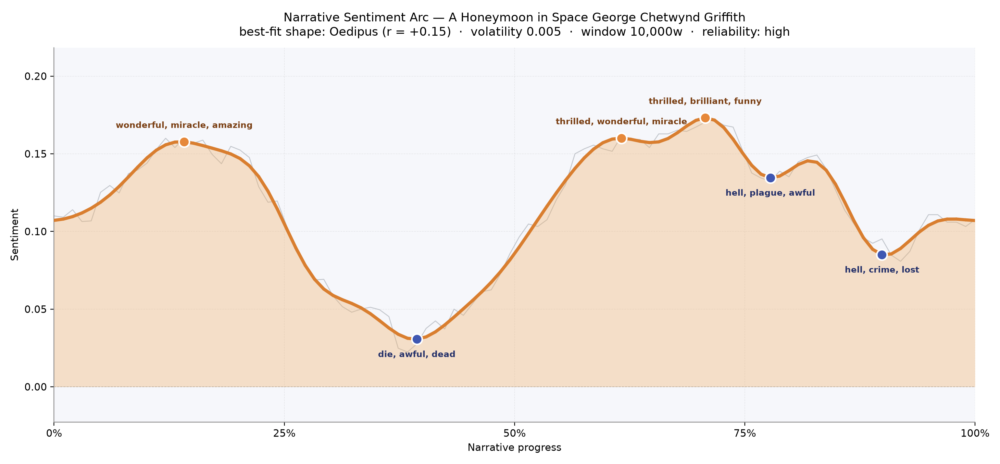
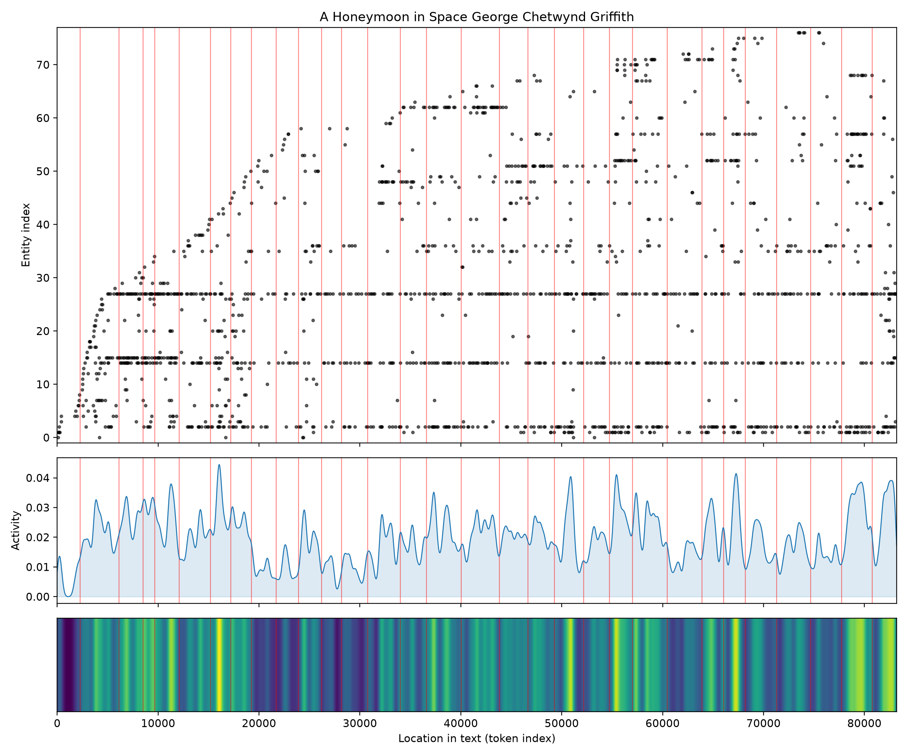
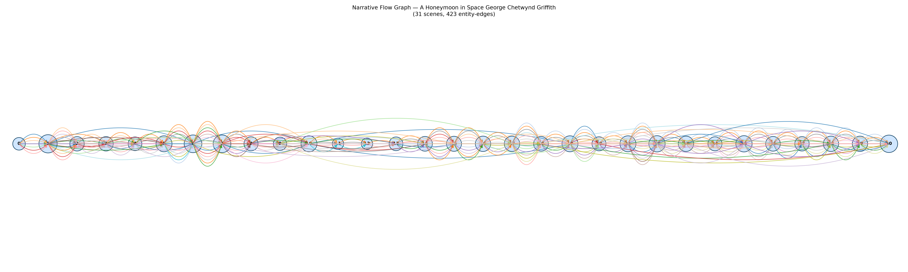

# A Honeymoon in Space
### by George Chetwynd Griffith

A 64,805-word Edwardian voyage across the solar system whose emotional shape most resembles the old Oedipus fall — a bright beginning that lowers into shadow before struggling upward again.

## The shape of the story
Griffith opens with the champagne of possibility. In the first fifth of the book, the reader is carried along on a current of language thick with "wonderful, miracle, amazing, supreme, triumph, heavenly" — the vocabulary of a honeymoon and a launch, a wife and a spaceship both christened at once. It is buoyant, unembarrassed by its own awe. Then the arc lowers. Around the two-fifths mark, the mood tips into a valley thick with "die, awful, dead, betraying, horrible, violent" — the first real weather of dread, arriving as our travellers meet worlds that do not welcome them. From there the story rallies. There are second and third summits near the two-thirds and seven-tenths marks, where the writing is again "thrilled, wonderful, miracle, brilliant, funny, beautiful," as if Griffith is remembering that this is, at heart, a wedding trip. And yet the book will not let itself close in easy joy: two late dips, one flavoured with "hell, plague, awful, dead, dying, ridiculous" and another with "hell, crime, lost, loose, awful, hideous," remind us that space here is not a playground but a mirror held to our own fallen worlds. The final tick returns near the calm of the opening, but the reader has been marked.

<figure><figcaption>A gentle, wide-shouldered curve: two glowing summits bracketing a middle dip, then a late shadow before the last soft return home.</figcaption></figure>

## Who lives on the page
Three names carry the book on their shoulders. Zaidie, the bride, is present in nearly three hundred beats — she is the emotional weather of every planet they visit. Redgrave, her husband and the pilot of their impossible ship, matches the pace of the vessel itself: the ship, called the Astronef, appears almost as often as its captain, and the tallies read them as inseparable, which feels right — the machine is a third protagonist, a kind of steel-hulled honeymoon suite. Around them orbit a smaller company: Van Stuyler, Murgatroyd the loyal engineer, and the shadow of Lenox. The rest of the top names are the itinerary itself — Earth, the Sun, Mars, Venus, Jupiter, Washington, New York, and the Martian people — and I would not pretend these are characters so much as ports of call. That the book's most-mentioned "figure" is really the ship tells you what Griffith loved: the vehicle of wonder, and the woman who made him build it.

<figure><figcaption>Zaidie, Redgrave and the Astronef braid together across the whole text; the planets flicker in and out as the couple arrives and departs.</figcaption></figure>

## The weave of scenes
Read as a score, the flow graph is a long processional. Thirty-one scenes lie end to end like beads on a wire, each dense with its own small company of names and each threaded to its neighbours by hundreds of shared presences. There is no single climactic knot; instead, the middle chapters swell into rounder, busier chambers as new worlds and their peoples are introduced, and the outermost scenes — the departure from Earth and the return to it — are quieter, more intimate, held by fewer figures. The activity beneath the arc shows the same rhythm: a steady heartbeat with clean peaks near the launch, the martian encounter, and the closing return. Griffith is not braiding subplots so much as walking us politely from planet to planet, letting each world own its chapter before handing us back to the couple and their ship.

<figure><figcaption>A long, even ribbon of thirty-one scenes — a travelogue's cadence rather than a thriller's spiral.</figcaption></figure>

## What a reader takes away
What lingers is the strange sweetness of the book's contradiction: a honeymoon that keeps meeting death. Griffith gives you awe and horror in the same breath, and asks you to keep loving the universe anyway. You close the last page a little older, a little more tender toward the ship, and quietly certain that wonder and dread were always meant to travel together.
