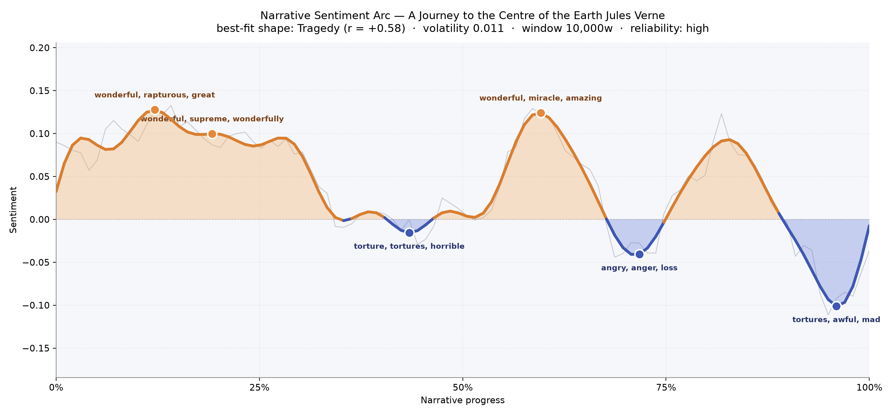
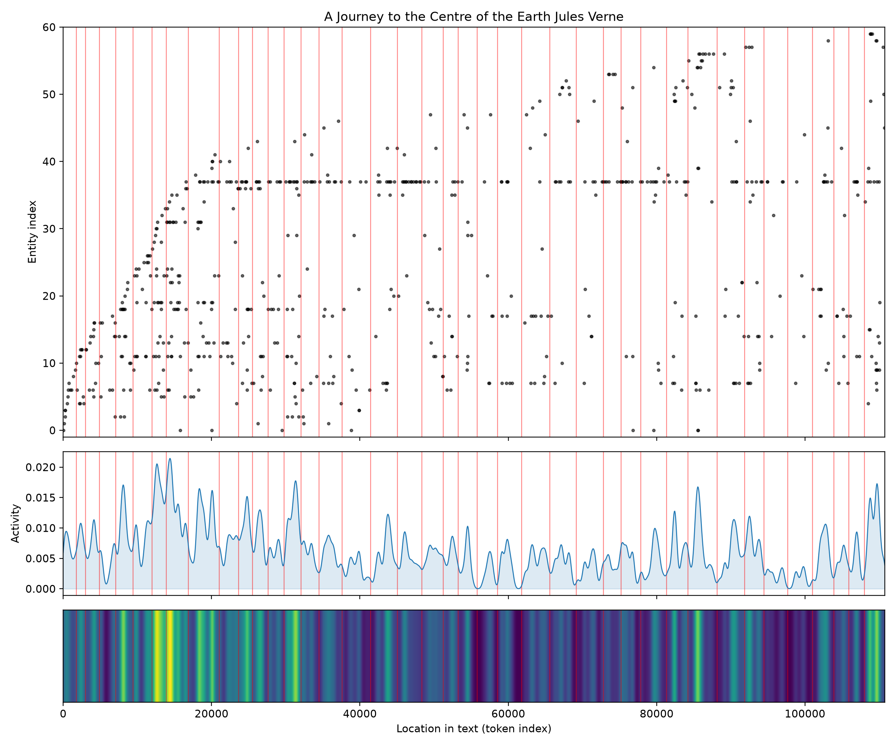
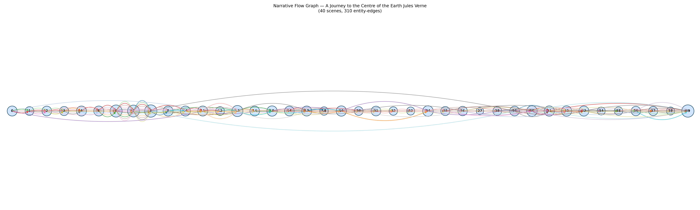

# A Journey to the Centre of the Earth
### by Jules Verne

A high-reliability read of roughly 86,400 words whose emotional line traces the long, patient descent of a tragedy — enthusiasm at the mouth of the volcano, exhaustion at the returning tide.

## The shape of the story

There is a particular species of nineteenth-century adventure that begins in an armchair by a warm hearth, rises quickly into rapture, and then, mile by subterranean mile, learns what it costs to want something so badly. Verne's novel belongs to that species. The felt experience here is not a bright climb but a slow-settling weight. Early on the prose is buoyant — the opening peaks near the twelfth and twentieth percentiles thrum with the vocabulary of a boyish enthusiast, "wonderful, rapturous, great, pleasure, excellent, good," as though Harry cannot quite believe his own fortune. There is a second brightness deep in the middle, around the three-fifths mark, where "wonderful, miracle, amazing, fantastic, brilliant, terrific" briefly gilds the interior sea. But after that everything cools. The valleys darken as we descend: first "torture, tortures, horrible, awful, hideous, dead" at the water crisis, then "angry, anger, loss, terrible, hideous, awful" during the great storm on the Lidenbrock Sea, and finally, near the exhausted last pages, "tortures, awful, mad, lost, violent, destroyed." The line does not crash — Verne is too tender for melodrama — but it drifts downward the way lantern-light drifts when the oil is nearly out.

<figure><figcaption>Two joys and three sorrows: the story's mood cools as the party descends further from daylight.</figcaption></figure>

## Who lives on the page

The most-named presence in the book is not, as one might expect, its narrator or its bombastic professor, but Hans — the Icelandic guide who appears one hundred and fifty-one times, more than three times as often as anyone else. That numerical dominance is itself a piece of criticism: Verne wants us to feel that the man who says almost nothing is the axis on which survival turns. Harry, the narrator, follows at forty-three mentions, and the professor lives here under two names the page-counter cannot quite braid together — "Hardwigg" (thirty) and, more obliquely, "Uncle" (twenty-seven) — plus the ghost of the alchemist Saknussemm (twenty-five), whose runes started the whole descent. Around these figures crowds a geography: Iceland, Reykjavik, Hamburg, the crater of Sneffels, and the Danish and Icelandic tongues that give the book its texture. Gretchen makes a small, faithful appearance from Hamburg. What emerges is a portrait of a lean cast wrapped in a heavy coat of places — a story more populated by landscape than by people.

<figure><figcaption>Names accumulate quickly in the first third, then the same handful recur like footfalls along the tunnel.</figcaption></figure>

## The weave of scenes

Read as a visual score, the forty scenes look less like a symphony and more like a long single-file procession — which is exactly right for a book about three men and a rope. The middle of the journey thins to as few as two named presences per scene, a striking narrowing that mirrors the moments when Hans, Harry, and the professor are alone with the granite. Near the shore of the interior sea and again in the final ascent, density thickens back up toward eighteen and nineteen presences per scene, as monsters, memory, and geography all crowd back into the frame. The threads do not braid so much as run parallel, occasionally leaping across the long middle in those wide sweeping arcs — recurrences of Hans, of Saknussemm, of Iceland — that remind us the party is still tied, however slack the rope, to the world above.

<figure><figcaption>A near-linear procession of forty scenes, thinning in the deep chapters and swelling again at the returning surface.</figcaption></figure>

## What a reader takes away

What lingers is not triumph but tiredness — a good, earned tiredness. Verne begins in wonder and ends in something quieter, closer to relief than to victory. The reader inherits the professor's obsession, Harry's fear, and Hans's silence, and finishes the book understanding that a journey downward is really a journey into one's own endurance. The wonder was real. The cost was, too.
