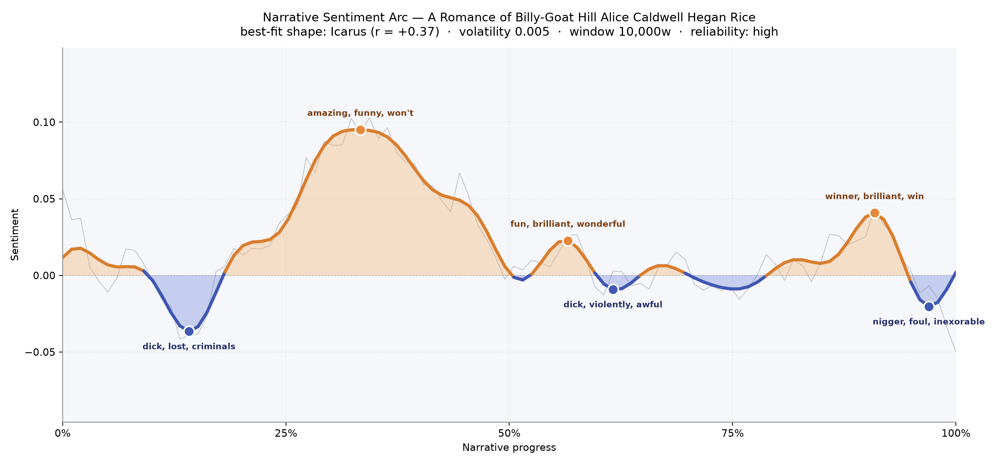
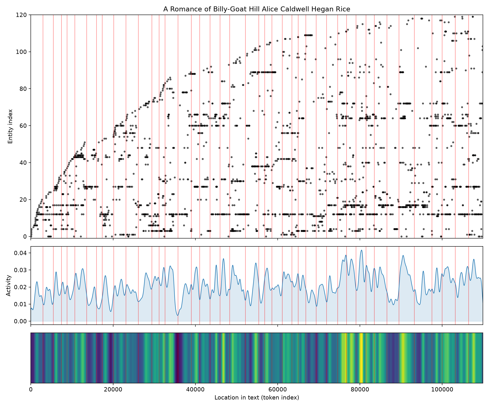

# A Romance of Billy-Goat Hill
### by Alice Caldwell Hegan Rice

A gently modulated Kentucky romance of roughly 82,700 words whose emotional line rises toward a bright midday and then leans, softly and inevitably, into the shadow of an Icarus fall.

## The shape of the story
Reading this novel is like watching a paper kite catch a summer thermal. It climbs, hangs golden a long while, and then feels the string tighten and the wind drop. The first quarter is anxious — the story opens on nerves and small alarms, a place where the driving pulse is felt in words like "lost, criminals, terror, mad, cheat," the small-town gossip of trouble brewing around a boy named Dick. From there the arc lifts into its warmest stretch near the one-third mark, buoyed by "amazing, funny, affection, delighted, magnificent" — a season of courtship and comic mischief where the book knows it is charming and lets itself be so. A second, softer plateau follows at the middle, still sunlit with "fun, brilliant, wonderful, happiness, wealth." But romance and wealth are dangerous altitudes in a Rice novel. By the two-thirds mark the wind changes: "dick, violently, awful, horrible, miserable, terrible." The final descent is unmistakable — even the late peak of "winner, brilliant, win, miracle, happy" cannot outrun the closing valley of "foul, inexorable, die, miserably, desperate." The kite comes down. What lingers is not tragedy exactly but the tender bruise of a story that flew too near its own hopes.

<figure><figcaption>The blue line barely climbs above the horizon — Rice writes in a hushed register — yet the shape underneath, that long slow bell, is the very silhouette of a rise-and-fall romance.</figcaption></figure>

## Who lives on the page
The dominant presence, appearing nearly three hundred times, is simply "lady" — almost certainly the Lady of the Lane or a similar honorific used for the novel's central woman rather than her given name. It is a telling habit of the book: Rice keeps her heroine slightly veiled, more archetype than nameplate. Around her orbit the men and children of Billy-Goat Hill: Donald, called Don in his intimate scenes, is the ardent second lead; Sequin and Connie share the middle of the roster, while Myrtella and Gooch supply the household comedy that Rice was famous for in her earlier Cabbage Patch books. Gerald, Noah, Queerington, Bertie, Jimpson, Phineas, Margery — a genuine ensemble, small enough to know and large enough to feel like a neighborhood. "Chick" reads more like a term of endearment than a person, and Phineas may be as much a family name as a figure; the counts are honest, but the labels sometimes wear disguises.

<figure><figcaption>A wide, evenly populated field — very few figures vanish for long. Rice keeps her cast in almost constant company with one another.</figcaption></figure>

## The weave of scenes
The scene-by-scene weave is remarkably even. Forty-three chapters, each humming with fifteen to thirty named presences, and hardly a lull between them. Early scenes braid tightly; the middle stretches a touch, as if the novel is drawing breath before its long emotional climb; and then, from the two-thirds point onward, the threads thicken and cross more often — twenty-nine names in the final chapter, the fullest room in the book. This is a novelist who gathers everyone into the parlor for the last act. The graph reads less like parallel rails and more like a long braided rope: characters keep meeting, keep overlapping, keep being pulled back into each other's orbits by the pull of the central romance.

<figure><figcaption>The bright arcs bunching at the right-hand side are the tell: everyone shows up for the ending.</figcaption></figure>

## What a reader takes away
What one carries away from Billy-Goat Hill is the flavor of a warm afternoon that knows an evening is coming — laughter kept close to grief, a heroine loved more than named, a small community that will not let its own go alone into the dark. Rice writes with the confidence of someone who trusts sentiment without surrendering to it, and the arc her book traces is finally the arc of every fond memory: it rose so beautifully that the falling had to hurt.
