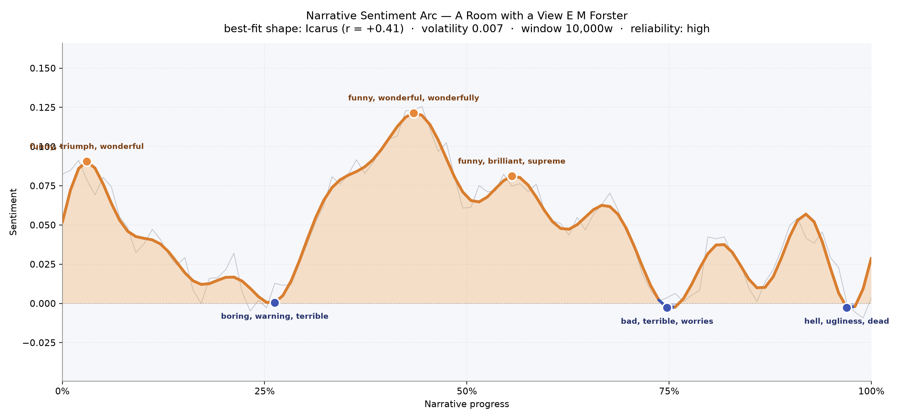
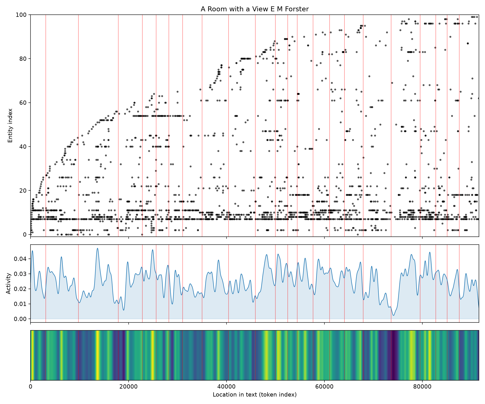

# A Room with a View
### by E. M. Forster

roughly 68,500 words across twenty-three scenes — an Icarus arc, a story that lifts on wings of Florentine sun and then cools into English drawing-room shadow.

## The shape of the story

Forster'''s novel opens with the window flung open. In the earliest pages Lucy Honeychurch steps into Italy and the prose fizzes with "funny, triumph, wonderful, rejoice, supreme"; you can hear the pensione bells and the small self-congratulation of a young traveller who has finally been given a view. That first crest is quickly checked. Around the quarter-mark the mood curdles into a hush stitched from "boring, warning, terrible, died, worrying, hideous" — the murder in the Piazza Signoria, the fainting, the sudden knowledge that Italy is not only picturesque but also mortal.

Then comes the book'''s true summit, near the middle of the reading time, where the language brightens into "funny, wonderful, wonderfully, fantastic, win, rejoicing". This is the ridge of violets, the stolen kiss, the sensation that life might, after all, be answered honestly. A shorter secondary peak — "funny, brilliant, supreme, fun, wonderful, perfect" — carries the glow a little further, into Freddy'''s bathing pool and Sunday laughter at Windy Corner.

After that the arc slopes down. Three-quarters in, the trough sits heavy with "bad, terrible, worries, awful, died, violently", the season of the Cecil Vyse engagement and the muddled lies to Charlotte. The final valley is the most bruised of all, thick with "hell, ugliness, dead, terrible, worried, destroyed" — the muddle at its blackest, just before the last chapter'''s small, hard-won reprieve. It is the shape of Icarus not because Lucy falls forever, but because the ecstatic middle can'''t be sustained; the book knows that clarity, once won, must be defended in quieter rooms.

<figure><figcaption>A gentle rise into Italian light, then a long, thoughtful cooling toward the English muddle.</figcaption></figure>

## Who lives on the page

Lucy dominates so completely — nearly five hundred mentions — that the novel is essentially her private weather system. Around her, the chaperones and suitors take their proper orbits: Mr. Beebe with his benevolent clerical curiosity, Charlotte Bartlett with her exhausting propriety, Freddy and Mrs. Honeychurch anchoring the Surrey home, and the two Emersons, father and son, whose surname is quietly the moral pole of the book. George arrives a little later in the count but pulls hard; Cecil Vyse hovers as a name attached to a fiancé who is really an idea. Mr. Eager and Miss Lavish, the Italian-tour caricatures, appear just often enough to remind us the pensione is a stage set.

A few labels wander in from the wrong shelf. "Charlotte" is tagged as a place rather than a person; "Windy Corner", the Honeychurch house, is treated like a character (which, fairly, it almost is); "Florence" and "Italy" show up as themselves — presences as much as backdrops. Forster would probably have smiled at that: in this novel, houses and cities really are the third party in every conversation.

<figure><figcaption>Lucy'''s dense central band, with Italian and English rooms crowding in above and below.</figcaption></figure>

## The weave of scenes

The scene-graph reads like a long, symmetrical piece of embroidery. Early scenes are already thickly populated — the pensione throws every guest into one room at once — and the middle chapters (around the drive to Fiesole and the return to Windy Corner) swell into the densest tangles, thirty-plus figures crossing threads. Two thinner passes near scenes seven and thirteen act as breathing spaces: Lucy alone with her piano, Lucy alone with her thoughts. Then the weave gathers again for the Cecil chapters and the final unravelling, before narrowing softly at the close, when only the two who matter are left in the returned Florentine room.

<figure><figcaption>A braided middle of crowded rooms, opening and closing on quieter duets.</figcaption></figure>

## What a reader takes away

A reader leaves Forster'''s novel carrying two rooms at once: the Italian one, where the shutters were thrown wide and something honest was allowed to happen, and the English one, where that honesty had to be re-earned in the face of tact. The arc'''s descent is not a defeat but the price of coming home with the view intact.
