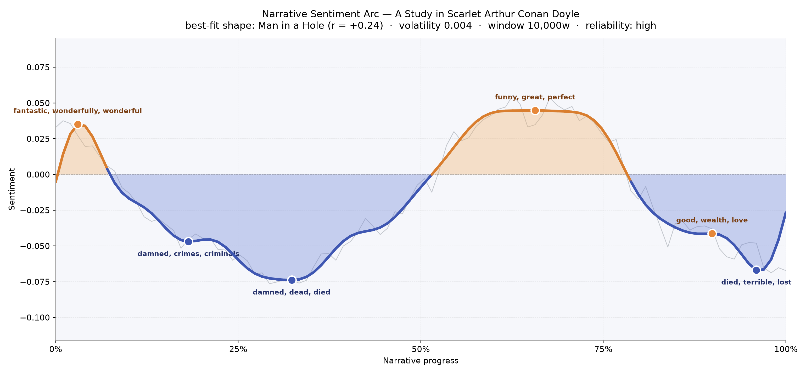
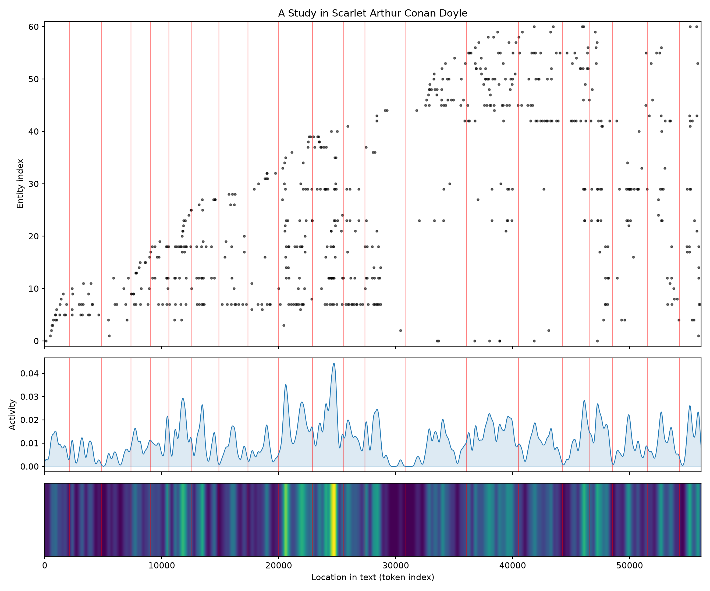

# A Study in Scarlet
### by Arthur Conan Doyle

44,121 words · a Man-in-a-Hole arc — a story that stumbles into darkness and claws its way back toward daylight

## The shape of the story

Doyle's debut novel behaves, on the page, like a lantern carried through fog. It begins on a note of high spirits — Watson's chance meeting with Holmes at Bart's, the giddy first taste of the great detective's mind, a moment brightened by words like "fantastic, wonderfully, wonderful, fun, excitement." Then the fog thickens. Roughly a fifth of the way in, the mood dims into the language of a crime scene — a hollow thick with "damned, crimes, criminals, terrible" — and a third of the way through the book bruises deeper still, weighed with "damned, dead, died, violent, worse, killed." This is the felt shape of a man falling into a pit and dragging himself out again: the middle of the novel lifts near the two-thirds mark on a warmer breath of "funny, great, perfect, good, best, won" as Holmes closes his net and the puzzle begins to click. The final descent, softened by "died, terrible, lost, inexorable, despair," is not a defeat but an elegy — Jefferson Hope's confession, the long American backstory of love and vengeance, quieting the book toward its end. The arc is subtle rather than seismic, a low sine wave carrying its darkness politely, the way Victorian prose so often does.

<figure><figcaption>A shallow trough through the murder scenes, a bright shelf near the solving, and a soft mournful close.</figcaption></figure>

## Who lives on the page

Holmes towers above everyone, as he should — his name is spoken nearly twice as often as any other, and when you fold in "Sherlock Holmes" he takes up almost a quarter of every named breath in the book. Around him orbit the victims and the hunters: Drebber, whose corpse opens the case; the doomed Stangerson; and the two rival inspectors, Lestrade and Gregson, sniping at each other while Holmes quietly out-thinks them both. Then, halfway through, the novel opens a trapdoor to Utah and a second cast walks in — Jefferson Hope, John Ferrier, and Lucy — figures who belong to a different climate entirely, the wide dry country and the shadow of the Mormon settlement. London and Utah bracket the geography; both places register as presences of their own. The tagging quietly mislabels Gregson as an organisation rather than a man, and "Mormon" surfaces as a collective rather than a person, but the shape of the cast is unmistakable: a detective story bolted to a frontier tragedy.

<figure><figcaption>A clear handoff around the 30,000-word mark: the London cast recedes and a new Utah cast floods in.</figcaption></figure>

## The weave of scenes

The scene graph makes visible what any reader of Study feels intuitively — this is a book of two halves stitched at the waist. Twenty-one scenes lie strung along a wire, sparse and quick at the opening (Watson's setup, first sightings, the empty house on Lauriston Gardens) and then swelling outward around scenes ten and fourteen into a dense braid of overlapping figures. That thickening is the Utah interlude: Ferrier and Lucy and Hope and the Mormon elders all pressing into the same rooms. The chapters afterward stay busy, a tangle of confessions and cross-references, before the book tapers cleanly to its final scene where Holmes explains his method to a delighted Watson. The pattern reads like a musical score — solo, then chorus, then solo again — with the loudest passage placed exactly where the emotional stakes shift from puzzle to grief.

<figure><figcaption>Threads gather thickest through the Utah flashback, then loosen for Hope's confession and Holmes's coda.</figcaption></figure>

## What a reader takes away

What lingers is not the trick of the crime but the odd warmth of the pairing at its centre — two men at 221B, one dazzling and cold, one loyal and observant — and the ache underneath the puzzle: a love story stolen, a vengeance carried across an ocean, a detective who solves everything except the sorrow. The novel introduces a friendship the century would not let go of, and it does so on a sentiment arc that dips into real darkness before lifting, only briefly, toward the light.
