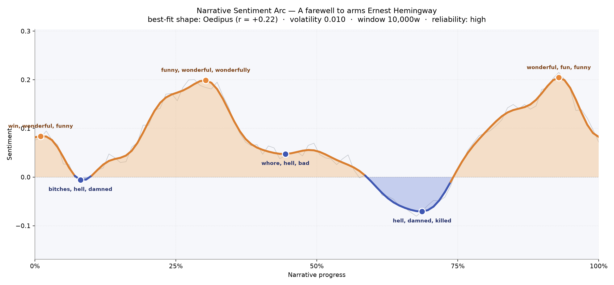
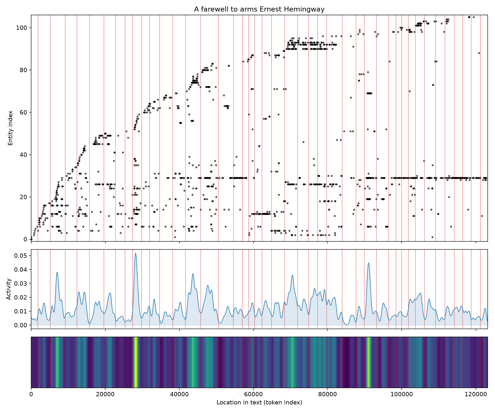

# A Farewell to Arms
### by Ernest Hemingway

A 91,577-word war-and-love novel whose emotional shape traces the old fall-then-false-dawn curve, the pattern the ancients called the Oedipus arc — a life lifted only to be undone.

## The shape of the story

The curve of feeling here begins high and hopeful, then dips, climbs into a plateau of tenderness, and drifts downward toward a quiet devastation. That is the arc of a man who thinks he has escaped fate and discovers, too late, that fate was the road he was walking. Early on, the language is bright: the opening peak sits in the register of "win, wonderful, funny, lovely, perfectly, amused," the flirtation-and-mess-hall register of officers who have not yet been hurt badly enough. By the first third — the Milan hospital, the affair with Catherine — the curve rises again on "funny, wonderful, wonderfully, fun, terrific, winner," a young man's happiness that reads, in retrospect, like foreshadowing dressed in silk. Then the valleys arrive. The mid-book trough is bruised with "whore, hell, bad, lost, killed, worse" — the retreat from Caporetto, the mud, the executions at the bridge. The deeper valley near the two-thirds mark is thick with "hell, damned, killed, kill, angry, bloody," which is exactly the timbre of a man rowing his pregnant lover across a lake in the dark. The late false peak — "wonderful, fun, funny, won, nice, grand" — is the Switzerland idyll, the borrowed month, before the last page pulls the floor away.

<figure><figcaption>The smoothed feeling-line: three little summits of happiness, each shallower than the reader hopes, and the drift toward a silence at the end.</figcaption></figure>

## Who lives on the page

Catherine Barkley owns this novel. Her name (and the surname Barkley) accounts for nearly three hundred mentions — more than three times any other figure — which is astonishing for a book usually filed under "war novel." Hemingway is telling us, in the crude arithmetic of attention, that this is a love story worn in a soldier's coat. Around her cluster the men of the ambulance corps: Rinaldi the surgeon-friend with his teasing warmth, Piani and Bonello and Aymo, the drivers whose fates are drawn hard and fast during the retreat. Ferguson, Catherine's Scottish friend, hovers at the edge as chaperone and conscience. "Tenente" — Italian for lieutenant — is really Frederic Henry himself, the narrator called by his rank; the counting system reads it as a name, which is a small, honest confusion the book invites, because Frederic almost never uses his own name. The Italians, Austrians, Germans, Americans appear less as characters than as weather. Milan is the one place-name that surfaces strongly: the city of the hospital, of grappa, of a summer that felt like a life.

<figure><figcaption>Catherine's line runs almost the full length of the book; the soldiers appear in dense knots and then, tellingly, vanish.</figcaption></figure>

## The weave of scenes

Forty-four scenes, and the density is not evenly spread. The early and middle scenes are crowded — thirteen, nineteen, twenty-four, twenty-two, twenty-nine, twenty-five presences braided together — the front, the officers' mess, the hospital, the retreat, all thick with soldiers and nurses and civilians. Then, past the halfway mark, the weave loosens. The late scenes hold five, three, two, four figures at a time. This is the shape of a novel that begins as a chorus and ends as a duet, and then as a monologue. The graph reads like a river narrowing to a stream and then to a single thread of water at the lake's edge. Hemingway is quietly pruning the world until only Catherine and Frederic remain — and then only Frederic, walking back to the hotel in the rain.

<figure><figcaption>A crowded early braid that thins deliberately toward the end: the war recedes so the loss can be heard clearly.</figcaption></figure>

## What a reader takes away

What lingers is not the war and not, exactly, the love — it is the arithmetic between them. The book teaches you to believe in a rescued life ("wonderful, fun, funny, grand") and then withdraws it in a single page. You close the novel with the sense that you have been given a small, warm room and shown, very calmly, that the door was never yours to keep.
