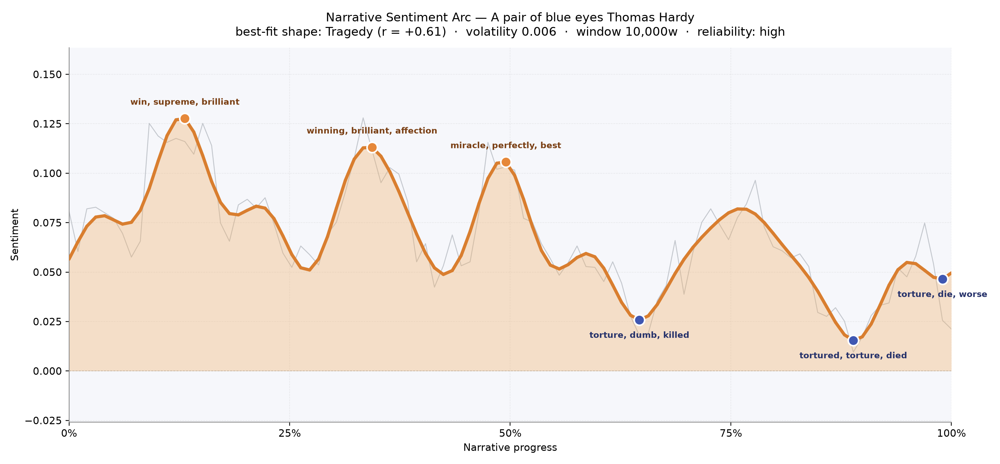
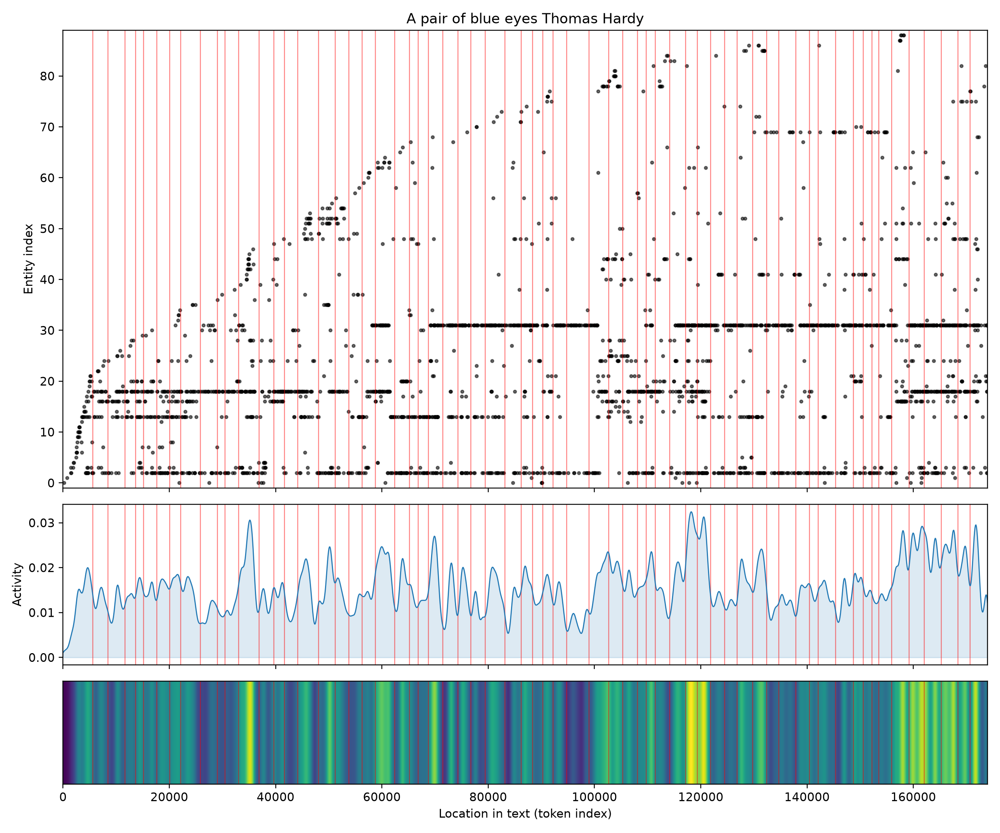
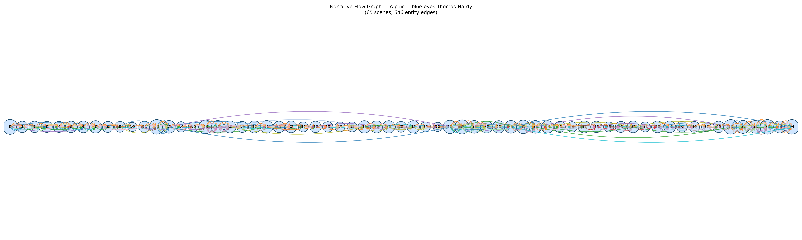

# A Pair of Blue Eyes
### by Thomas Hardy

A 133,853-word Cornish romance whose emotional weather bends, unmistakably, into the long shape of a tragedy.

## The shape of the story

The felt life of this book is a slow settling. Not a plunge — Hardy is too patient for that — but the sensation of a bright morning gradually clouding over, and then the clouds refusing to lift. Early on, the arc lingers in a warm, honeyed register: the driving words of the first peak, "win, supreme, brilliant, triumph, wonderfully, excellent," speak to the giddy self-congratulation of young courtship, when even a walk on a windy cliff feels like a private victory. A second bright ridge near the one-third mark keeps the mood aloft on "winning, brilliant, affection, good, mirth, impressed" — the sound of two young people convincing themselves that fondness is fate. The last true crest, at almost exactly the midpoint, is the most tender and the most fragile: "miracle, perfectly, best, love, admire, loved" — six words that read like a lover's private catechism.

Then the light goes. From the two-thirds turn onward, the valleys arrive one after another and refuse to argue with themselves. The book's later dips are thick with "torture, dumb, killed, suck, killing, dead," and then "tortured, torture, died, irritate, fatal, dead," and finally, at the very last breath, "torture, die, worse, lost, miserably, cruel." The vocabulary itself has been bereaved. What a reader feels is not a sudden catastrophe but a moral gravity — the sense that the story has been leaning quietly downhill from the very first chapter and only now permits us to notice.

<figure><figcaption>Three bright ridges of courtship, then a long unlit slope toward the graveyard.</figcaption></figure>

## Who lives on the page

The counts tell a small, sharp truth about who Hardy's imagination actually served. Knight, the older intellectual suitor, appears more than any other name — nearly six hundred times — with Elfride just behind him and Stephen, the young architect, close on her heels. The novel is nominally hers, and its title belongs to her eyes, but the sentence-by-sentence weight of the prose is carried by the two men who love her and, in loving her, weigh her. Swancourt — her father, and also the name of the parish she moves through — sits in the middle distance as both a person and a place, which is very Hardy: family and geography are the same pressure. Around them cluster Smith and the Luxellians and old Mrs. Jethway, whose bitter presence in the margins turns out to matter more than her line-count suggests. London and Endelstow and St. Launce's are not characters but the poles the lovers travel between; their presence in the tally is the map of the book's restlessness. Some of the type-labels are noisy — Elfride tagged as an organisation, "Elfie" as another — but the shape underneath is unambiguous: two men, one woman, one father, one haunted widow.

<figure><figcaption>A cast of five real presences and a long tail of villages, siblings, and passers-by.</figcaption></figure>

## The weave of scenes

Read as a visual score, the flow graph looks like a long ribbon rather than a knot. Sixty-five scenes stretched end to end, most of them thickly populated, with a few thin passages where Hardy narrows to two figures on a cliff or a stairwell. The densest stretches are not at the opening but past the midpoint — around scenes thirty-seven and thirty-eight, and again in the closing sixty-first through sixty-fifth, where the population of the page swells to twenty-one at a time. That is the classic Hardy geometry: he loosens his early chapters to let a courtship breathe, then crowds the finale with witnesses — servants, clergymen, aunts, the whole village turning up for the last, terrible scene. The middle threads mostly braid the same three names together; the ends fan out into community. It is the shape of a private grief becoming a public event.

<figure><figcaption>A long horizontal ribbon: intimate in the middle, crowded at the close.</figcaption></figure>

## What a reader takes away

You close the book carrying a very Hardy inheritance: the memory of blueness — sea, eyes, sky — and the knowledge that tenderness in his world is not spared for being tender. The signals are quiet, the volatility low, but the drift is unarguable. A pair of blue eyes opens on a triumph and closes on a coffin, and the miles between are the long, courteous, unbearable walk from one to the other.
