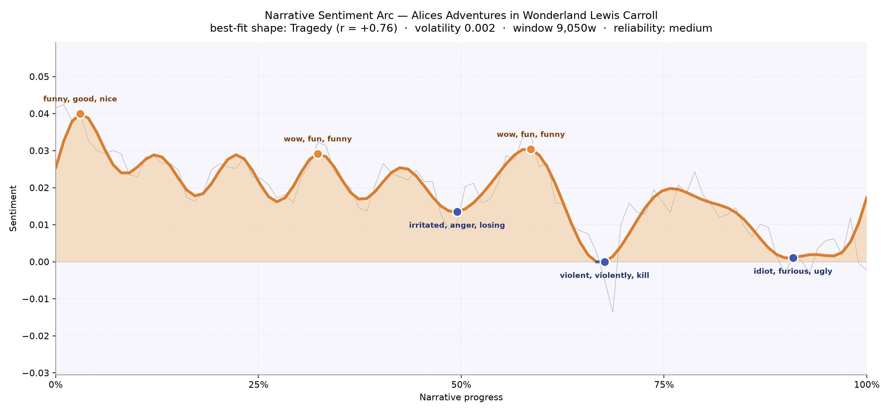
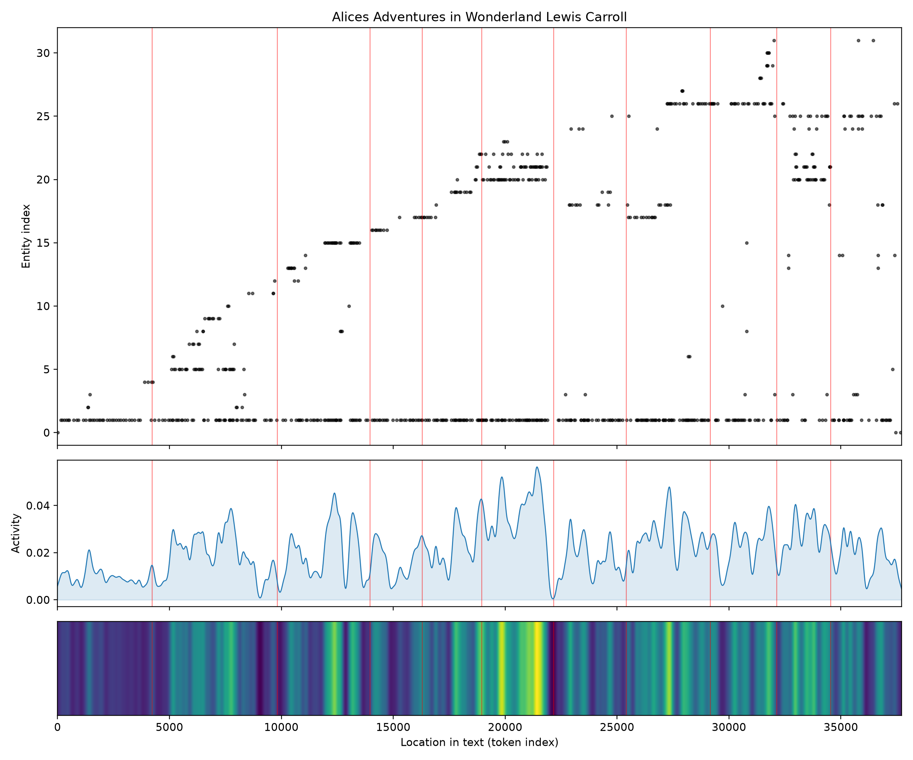
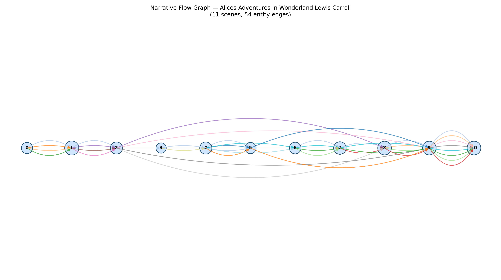

# Alice's Adventures in Wonderland
### by Lewis Carroll

roughly 27,400 words · a Tragedy arc in miniature — a bright child's day that quietly darkens as the afternoon wears on

## The shape of the story

The arc of Wonderland is not the loud collapse of a great house but a slow tarnishing of light — a curve that begins in gleam and ends in shadow, like sunlight leaving a nursery window inch by inch. The opening chapters shimmer, sweet with "funny, good, nice, grand, glad, great"; you can almost hear the small delighted intake of breath as Alice tumbles down the rabbit-hole and finds the world absurd but generous. A second brightness lifts around the third of the way in, giddy with "wow, fun, funny, best, fan, good" — the caucus-race, the pool of tears drying into farce, the caterpillar's smoke curling upward.

Then the story tips. Just past the midpoint the ground goes soft, and the trough at the halfway mark bruises with "irritated, anger, losing, violent, lost, violently" — the Duchess's kitchen, the pepper, the flung baby. A brief lift returns near the croquet lawn, "wow, fun, funny, win, good, succeeded" — but this is the last real sunlight. From there the reading darkens fast: the deep valley at roughly the two-thirds mark is thick with "violent, violently, kill, ugly, mad, angry", the Queen barking her sentence, and the final low near the courtroom finish is heavy with "idiot, furious, ugly, worried, died, warning". This is a short book, so the slope is impressionistic rather than definitive — but the felt direction is unmistakable: a dream that grows louder and less kind until the dreamer wakes.

<figure><figcaption>A gentle downward drift — Wonderland's laughter thinning into a tribunal.</figcaption></figure>

## Who lives on the page

One name towers over everything: Alice, mentioned 381 times, is the sun this small solar system orbits. After her, a cabinet of curiosities — the Hatter, the Gryphon, the Dormouse, the Mouse, the King, the Caterpillar, the Duchess, the Queen, the March Hare, the Cheshire Cat, the White Rabbit, Bill the Lizard, the Pigeon. It is a cast almost entirely of creatures and titles, no surnames, no biographies — which is exactly right for a dream, where identities are heraldic rather than psychological. "Majesty" surfaces as a repeated address, a courtly echo rather than a person. The tagging occasionally misfiles a character as a place or an institution — the Duchess appears sorted with locations, the Cat with organisations — a small confusion that itself feels Wonderland-appropriate, as if the categories themselves refuse to sit still.

<figure><figcaption>Alice threads every band; the others enter, hold court a while, and vanish like guests in a receiving line.</figcaption></figure>

## The weave of scenes

Eleven scenes, fifty-four connecting threads — for a book this short, that is a dense little tapestry. The early scenes are sparse, three or four presences at a time (Alice alone with a rabbit, a mouse, a bottle labelled DRINK ME). The middle chapters swell — twelve figures crowding one scene, then seven, then eight — as the Mad Tea-Party and the Duchess's kitchen and the croquet-ground pile characters onto the page like a pantomime finale. The last three scenes each hold eleven figures apiece: this is the trial, and Wonderland has emptied its whole populace into the courtroom. The graph's long looping arcs are the recurring residents — Alice, the Queen, the Hatter — reappearing at intervals, stitching the front of the book to its back. It reads less like a plot and more like a procession that keeps circling past the same window.

<figure><figcaption>A slender braid at first, then a knot at the trial — everyone summoned at once.</figcaption></figure>

## What a reader takes away

What lingers is not the nonsense but the temperature of it: a story that begins in a child's warm bewilderment and ends with a small girl standing up to a court of playing-cards and calling them by their true, flat name. Carroll gives you a world that grows sharper the longer you stay in it — and the mercy of the final page is that you get to wake. You close the book carrying the aftertaste of a very long, very bright afternoon that stayed out just past its welcome.
