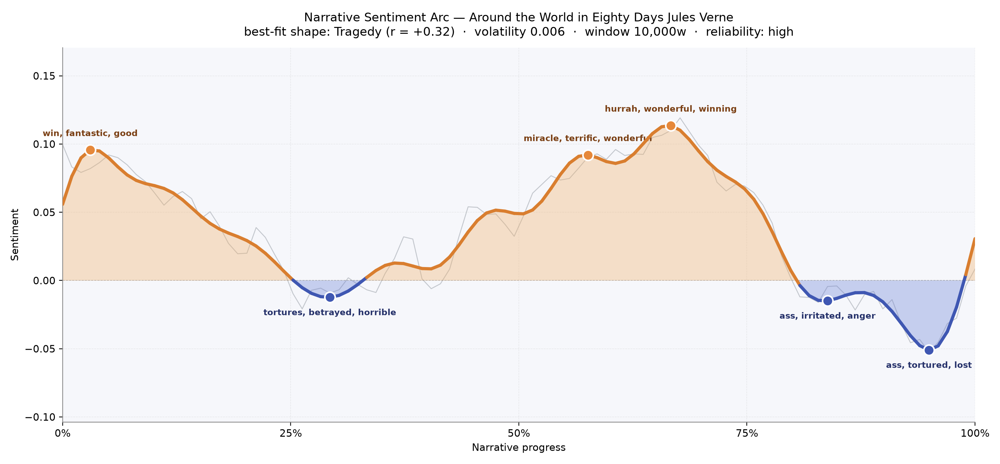
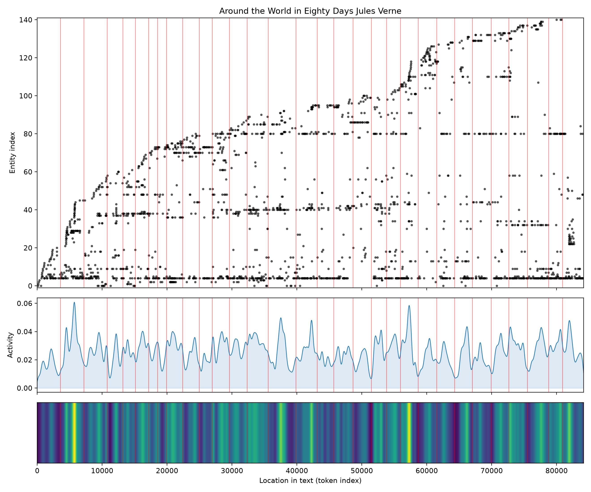
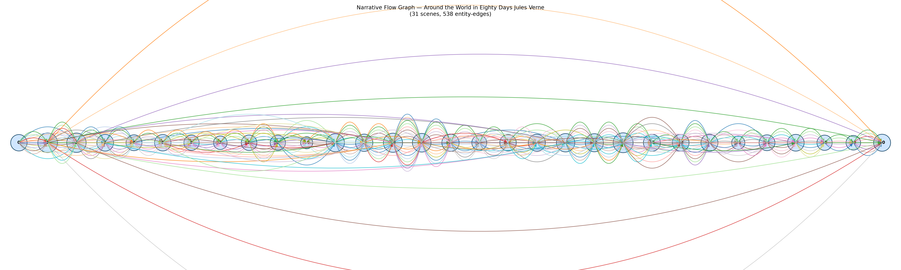

# Around the World in Eighty Days
### by Jules Verne

64,288 words carried on a wager and a pocket watch — nominally a Tragedy shape, though the truth is a jaunt that keeps flirting with disaster.

## The shape of the story

Verne's globe-circling romp is officially graded a downward-tilting arc, and if you squint at the trend line you can almost see it: a bright, buoyant London opening slowly giving ground to the anxieties that pile up as the eighty-day clock runs down. But the felt experience is stranger and more delightful than a straight fall. The mood pitches gently across the meridians rather than plummeting — a wobbling equator of feeling.

The book opens on a puff of confidence, a peak thick with "win, fantastic, good, handsome, magnificent, perfect" — that is the sound of Phileas Fogg accepting the wager at the Reform Club with the composure of a man ordering toast. By the middle third, when the elephant charges through the Indian jungle and the rescue of Aouda is done, the arc lifts again into its brightest crest, glittering with "miracle, terrific, wonderful, winning, fantastic, triumph" and, a little later, the pure boyish "hurrah, wonderful, winning, fantastic, triumph, terrific." These are Passepartout's exclamations more than Fogg's; the valet is the story's emotional weather.

The valleys are shallow but pointed. Around the thirty percent mark — the Indian episodes and the threat of the pyre — the tone bruises with "tortures, betrayed, horrible, angry, worrying, hideous." Later, as Fogg is arrested in Liverpool and the wager appears lost, the trough is soured by "irritated, anger, bankruptcy, outraged, assassination," and just before the ending's famous reversal the darkest dip of all shivers with "tortured, lost, violent, killed, dead." Verne teases catastrophe, then whisks it away with a calendar trick.

<figure><figcaption>A traveller's mood chart: three cheerful crests, three small bruises, and a homecoming that refuses the downward line the model wants to draw.</figcaption></figure>

## Who lives on the page

The cast list confesses the book's true engine. Fogg himself towers over everything, named more than five hundred times, with "Phileas Fogg" adding another formal salute — as if Verne cannot resist reminding us that this metronomic Englishman is the still point around which continents wheel. Aouda, the rescued princess, is the second human presence, and her steady count suggests something the plot half-hides: she is not a decoration but a companion whose quiet gaze reshapes Fogg by journey's end. Colonel Francis Cromarty appears often enough to register as the third real character, the good-natured witness to the Indian leg.

Everyone else on the list is a place — London, Hong Kong, Bombay, Yokohama, Liverpool, New York, San Francisco — which is exactly right for a book whose protagonist is really the itinerary. The word "parsee" is tagged as a location but is really the elephant-driver Kiouni's guide; a small misreading that a reader will forgive. The absence of Passepartout from the top ranks is a quirk of how his French name gets sliced, not a comment on his importance; he is everywhere in the driving words above.

<figure><figcaption>A stippled map of arrivals: names accumulate as ports do, each red bar a scene break, the heat band below flaring at every new customs house.</figcaption></figure>

## The weave of scenes

Thirty-one scenes strung along a single filament, with hundreds of connective threads arching between them — this is what an itinerary looks like when you draw it. The middle is the densest bloom, where Bombay, Hong Kong, Yokohama and the Pacific crossing overlap and characters keep reappearing; the tallest arcs at the top and bottom of the graph are the long-distance recurrences — Fix trailing Fogg from London to Liverpool, Aouda travelling from her rescue to the wedding chapel. The two endpoints thicken again as the story comes home to the Reform Club, closing the loop the way a good travelogue must.

<figure><figcaption>A journey drawn as a spindle: dense in the middle where the world crowds in, tied at either end by the London that dispatches and receives its most punctual gentleman.</figcaption></figure>

## What a reader takes away

You close the book with a small, warm confidence — that timetables can be beaten, that decency travels well, and that a gained day at the International Date Line is worth more than twenty thousand pounds. Verne's arc leans toward tragedy on paper and refuses it in practice; that stubborn cheerfulness is the inheritance. What you carry away is the pleasure of watching a serene man discover, somewhere between Suez and Shanghai, that he has a heart after all.
