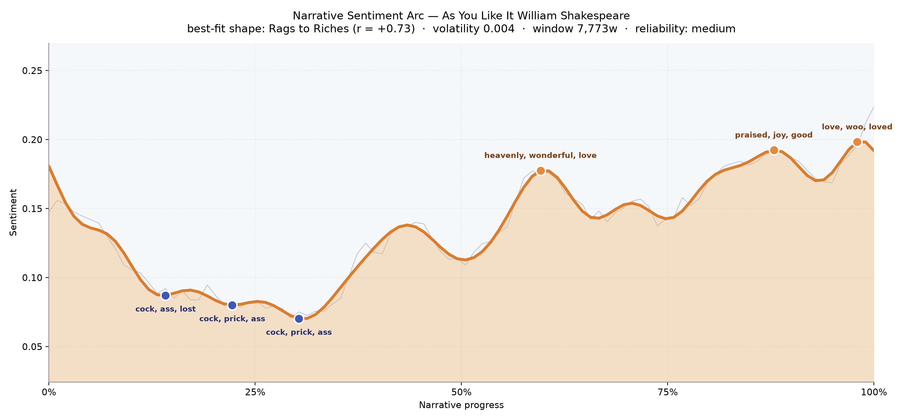
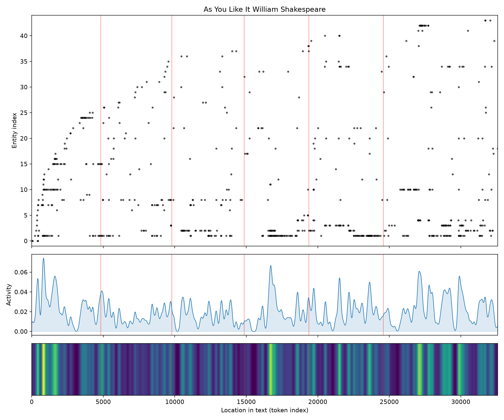
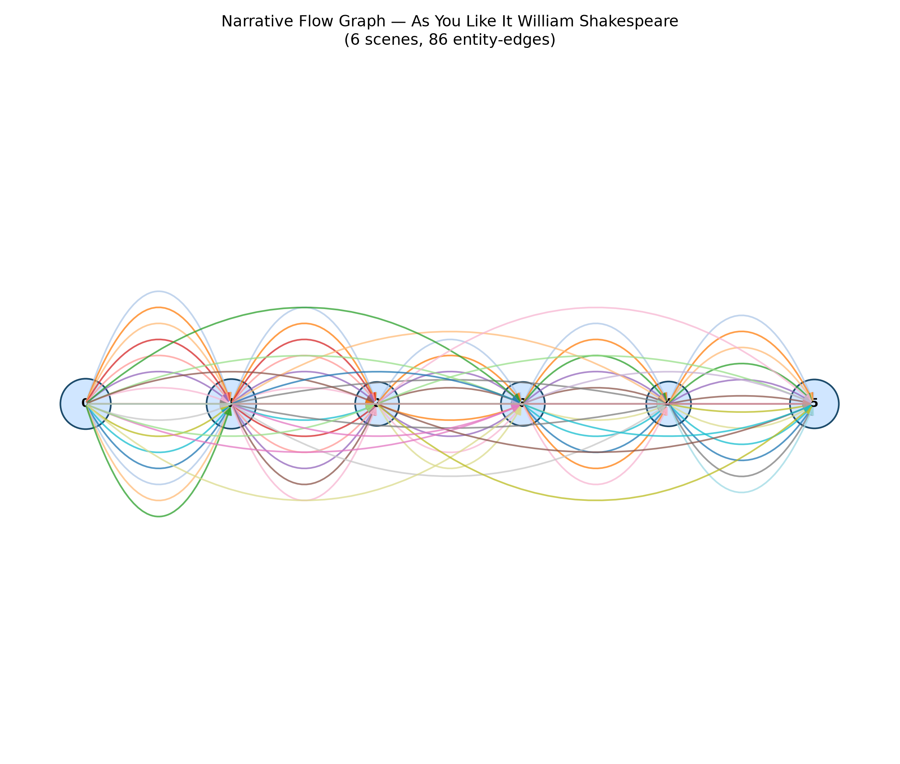

# As You Like It
### by William Shakespeare

A pastoral comedy of roughly 23,500 words — a Rags to Riches arc that walks from grumbling exile into a meadow of vows.

## The shape of the story

Read as a felt curve, this play begins in a mood of sour complaint and ends in a chorus of blessings. The opening thirty percent lingers in the low country — a stretch where the language is thick with "cock, ass, lost, dead, cruel, guilty" and later "cock, prick, ass, damned, mad, hate", the barnyard-and-oath vocabulary of banished men, resentful brothers and courtly bruises. It isn't tragic, exactly; it's the murmuring floor of a comedy that hasn't yet remembered it is one. Then, near the three-fifths mark, the arc tilts upward and stays there. The first true peak breaks with "heavenly, wonderful, love, good, loved, great" — Rosalind's forest schooling of Orlando, all sighs and clever tests. A second crest, deeper into the woods, rings with "praised, joy, good, glad, excellent, love", and the final rise, almost at the last page, closes on "love, woo, loved, perfect, best, marvel" — the mass wedding, the reconciliations, Hymen's benediction. The overall climb is gentle rather than steep; because this is a short book by the tooling's standards, the arc is impressionistic, a mood-graph rather than a proof. Still, the direction is unmistakable: a story that begins with men cursing their fortunes and ends with lovers naming each other's virtues.

<figure><figcaption>A shallow but steady climb from grievance into blessing — the comedy remembering itself.</figcaption></figure>

## Who lives on the page

The count of who speaks and is spoken of is, appropriately for this play, a little unruly. Orlando towers above everyone with a hundred-and-sixty-seven mentions — he is the play's suffering, wooed, riddled centre. Jaques follows at a distant seventy-one, the melancholic philosopher whose "All the world's a stage" hangs over the whole forest. Then come the shepherdess Phoebe, the reformed elder brother Oliver, the goatherd Audrey, faithful old Adam, the wrestler Charles, Rosalind's cousin Celia, the lovesick Silvius, the country simpleton William, and the courtier Le Beau. Duke Senior appears simply as "duke", flattened by the tooling. A few of the labels are noise a reader should nod past — "thou" and "nay" are archaic pronouns and interjections that the counter mistook for people, and "exit" is a stage direction promoted to a character. Rosalind herself, the play's true engine, hides behind her Ganymede disguise and so slips under the counting; her presence is felt everywhere in the shape of the arc even where her name doesn't tally.

<figure><figcaption>Orlando's line dominates the top band; a scatter of shepherds, brothers and fools braids beneath him.</figcaption></figure>

## The weave of scenes

The scene graph reads like a well-strung necklace: six beads of roughly even weight, laced by eighty-six threads of shared presence. The first and last scenes each carry the fullest cast — twenty-six figures at the court's fracture, twenty-four at the forest's final gathering — while the middle beads (eighteen, eighteen, nineteen) draw in a little, the way pastoral acts do when the crowd disperses into pairings. Long arcs bow above and below the line, showing figures who vanish and return — Oliver hunted in Arden, the old Duke rediscovered, Rosalind and Celia running the length of the play under other names. Nothing is truly parallel; every thread crosses. It is the visual score of a comedy that gathers, scatters, and gathers again for the dance.

<figure><figcaption>Six evenly weighted scenes braided by long returning threads — the choreography of a reunion play.</figcaption></figure>

## What a reader takes away

You leave As You Like It the way you leave a good, long walk in weather that turned kind halfway through. The grievances of the opening — usurped dukedoms, envious brothers, a wrestler paid to break a boy's neck — never quite disappear; they simply get outwalked by song, argument and the forest's willingness to forgive. The arc's slow climb is the play's whole argument: given room, given trees, given a clever girl in breeches, people talk themselves back into love. It's not a triumph. It's a thaw.
