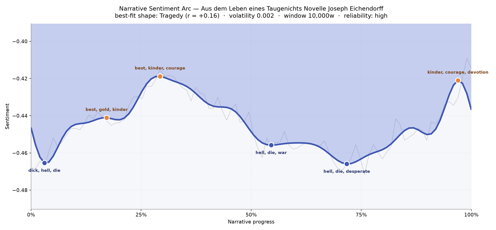
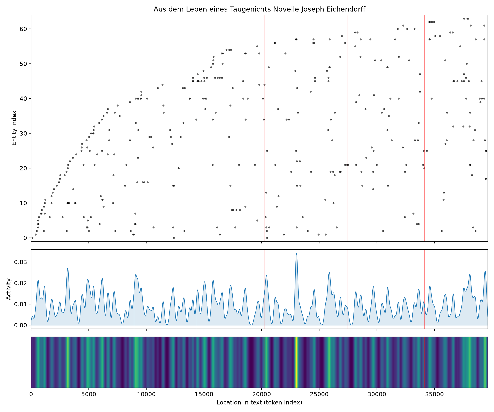
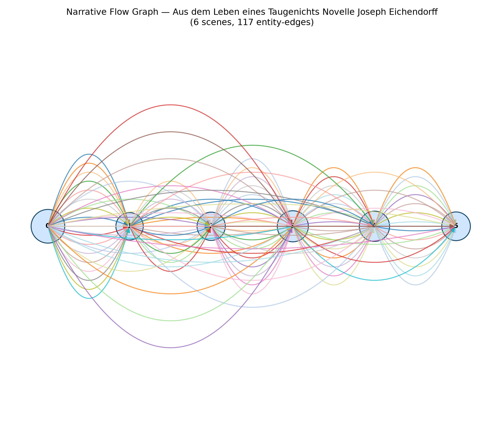

# Aus dem Leben eines Taugenichts
### by Joseph von Eichendorff

A wandering German novella of some 31,000 words that reads as a soft, sustained Tragedy — a whole life lived below the sunlit line, tinted by longing rather than ruin.

## The shape of the story

For a book so famously suffused with birdsong, moonlight and the open road, the mood-line here is a surprise. It never lifts into brightness. From the first pages to the last it hovers a hand's-breadth below neutral, drifting rather than climbing, so that the closest classical shape is a slow Tragedy — not a plunge, but a life that never quite catches the sun. Eichendorff's Taugenicht sings his way through Vienna and Rome, and yet the emotional weather stays overcast; his cheer, in the underlying vocabulary, is always shadowed by loss.

The three small crests of the arc read like sunlit clearings inside a long forest walk. Early on, near the flute-and-garden opening, the reading brightens with "best, gold, kinder, courage, rose" — that Romantic vocabulary of childhood, roses and quiet bravery. A second lift arrives around the first third, again warmed by "best, kinder, courage, rose, warm", the warmth of a young man discovering he is loved. And the final upward flicker, right at the closing pages, glows with "kinder, courage, devotion" — the Taugenicht's small, victorious tenderness, the promise of a home. The dips between are gentler than the shape's name suggests: the opening trough bruises with "dick, hell, die, war, lied, rage"; the middle valley near the halfway mark thickens with "hell, die, war, lied, fallen, stab"; and the deepest late trough carries "hell, die, desperate, war, lied, fallen". A German reader will smile — many of these are false friends ("die" the article, "war" the verb "was", "lied" a song, "hell" meaning bright) — so the darkness is partly a translation shadow. Even so, the persistent undertow is real: this is a book whose joys are always tinged with homesickness.

<figure><figcaption>A quiet, almost level Tragedy — three small clearings of warmth in a long twilight.</figcaption></figure>

## Who lives on the page

The novella's population, as the counts pull them up, is more geography than crowd. Italien, Rom, the Donau, "bergen" (mountains), "stadt" (a town), "hause" (home), even Mond and Erde — moon and earth — outnumber the human names. That is exactly right for this book: the Taugenicht is a wanderer, and place is his co-protagonist. Among the actual figures, Leonhard and Guido rise clearest, the two Italian companions whose masquerade drives the middle chapters. The rest — "andern", "damen", "mir", "mirs", "zeit" — are German pronouns and common nouns caught in the net, the noise you expect when a non-English text is read by tools tuned for English. Take them lightly; what remains is a truthful map of the book's obsessions: Italy, the Danube, mountains, a house to return to, the moon overhead.

<figure><figcaption>Presences scatter thickly early on and pulse through the middle — the road accumulating companions and places.</figcaption></figure>

## The weave of scenes

Six scenes, one hundred and seventeen threads between them — a dense little tapestry for so short a book. The graph shows the opening chapter as the busiest hub, forty presences crowding the mill, the castle, the first road out; the second scene narrows sharply as the Taugenicht slips into the wider world alone, then the middle scenes swell again as Italy, Leonhard, Guido, Rom and the ladies enter. The braid never fully unravels: threads arc all the way from the first scene to the last, which is the visual signature of a homecoming plot. Characters and places we met at the mill re-appear at the wedding, and the graph literally curves them home.

<figure><figcaption>Long arcs from first scene to last — the shape of a wanderer's return.</figcaption></figure>

## What a reader takes away

What lingers is a particular Romantic ache: the sense that even happiness, for this good-for-nothing with a violin and a heart full of songs, tastes faintly of departure. The arc's flat, low hum is not sadness so much as *Sehnsucht* — the German word for a longing that has no cure and no enemy. You close the book with sunlight on your face and something small and wistful in your chest, as if you had walked a very long road only to find the garden was always waiting.
