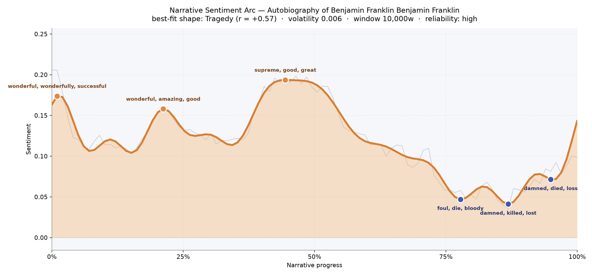
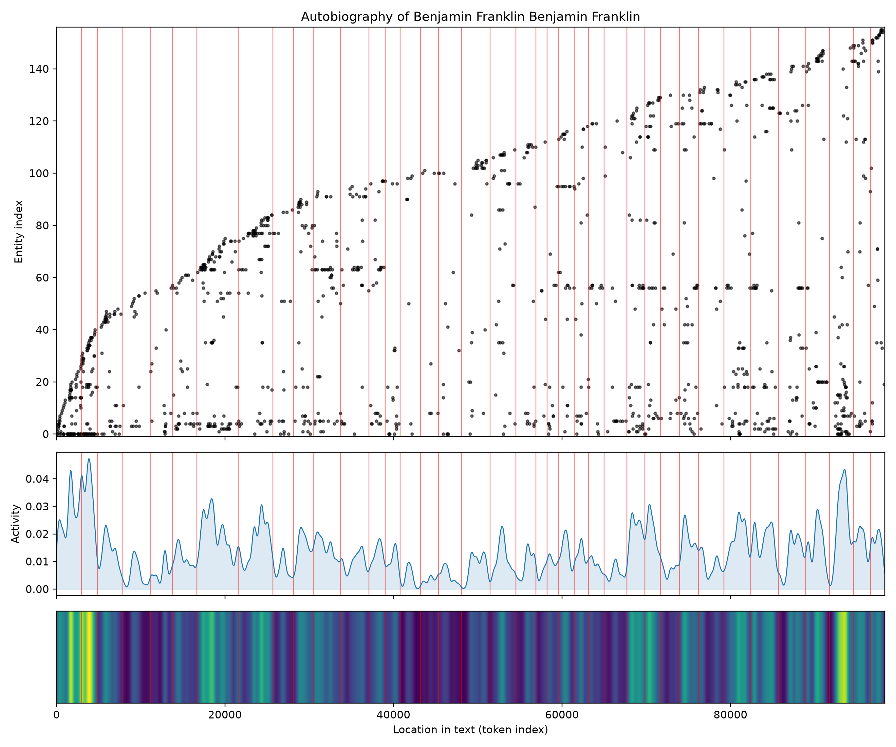

# Autobiography of Benjamin Franklin
### by Benjamin Franklin

75,520 words · a quiet Tragedy arc — a life recounted in bright confidence, shading toward loss as the ledger of years closes

## The shape of the story

Franklin's memoir does not swing wildly; it hums. The smoothed line of feeling floats a little above neutral for most of the book, then drifts gently downward as the pages thin — the shape of a man who has told his triumphs first and left the harder accounting for last. It is not the vertiginous plunge of a novel's tragedy; it is the softer sadness of a life narrated by someone who has already lived it, who knows how it ends.

The early stretches glimmer with the young printer's self-made buoyancy. Near the opening, the language is spun from "wonderful, wonderfully, successful, charm, fascinated, great" — a boy loose in Boston and Philadelphia, dazzled by his own capacities. A second crest around the one-fifth mark keeps that music going with "wonderful, amazing, good, succeed, excellent" — the years of the print shop, the Junto, the first taste of civic esteem. The highest point of the whole book arrives near the middle, where "supreme, good, great, excellent, pleasure, affection" describes a man in full: virtues catalogued, projects launched, friendships thick around him.

Then the tone slowly cools. By the three-quarter mark the writing thickens with "foul, die, bloody, abusive, selfish, loss" — the frontier expeditions, the Braddock disaster, quarrels with the proprietors. A little later the trough deepens into "damned, killed, lost, destroy'd, abusing, loss," and near the very end the closing valley returns to "damned, died, loss, foul, deceiving, damages." Franklin the ambassador is writing of casualties, of duplicity, of friends buried. The reading is reliable; the book is long enough to trust the drift.

<figure><figcaption>A long, low ridge of contentment that erodes as the years accumulate.</figcaption></figure>

## Who lives on the page

The dominant presence, unsurprisingly, is Franklin himself — his own surname is by far the most frequent proper noun, which the tooling files under "organization" but which any reader will recognize as the tireless first-person hero. After him, the cast is really a map. Philadelphia, London, Boston, New York, Pennsylvania, England, and America crowd the top of the list: this is a life measured by the ports its author sailed between. Among the humans, Keimer the eccentric rival printer surfaces most vividly, then Ralph, the poet-friend of the London years — the two figures who mark Franklin's apprenticeship in both trade and disillusion. "Assembly" and "house" nod to the Pennsylvania legislature, where so much of his middle life was spent arguing. A stray "thro" is just Franklin's beloved abbreviation for "through" that the reader will recognize as eighteenth-century spelling slipping into the roster.

<figure><figcaption>A rising staircase of names and places — a life that keeps enlarging its social world.</figcaption></figure>

## The weave of scenes

Read as a visual score, the thirty-eight scenes braid tightly through the middle and fray at the edges. The densest scene — thirty-four figures crowding a single stretch — sits near the book's close, where Franklin gathers the whole cast of colonial politics into one late chapter. Early scenes are populous too, the young man collecting acquaintances at speed. A few thin middle scenes, some with only four or five figures, mark his solitary passages: the London stretch, private study, the walk-back through his moral ledger. The many crossing threads suggest a life whose characters recur — the same printers, governors, and friends surfacing chapter after chapter, the way real acquaintance actually behaves.

<figure><figcaption>A long spindle of connected scenes — one man's social world drawn as a single stretched thread.</figcaption></figure>

## What a reader takes away

You close the book with the odd, doubled feeling that only autobiography gives: the buoyancy of a young man rising, and the shadow of the older man who is writing him down. Franklin sells us his optimism generously in the first half, then lets the losses accumulate quietly in the second. What lingers is not any single triumph but the temperament — the patient, improving, faintly rueful voice of someone who believed a life could be edited into a lesson, and nearly succeeded.
