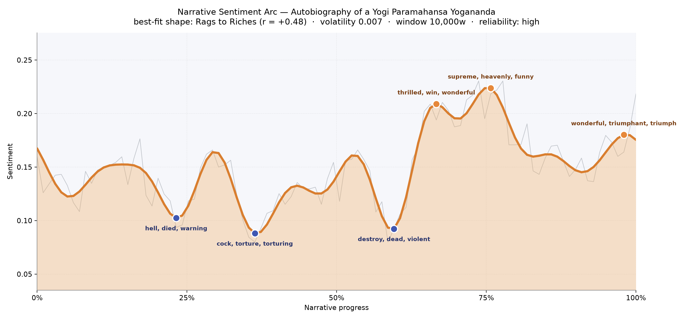
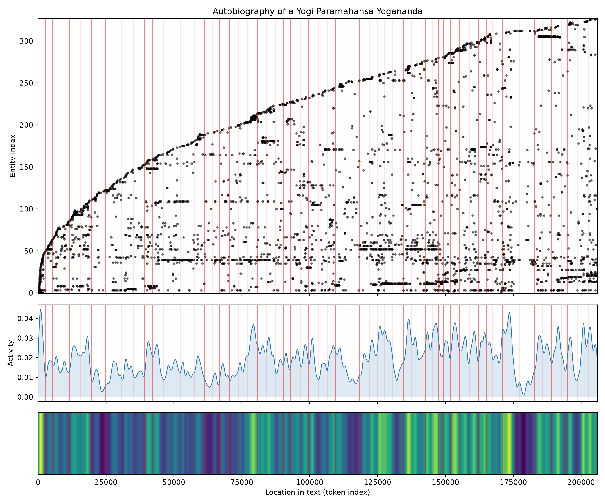
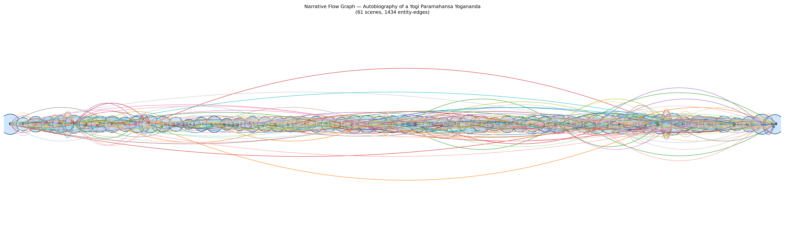

# Autobiography of a Yogi
### by Paramahansa Yogananda

157,139 words · a Rags to Riches shape — a life that begins in restless seeking and gradually opens into radiance.

## The shape of the story

Yogananda's memoir moves less like a plot and more like a slowly warming lamp. The reader begins somewhere in the middle of feeling — neither low nor exultant — and stays there, a steady, almost meditative hum, for a long time. The book's undercurrent is contentment, but early on it is contentment shadowed by grief and by the ordinary bruises of a boyhood colliding with mortality. The first real trough, near the one-quarter mark, feels like the loss of the author's mother and the boy's first confrontation with death — the passage is heavy with "hell, died, warning, ugly, slave, idiocy," a vocabulary of dread that a spiritual autobiographer rarely lingers over but that Yogananda names honestly. A second dip near the one-third mark carries the moral outrage of witnessed cruelty, thick with "cock, torture, torturing, evil, destroy, worst" — the young seeker recoiling from the world's appetite for pain. A third valley just before the arc turns is quieter but no less raw, murmuring "destroy, dead, violent, furious, hysterical, dying," as if the narrator must acknowledge one last shore of suffering before pushing off.

Then the light comes on. From about two-thirds through, the arc lifts into a sustained plateau of joy that never really breaks. The first peak sings with "thrilled, win, wonderful, awesome, brilliant, rejoicing" — the pupil's astonishment at what his teachers have shown him. The next crest is more numinous, dense with "supreme, heavenly, funny, rejoiced, miracle, rejoicing," the register of a man describing samadhi in the only words English will lend him. And the book closes on a genuine benediction, its final peak bright with "wonderful, triumphant, triumph, ecstatic, rejoicing, heavenly." The overall climb is gentle rather than steep; the arc barely trembles; this is a life told with equanimity, not melodrama, and the reader feels it that way.

<figure><figcaption>A patient, low-lying line that finds its rise late — the arithmetic of a soul finally at ease.</figcaption></figure>

## Who lives on the page

The most-named presence is not a person at all but a country: India, invoked more than two hundred times, the ground under every anecdote. Around it cluster the great teachers of Yogananda's lineage — Lahiri Mahasaya, his own guru Sri Yukteswar, and the mysterious deathless Babaji — the three names that recur like a mantra. His brother Ananta and his American disciple Wright come in as domestic and continental bookends. Places do much of the emotional work: Benares with its river-facing ghats, Ranchi where the school takes root, America where the mission travels. The tagging picks up Hindu, Indian, and Sanskrit as recurring registers of identity, and Gandhi appears often enough to signal the political air Yogananda breathed. A couple of items are noise — "chapter" is a header artifact rather than a figure — and Sri Yukteswar shows up twice because a possessive form was separated, a small quirk worth ignoring. What's striking is how few Western names dominate: this is a book whose social world is populated overwhelmingly by saints, and by the geographies that made them.

<figure><figcaption>New figures keep entering the book right to its final pages — a memoir that never stops meeting people.</figcaption></figure>

## The weave of scenes

Sixty-one scenes, and the weave they make is unusually even. Rather than tapering at the ends, the flow keeps a thick trunk of connections all the way through, with the busiest chambers falling roughly two-thirds of the way in — the chapters where Yogananda travels widely and gathers disciples — and a second dense cluster near the very end, where the American tour and the meeting with Gandhi bring the largest cast on stage at once. The graph reads less like a rising drama and more like a rosary: bead after bead of encounters, each with its own small circle of companions, threaded on the single cord of the narrator's presence. Long ligatures arc from early meetings to late ones, honoring how the same teachers keep returning across decades.

<figure><figcaption>A steady, braided flow — the visual signature of a life composed of returns rather than reversals.</figcaption></figure>

## What a reader takes away

You close the book calmer than you opened it. The memoir does not promise triumph — it enacts it, quietly, by refusing to raise its voice even when the miracles pile up. What lingers is the sense of a man who has met sorrow honestly, then decided to spend the rest of his pages praising what outlasts it.
