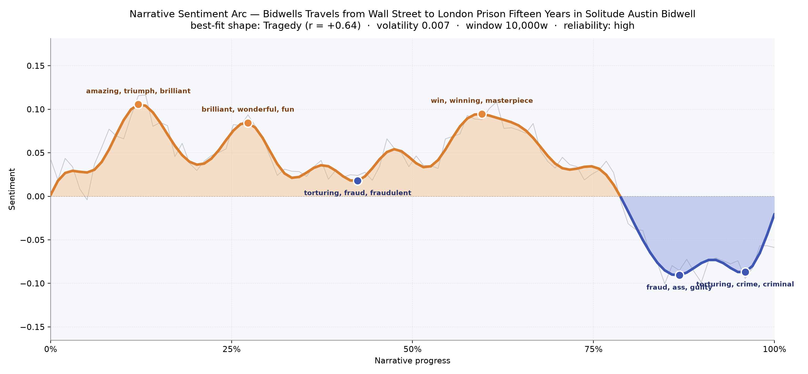
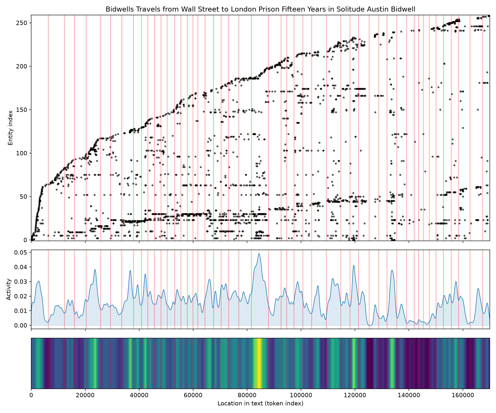
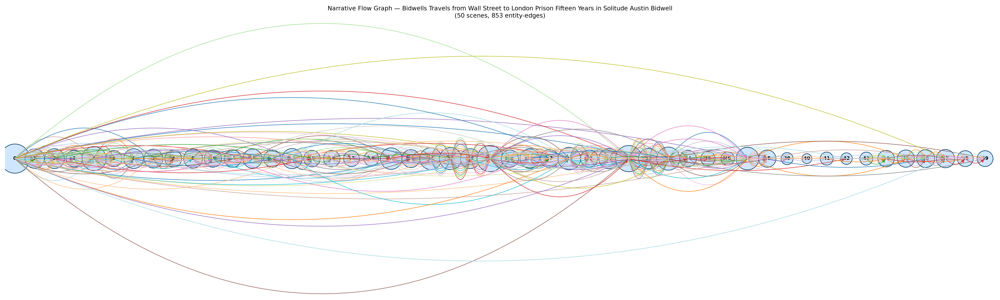

# Bidwell's Travels: From Wall Street to London Prison — Fifteen Years in Solitude
### by Austin Bidwell

138,211 words · a Tragedy arc — a life that glitters for a while, then slides irrevocably into iron and stone

## The shape of the story

Bidwell's memoir does not roar into disaster; it slips. The reader is buoyed, at first, by an almost boyish exuberance — the early stretch near the twelve-percent mark shines with "amazing, triumph, brilliant, terrific, wonderful, fantastic," the voice of a young sharp already convinced he has beaten the world. That confidence blooms again near a quarter of the way in, where "brilliant, wonderful, fun, nice, devoted, grateful" carry the flavour of good hotels, good friends, and a purse that never seems to empty. Even past the midpoint the swagger flares one last time, around the three-fifths mark, where "win, winning, masterpiece, fun, brilliant, fantastic" surface — the tone of a man admiring his own forged notes as if they were oil paintings.

But underneath the twinkle, the long diagonal of the tragic arc has been pulling downward the whole time. At the two-fifths mark, right where the con on the Bank of England begins to eat him, the mood turns bruised with "torturing, fraud, fraudulent, bankruptcy, deceived, madly." From there the descent is not violent so much as inevitable. The deepest trough, near the seven-eighths mark, is heavy with "fraud, ass, guilty, loss, crime, crimes" — a courtroom register, blunt and civic. The final valley, almost at the last page, closes on "torturing, crime, criminal, worse, criminals, victim," the vocabulary of a man writing from inside a cell about fifteen years of solitude. It is a very American shape: hustle, dazzle, fall.

<figure><figcaption>Three bright bells of self-congratulation, then a slow twilight into the language of guilt.</figcaption></figure>

## Who lives on the page

The book's true protagonist, by sheer weight of mention, is not a person at all but a city: London appears 174 times, more than any human figure, and behind it stand New York, Paris, England, America, Havana, and Europe. This is a memoir written with a passport in hand — the geography of the great forgery, tracked across steamer lanes and hotel foyers. Among the people, "Mac" (Bidwell's partner-in-crime George MacDonnell) dominates at 142 mentions, shadowed by George, James, and Irving — the Pinkerton detective who eventually ran him to ground. The Bank of England looms as an institution, quoted with the reverence and hatred a burglar reserves for the safe he cracked. "Nunn" and "Noyes" round out the confederates, the ring of accomplices that made the swindle possible. A few labels are noise — "American" tags a nationality more than a person — but the list, cleanly, is the cast of a real transatlantic caper: two forgers, one detective, and the capitals they moved between.

<figure><figcaption>A restless spatter of names and places from wharf to witness stand — London the thick vertical rope that runs the length of the book.</figcaption></figure>

## The weave of scenes

The scene weave is unmistakably front-loaded. The opening chapters bulge with faces — sixty-five presences in the first scene alone, then thickets of twenty to fifty as the young Bidwell circulates through Wall Street offices, Havana docks, and Parisian salons. Two great swellings sit around scenes twenty-five and thirty-two, the twin climaxes of the Bank of England fraud and its unraveling, each carrying more than fifty named presences threaded together. Then the braid thins, hard. By the last quarter the counts fall to single digits — one lone name in scene forty-one, four, five, seven — a visual portrait of a man losing his world. The final scenes tick back up to teens, but only slightly: the population of a prison memoir is small, and the graph knows it. What begins as a crowded procession ends as a monologue behind a door.

<figure><figcaption>A wide social fabric collapsing scene by scene into the narrow bead-string of solitary confinement.</figcaption></figure>

## What a reader takes away

You close Bidwell's book with the strange, doubled taste of a confession that half wants to boast. The dazzle is real — the champagne, the cleverness, the crossings — and so is the reckoning. What lingers is the arithmetic of it: fifteen years alone, paid out one silent hour at a time, for a few months of brilliance. It is a Tragedy told by a man who never quite stopped admiring the trick that ruined him.
