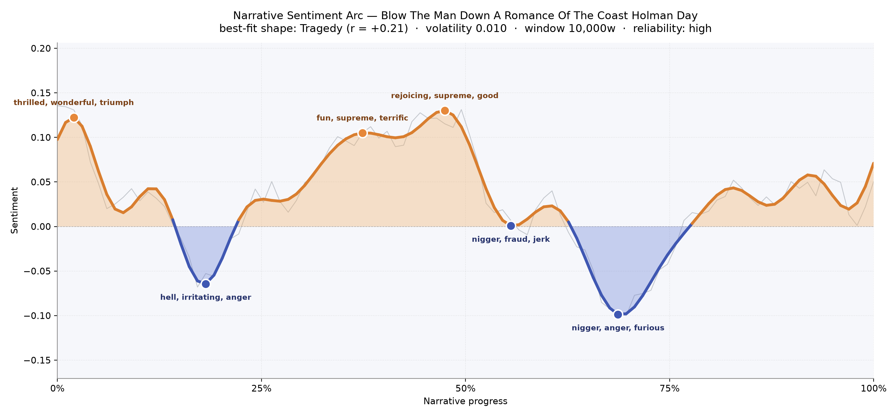
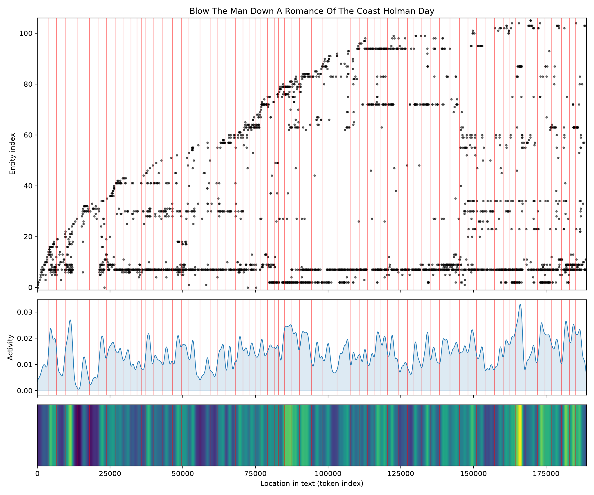

# Blow The Man Down: A Romance Of The Coast
### by Holman Day

142,314 words · a Tragedy arc — a coast-bright opening that the tide slowly darkens

## The shape of the story

Holman Day's sea-yarn starts on a rising swell and then, like a barometer before a nor'easter, quietly loses ground. The opening pages break with sunlight on brass — the earliest peak crests with "thrilled, wonderful, triumph, funny, win, fun" bobbing on the surface, the sort of buoyant chatter you get from a young mate who has not yet met his weather. But almost immediately the barometer drops. The first valley, near the one-fifth mark, is bruised with "hell, irritating, anger, violence, worry, awful" — a squall of temper that sets the moral compass for everything to come.

The middle stretch teases the reader with two more crests. Around the one-third mark the language brightens again with "fun, supreme, terrific, amazing, ecstatic, delight," and just past the halfway point a smaller lift arrives on "rejoicing, supreme, good, pleased, excellent." These feel like calm harbours between storms — the sort of interlude where a captain lets himself believe the worst is behind him. It isn't. The deep valley near the two-thirds mark is the book's true sounding-line, thick with "anger, furious, hysterical, violence, angry," and it drags the arc down toward a colder shore. A slur that reads brutally to modern ears also appears in these troughs, a fossil of the era's coastal vernacular that the reader must contend with honestly.

The best-fitting shape here is a Tragedy — a long, patient descent from early promise. The match is modest, so it is less a plunging cliff than a tide going out mile by mile. The reading is judged reliable, which lends the shape its quiet authority.

<figure><figcaption>Three sunlit crests, three darker troughs, and a long ebb toward the horizon.</figcaption></figure>

## Who lives on the page

The book belongs, resoundingly, to Mayo — his name rings out 891 times, more than three times as often as anyone else's. He is the mast around which the rigging is strung. Around him gathers a working crew of coastal figures: Fogg, Marston (and the more formal Julius Marston, clearly the same man in Sunday clothes), Bradish, Downs, Wass, Burkett, Rowley, and Speed — a chorus of Yankee surnames that could have been lifted from any Down East wharf ledger.

Captain Candage, though the counting labelled him as an organisation, is plainly a man — a skipper whose title confused the machinery. Olenia and Conomo, similarly, sound like schooners or coastal towns pressed into service as if they were people; Maquoit reads as a Maine place-name rather than a group. That drift between vessel, harbour, and human is entirely appropriate to a sea-story, where a boat is often the strongest character in the room. Montana is more likely a nickname or a horse than a state visitor.

<figure><figcaption>Mayo's line runs the length of the deck; the crew signs on in staggered watches.</figcaption></figure>

## The weave of scenes

Across sixty-five scenes and more than six hundred connective threads, the story reads like a long coastal voyage broken into legs. The scene-populations swell and thin like a tide table: some chapters carry fifteen to twenty named presences shoulder-to-shoulder, others narrow to four or five for an intimate cabin conversation. The densest passages sit near the final quarter — twenty-three figures crowding a late scene, then twenty-three again at the very close — which suggests a broad ensemble muster before the last horn blows. The long arcing lines that leap across the graph are Mayo and one or two co-stars carrying continuity across leagues, while the smaller local knots handle the port-of-call business.

<figure><figcaption>A long shoreline of scenes, with a few figures arching over the whole voyage like gulls.</figcaption></figure>

## What a reader takes away

What lingers is the smell of tar and the sound of a temper barely kept. Day gives you the bright coastal morning of a young man's ambition and then, honestly, the weather that follows: the arguments, the frauds, the furies, the dull ache of a livelihood wrung from salt water. The book's inheritance is that particular New England stoicism — that a life at sea is mostly ebbing, and that the reader, like Mayo, learns to stand steady while the deck tilts.
