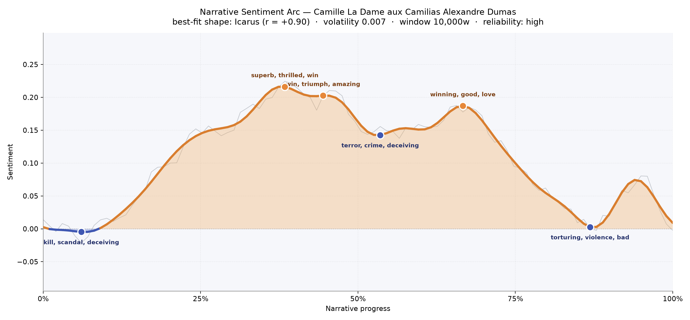
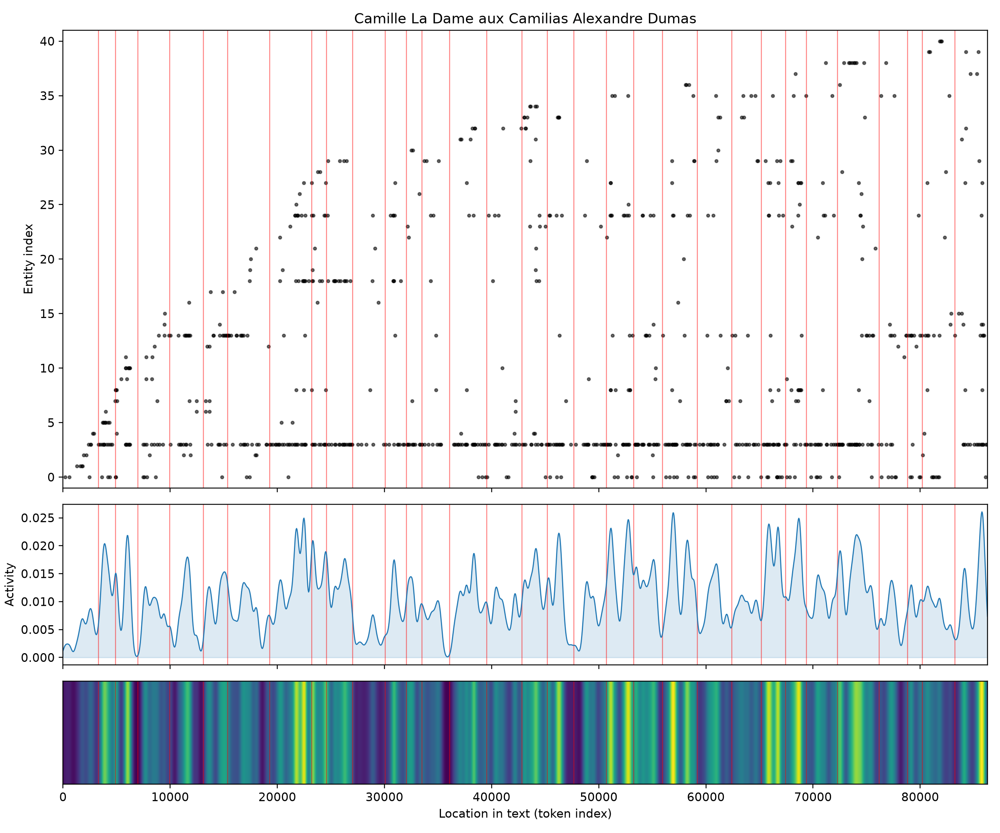
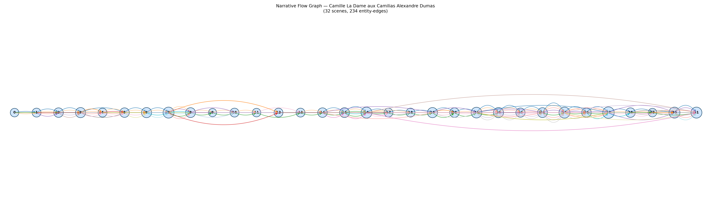

# Camille: La Dame aux Camélias
### by Alexandre Dumas fils

roughly 67,000 words · an Icarus arc — a rise into radiance that cannot hold its altitude

## The shape of the story

Dumas begins in shadow. The very opening carries a chill of "kill, scandal, deceiving, die, dead, died" — an auction, a grave, a woman already lost before we meet her — and only after that mortuary hush does the book climb. The rise is patient. By the middle third the arc lifts to its brightest point, and Marguerite's country idyll with Armand glows with "superb, thrilled, win, triumph, amazing, miracle," a happiness so unguarded it feels borrowed. That brightness lingers into a second peak flushed with "win, triumph, amazing, miracle, great, good," as though the lovers have almost persuaded fate to look elsewhere.

Then the altitude fails. A softer valley near the middle bruises with "terror, crime, deceiving, scandal, betrayed, destroyed" — the exact moment the world of fathers and reputations reaches into the garden. There is a brief recovery, a last look upward around the two-thirds mark that still remembers "winning, good, love, happiness, succeeded, best," but it is the light of a candle already tilting. By the closing stretch the arc sinks again into "torturing, violence, bad, madly, deceiving, dead," and the book ends where it began, in the cold. It is an Icarus story in the truest sense: not a plunge into hell but a slow, tender descent from a height that was never sustainable — a woman who reaches for ordinary love and is punished, exquisitely, for the reach.

<figure><figcaption>The rise is modest, the fall inevitable — happiness sits like a single sunlit terrace between two winters.</figcaption></figure>

## Who lives on the page

Marguerite owns the book. Her name appears nearly four hundred times, almost five times more often than Armand's, and the imbalance is the novel's real thesis: this is her passion, her sacrifice, her death, told through a man who can only orbit her memory. Armand narrates but does not dominate; Paris, the second most frequent presence, functions almost as a character too — the city whose salons, opera boxes, and gossip mills manufacture Marguerite's fame and then, with the same hand, destroy her. Prudence Duvernoy hovers as the pragmatic go-between, Gaston as the light companion, Nanine as the loyal maid, and Olympe as the rival whose cruelty sharpens the final act. The tagging occasionally stumbles — "Prudence" and "Gaston" appear as places rather than people, and "mme" and "mlle" are honorifics stripped of their surnames — but the human roster underneath is unmistakably a Parisian demi-monde: a courtesan, her lover, her friends, her creditors, and the country villages (Bougival, Bagnères) where she tries, briefly, to become someone else.

<figure><figcaption>Presences thicken toward the second half, when illness and reckoning draw the whole cast around a single bedside.</figcaption></figure>

## The weave of scenes

Thirty-two scenes lie along a single spine, connected by two hundred and thirty-four threads of recurring figures. The early scenes are lean — five or six presences each — as Armand approaches the story through the auction and its aftermath. The middle broadens: the country retreat, Marguerite's household, the intrusions of Armand's father, the return to Paris. By scenes twenty-two through thirty-one the graph thickens dramatically, cresting at fifteen presences in a single scene near the climax, as debts, letters, rivals, servants, and doctors all converge on Marguerite's shrinking room. The long braided arcs stretching across the entire graph — threads that touch the first chapters and the last — belong to Marguerite and Armand themselves, the two names that hold the book together from auction block to deathbed.

<figure><figcaption>A single horizontal line of scenes, sparse at the ends and densely braided at the close, like a life crowded most at its dying.</figcaption></figure>

## What a reader takes away

Camille leaves the taste of camellias and cold ash. It is a book about the exorbitant price of respectability, paid by the person least able to afford it, and about how a love that briefly rewrites a life cannot, in the end, rewrite the world around it. You close the last page understanding why Marguerite forgives everyone — and why we, more than a century later, still refuse to.
