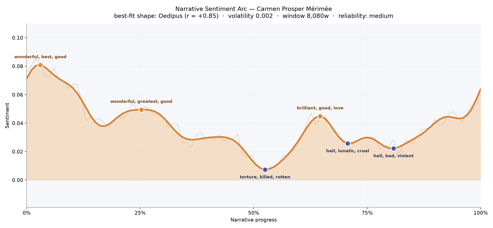
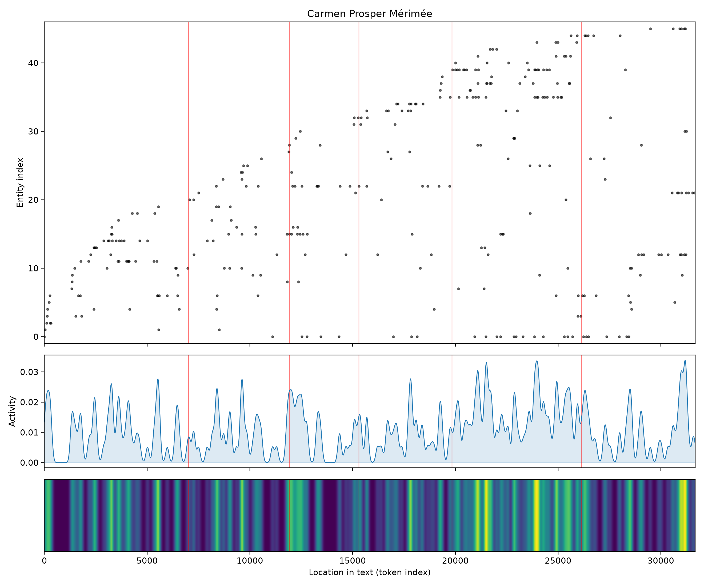
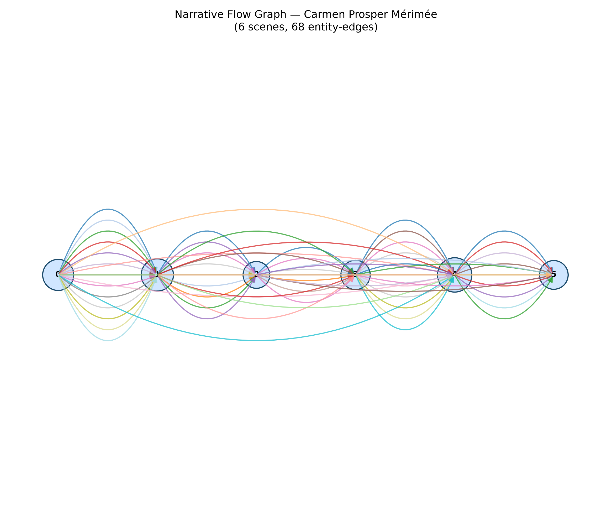

# Carmen
### by Prosper Mérimée

roughly 24,500 words — an Oedipus arc, a life briefly lifted before it is undone.

## The shape of the story

Carmen begins in bright weather. The first stretch of the book reads like a traveler's warm dispatch, buoyant with "wonderful, best, good, delightful, splendid, great," as if the narrator has come south to enjoy himself and finds the countryside obliging. That brightness lingers into the second peak near the quarter mark, again glowing with "wonderful, greatest, good, great, charm, astound" — the register of first meetings and first infatuations, the tone of a man who does not yet know he is doomed.

Then the light bends. Past the midpoint the arc slips into its long descent, and the reader feels the temperature drop even before the language names it. The first valley, near the halfway line, is bruised with "torture, killed, rotten, mad, evil, lost." A brief flare of "brilliant, good, love, merry" flickers around two-thirds through, the kind of stolen happiness that belongs to lovers on the run, and then the floor gives way for good: the trough at seventy percent burns with "hell, lunatic, cruel, killed, dead, slave," and the final descent past eighty percent is furnace-hot with "hell, bad, violent, angry, jerk, terrible." This is the Oedipus curve in its purest emotional form — not a plunge into a hole from which one climbs back out, but a life raised only so the fall has further to travel. The smoothed line itself is subtle, hovering close to neutral throughout; that flatness is worth naming. Carmen is a short book with a narrator who keeps his composure even as everything around him burns, so the arc is impressionistic rather than definitive, more a felt gravity than a shout.

<figure><figcaption>A warm opening, a slow tilt, and a valley of hell-words toward the end — the classical shape of a fall.</figcaption></figure>

## Who lives on the page

Carmen herself dominates the roll call, named more than anyone else, and rightly — she is the gravitational body around whom everyone else drifts. Don Jose, the Basque soldier who ruins himself for her, appears often but more quietly, as if the book is watching him watch her. Garcia, her brutal husband, and El Dancaire, the smugglers' chief, crowd into the middle chapters where the plot thickens into contraband and knives. The list is thick with places as much as people: Seville, Cordova, Gibraltar, Spain, Andalusia — the geography of the story is almost a character in itself, a hot dry stage on which the drama plays. The labels "Spanish," "Basque," "Andalusian," and "Romany" tell you exactly what tensions the novella is built on: nation, tribe, and the wandering people to whom Carmen belongs. A couple of tags read oddly — "Calle del Candilejo," a Sevillian street, gets flagged as a person, and "Romany" appears as a name rather than a people. That is the ordinary noise of automatic reading; the human eye restores them to street and folk without trouble.

<figure><figcaption>Presences thicken through the middle chapters, then thin as the cast narrows to two.</figcaption></figure>

## The weave of scenes

Six scenes, sixty-eight threads. The flow graph shows a story that never lets its cast disperse: nearly every figure who appears early is still touching the story late, the coloured filaments arcing all the way from the opening scene to the final one. The densest node sits fourth from the left — the smugglers' interlude, the crowded middle where Carmen, Don Jose, Garcia, and the whole caravan of thieves share the page. The last scene narrows sharply, fewer presences, tighter braid: the book is closing its fist. Read as a score, the weave says this is a chamber tragedy dressed up as an adventure — small cast, tight recurrences, an ending that pulls every thread to a single point.

<figure><figcaption>Six scenes, densely braided; the middle swells with smugglers, the end contracts to two.</figcaption></figure>

## What a reader takes away

Carmen leaves you with the particular ache of a story you knew was going to end badly and read anyway. Mérimée gives you sunlight, dust, tobacco smoke, a woman who refuses to be owned, and a man too honest to survive her — and then closes the door softly on the whole ruined thing. What you carry away is not the violence but the calm of the telling: the sense that freedom, in this book, costs exactly one life, and Carmen pays it without flinching.
