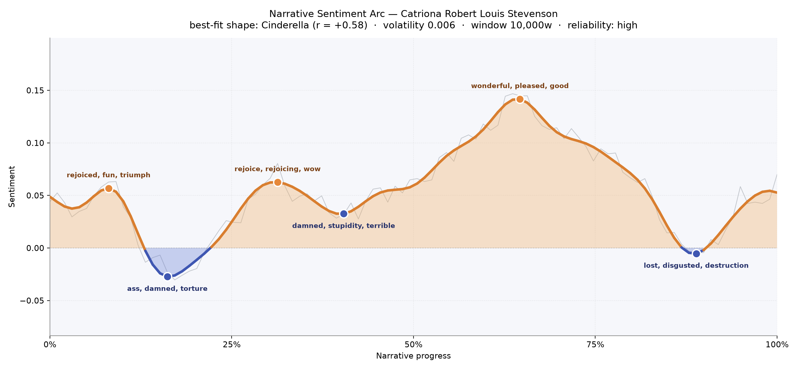
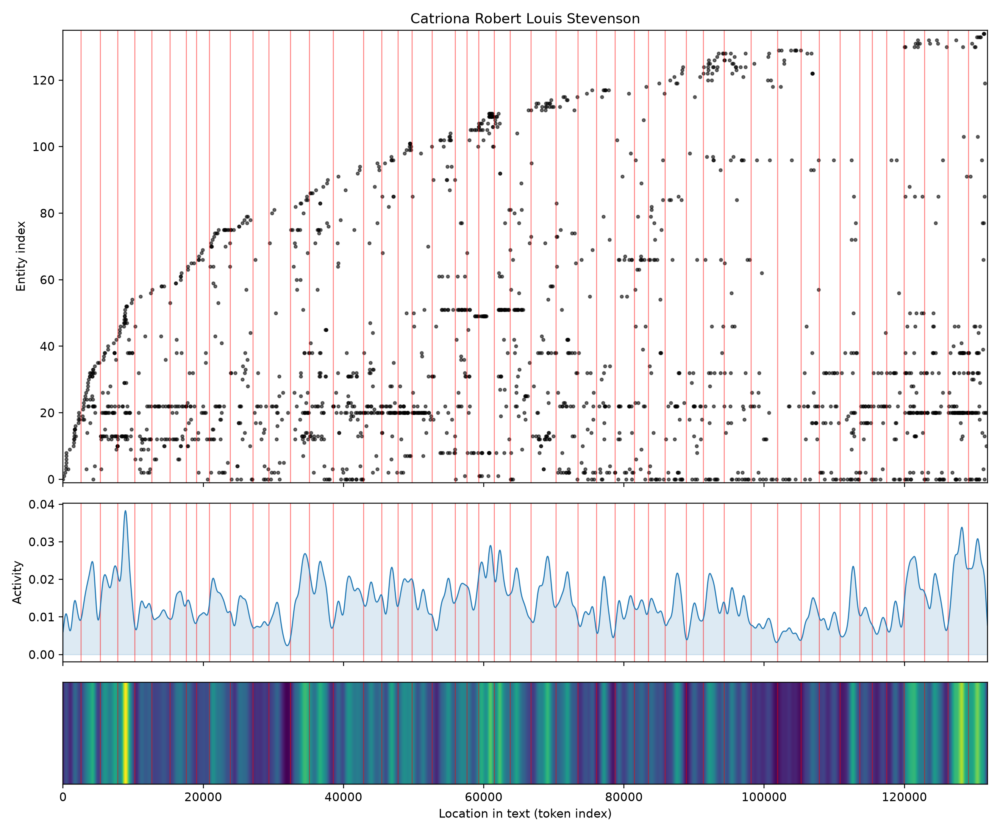
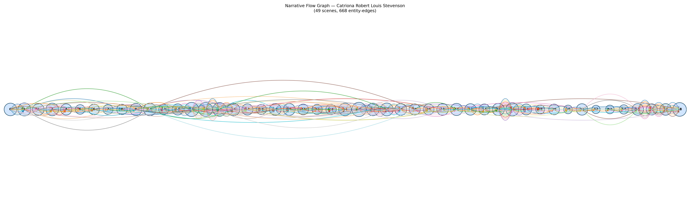

# Catriona
### by Robert Louis Stevenson

A 102,697-word Jacobite romance whose arc climbs and dips like a Cinderella tale — hard-won gladness earned through peril, then softened by an autumnal ache near the end.

## The shape of the story

Stevenson's sequel to *Kidnapped* moves the way a young man learns to love while a hanging looms in the next parish: cautiously, with joy that keeps flinching. The overall curve rises from a hopeful opening through a long middle of dread to a bright, sustained crest near the two-thirds mark, then softens toward a wistful close. It is, in feeling, a Cinderella pattern — deprivation and misjudgment giving way to a hard-earned brightness — though the fairy-tale simile only half fits a book so preoccupied with the gallows and the honour of witnesses.

The earliest peak, near the opening, is bright with "rejoiced, fun, triumph, lucky, great, blessing" — the small elation of a boy just released from the Bass Rock and freshly in love with his own courage. That flush is almost immediately answered by the first valley, which bruises with "ass, damned, torture, dying, criminal, worst" as David Balfour circles the trial of James of the Glens and feels the machinery of Scots law closing on an innocent man. A second uplift a third of the way in — "rejoice, rejoicing, wow, good, mirthful, mirth" — is undercut by a trough thick with "damned, stupidity, terrible, deadly, liars, die" as betrayal, exile and false friendship cluster around James More. The tallest crest, near the two-thirds mark, breathes "wonderful, pleased, good, best, merry, beautiful" — the Leyden interlude, the domestic idyll where Catriona and David finally share a hearth. The final valley, near the close, is a quieter grief tinged with "lost, disgusted, destruction, warning, damaged, violence" — not catastrophe but the melancholy of adulthood arriving.

<figure><figcaption>A shallow, steady rise punctuated by four small storms — a Cinderella curve read at whisper-volume.</figcaption></figure>

## Who lives on the page

The book belongs, unsurprisingly, to Alan Breck Stewart, whose name flares 202 times — the reckless Jacobite friend whose loyalty stitches the whole plot. Catriona Drummond herself is close behind, along with her impossible father James More and the shifting figures of the Stewart clan — David Balfour, Andie the jailer on the Bass, Neil the gillie, and Prestongrange (indexed here simply as "Grant"). Scotland and the Highland glower in the background like weather. A few entries deserve a shrug: "i." is a chapter-numbering artefact rather than a person, and the parser has miscategorised Catriona as an organisation rather than the tender heroine she plainly is — a small misfiling that says nothing about her presence, which is the emotional gravity of the second half.

<figure><figcaption>Alan and Catriona dominate the vertical bands; activity thickens around the courtroom and the Leyden stretch.</figcaption></figure>

## The weave of scenes

The scene-graph reads like a long, uneven necklace with a heavy clasp at either end. The opening chapters (twenty-plus figures per scene) are crowded — Edinburgh lawyers, Highland witnesses, jailers, spies — as David tries to save James of the Glens. A quiet middle thins the strands to just Alan, David and Catriona, then swells again around scenes fourteen through sixteen, where the density spikes into the twenties as the Bass Rock episode and the abduction pull every player back onto the board. The Dutch chapters run leaner and more intimate, before the final scenes fatten again with reconciliations. Braided threads — Alan's line, Catriona's line, James More's treacherous line — cross and recross rather than run parallel, which is exactly how the novel feels: a courtship shadowed by conspiracy, each scene forcing the lovers to renegotiate trust.

<figure><figcaption>A long horizontal chain — dense at the trial, thin through exile, dense again at the reunion.</figcaption></figure>

## What a reader takes away

*Catriona* leaves the reader with something rarer than adventure's usual afterglow: the quiet pride of a young man who has learned that honour is mostly small, awkward decisions made in bad light. Stevenson gives us peril, yes, and a Highland girl worth crossing seas for — but the book's real inheritance is the gentle certainty that love is earned by refusing, in specific rooms and on specific nights, to lie.
