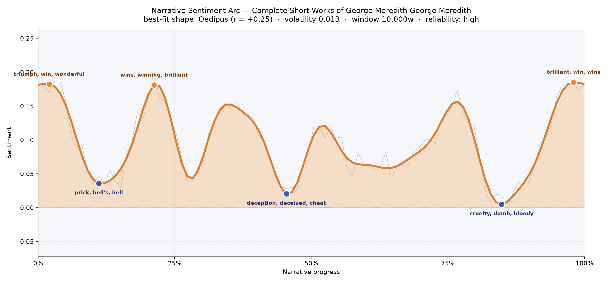
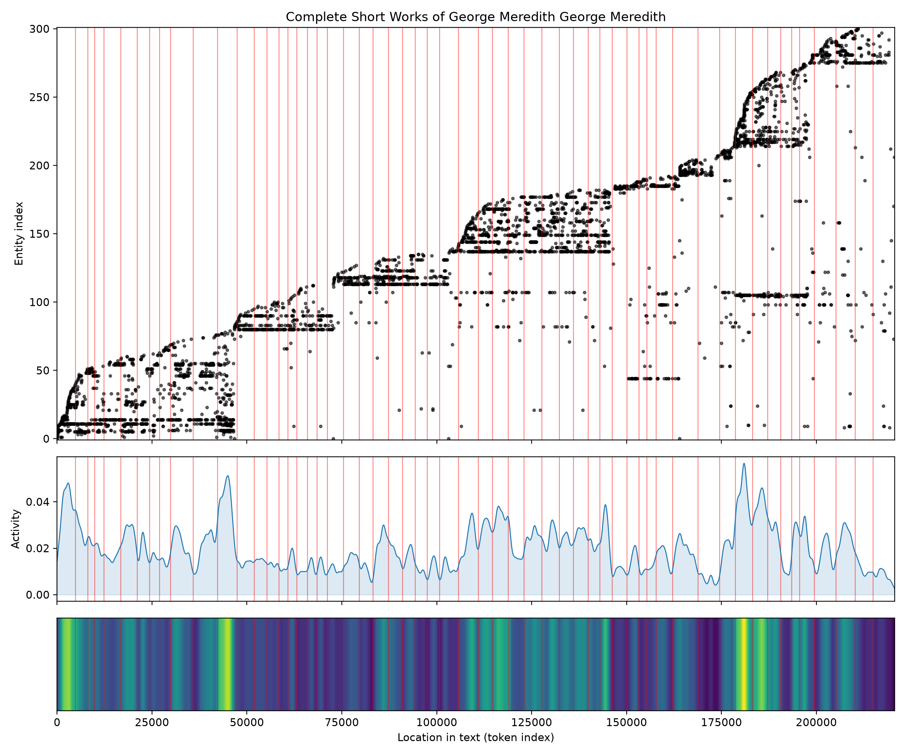
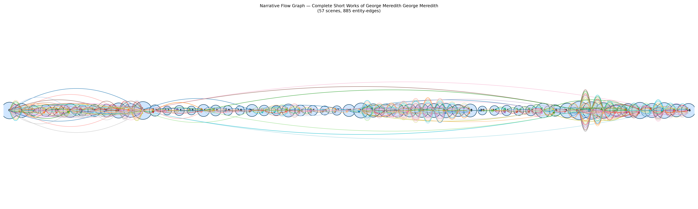

# Complete Short Works of George Meredith
### by George Meredith

172,433 words · an Oedipus arc — a life lifted only to be undone, then quietly forgiven at the last

## The shape of the story

Read as one long tapestry, Meredith's collected short works trace the oldest curve of tragic feeling — a temperament that begins bright, believes in itself, and is gradually shorn of that belief before some late, unhoped-for grace steals back in. The opening pages sound almost like a wedding toast, their crest bright with "triumph, win, wonderful, wins, good"; a hundred pages later Meredith has already turned the light down, the first valley pricking at the reader with "prick, hell's, hell, ungrateful, worse, harassed", the sting of small humiliations before larger sorrows arrive. Near the middle, at the deception valley, the language darkens further into "deception, deceived, cheat, terrible, destruction" — the moral bruise of a Meredith story, where a lie is worse than a wound. The book's lowest point sits three-quarters of the way through, sunk almost to zero and thick with "cruelty, dumb, bloody, terrible, lost, killed", the sound of the axe finally falling on someone we've watched too long to lose easily. And then, at the very end, the arc lifts — "brilliant, win, wins, rejoicing, fun, heavenly" — not to erase the dark stretch, but to remind us that Meredith was, above everything, a comic writer who believed the world could still surprise a bruised heart. The high reliability of this arc, drawn from so many pages, gives the shape unusual weight: this really is how Meredith felt about his people.

<figure><figcaption>An Oedipus curve softened by comic reprieves — the fall is real, the ending forgiving.</figcaption></figure>

## Who lives on the page

Because this is a collected edition, no single hero rules; instead the page is crowded with the recurring names of Meredith's separate tales. Tinman leads, doggedly present, followed closely by Margarita, Farina, and Chloe — a quartet of the poet-novelist's beloved slightly-comic protagonists, each carrying a story on their shoulders. Camper, Beamish, Pollingray, Fellingham, and young Guy fill out the middle ranks, all with that faintly ridiculous Meredithian music to their names. Crickledon appears as a place-presence rather than a person, the coastal village that anchors "The House on the Beach"; Italian arrives as a national temperament rather than a character. Van Diemen, Gottlieb, Werner and Elizabeth round out the cast, hinting at the German and cross-Channel settings Meredith loved. Nothing here is noise — this list reads like the roll-call of a small, faintly eccentric traveling theatre company, exactly the register of Meredith's shorter fiction.

<figure><figcaption>A staircase of arrivals — each new story ushering in a fresh set of names, the old ones dropping quietly away.</figcaption></figure>

## The weave of scenes

The narrative flow map shows this shape beautifully: not one continuous braid but a long chain of loosely joined bulbs, fifty-seven scenes strung end-to-end like beads on a string. Density gathers unevenly — a fat cluster near the two-thirds mark where one of the longer novellas thickens with figures, and thinner passages between, where a briefer tale breathes with only its handful of speakers. The staircase pattern of the character map confirms it: Meredith isn't developing one plot but stacking many, each story climbing into its own vertical stripe of new presences before yielding the stage. The result reads less like a novel and more like a well-curated evening of chamber pieces — separate keys, one composer's hand.

<figure><figcaption>Beads on a thread — each swelling a self-contained tale, the whole collection loosely stitched by a single sensibility.</figcaption></figure>

## What a reader takes away

What you carry away from Meredith's shorter works is a peculiar mixture of ache and mischief — a sense that people are absurd and worth loving anyway, that vanity gets punished but rarely destroyed, and that the deepest wound is not death but the discovery of one's own foolishness. He fills the last page with light because he cannot help it; he is that kind of writer. You close the book smiling, but slowly.
