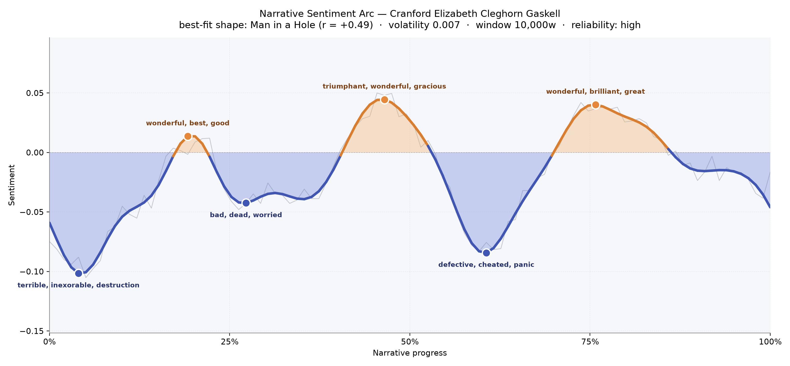
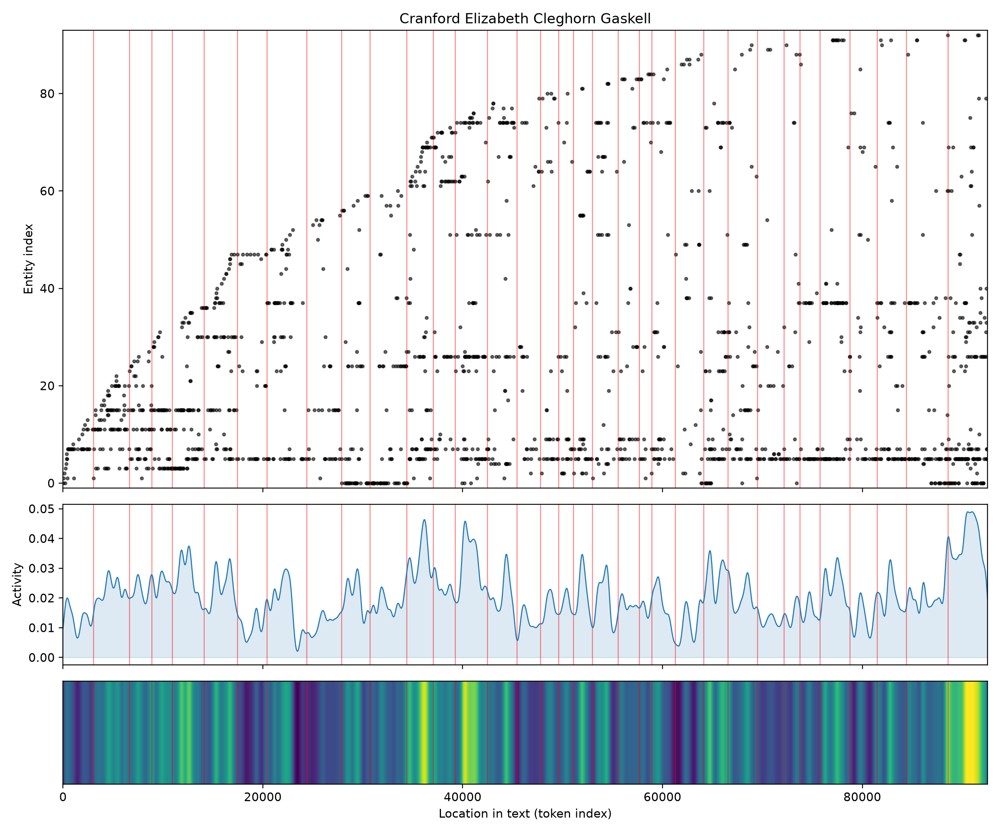
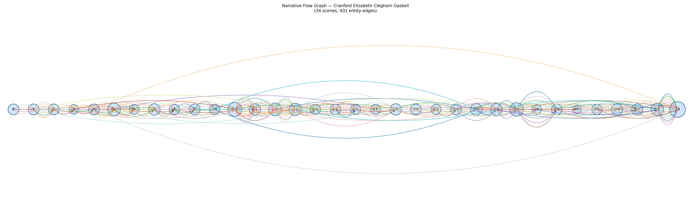

# Cranford
### by Elizabeth Cleghorn Gaskell

roughly 72,900 words · a Man-in-a-Hole arc — a small town that stumbles, grieves, and climbs back into its own warm parlour light

## The shape of the story

Cranford does not shout its griefs; it sets them down beside the tea things. The felt shape of Gaskell's little book is the shape of a village learning, again and again, that misfortune can be borne with lace mittens on. The arc opens under a soft cloud — the earliest valley bruises with "terrible, inexorable, destruction, lost, bad, terror," the vocabulary of a first bereavement that steadies the tone for everything after. From that hush the story lifts into its first small brightening at the one-fifth mark, where the parlour glows with "wonderful, best, good, excited, love, perfection" — the pleasure of card parties, of a green turban worn defiantly, of the ladies making a fortress of good manners.

A second dip in the first third sits low with "bad, dead, worried, loss, terribly, destroying," the register of loss recalled rather than loss endured. Near the middle, Cranford's warmest peak arrives, thick with "triumphant, wonderful, gracious, good, happy, pleased" — Gaskell's gentle comedy at its most self-satisfied, all bows and visiting cards. Then the deepest trough of the second half falls close to the three-fifths mark, saturated with "defective, cheated, panic, dead, despair, bad": the bank failure, the sudden hollowing of Miss Matty's small fortune. The recovery peak that follows — "wonderful, brilliant, great, happy, glad, good" — is the book's quiet miracle, the tea-shop, the returned brother, the community stitching itself back together. It is not a story that soars; it is a story that dusts itself off.

<figure><figcaption>A shallow, patient curve: sorrow visits, sits down, and is eventually shown out.</figcaption></figure>

## Who lives on the page

Matty presides over this book as no other character does — her name recurs more than three hundred and seventy times, a quiet gravitational centre around whom every visit, every crisis, every kindness orbits. Cranford itself, the little town, is the second most-named presence, which feels exactly right for a novel whose true protagonist is a place. Peter, the wandering brother, and Deborah, the elder sister who dies early but whose voice keeps returning as remembered decree, share the Jenkyns household with her. Around them cluster the small aristocracy of the drawing rooms: Mrs Jamieson with her lofty airs, Lady Glenmire who marries beneath herself and is forgiven, Miss Pole the news-carrier, Mrs Forrester of the pocket-handkerchief economies, and the doomed Captain Brown with his daughter Jessie. Martha, the loyal servant, and the surgeon Mr Hoggins round out a company that is almost entirely female, elderly, and unshakeably particular about propriety. The surname "Matilda" appears as a formal echo of Matty herself — the same woman in her Sunday name.

<figure><figcaption>A steady procession of the same few names — a village as chorus, not crowd.</figcaption></figure>

## The weave of scenes

Read as a visual score, the thirty-four scenes lie almost in a single flat line, like a row of houses on one long street. The circles swell where the crises arrive — the scene of twenty-seven presences near the middle, and the final scene bulging with thirty-seven, gathering nearly everyone for the closing reconciliations. Between those swellings, the community braids and rebraids itself: the same figures pass in and out of parlours, so the connecting threads arc high above and below the line like ribbons tying visit to visit. There is no great climactic knot, only a long, patient weaving. The thin patches — a scene of six, another of nine — feel like the quiet chapters where Miss Matty is alone with her memories or her account-book.

<figure><figcaption>A ribbon of visits: the same hands passing the same teacups, thirty-four times over.</figcaption></figure>

## What a reader takes away

Cranford leaves you with the strange, durable comfort of having been let into a room where women who own very little decide, together, to behave as though they own enough. It is a book about the dignity of small economies and the generosity that hides inside strict manners. You close it feeling that gentleness is a form of courage, and that a community, kindly kept, is its own quiet fortune.
