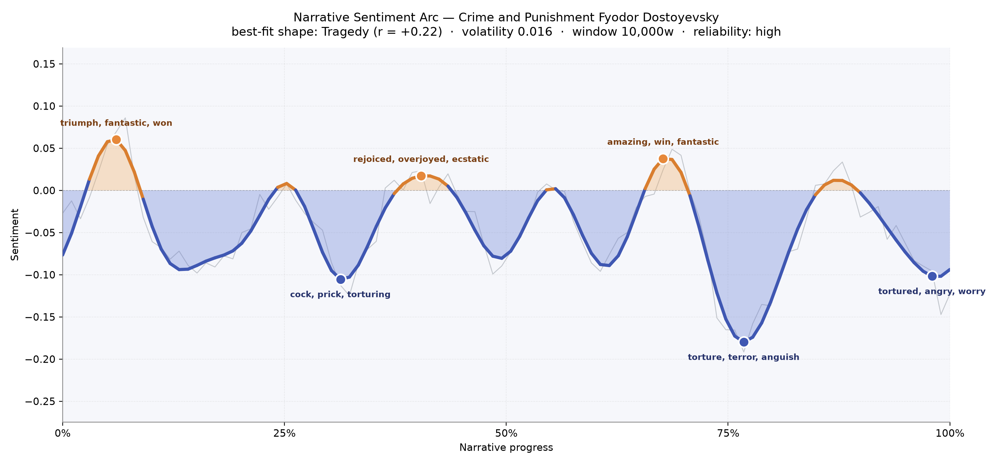
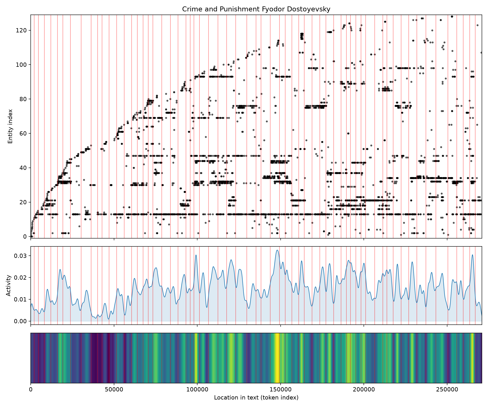
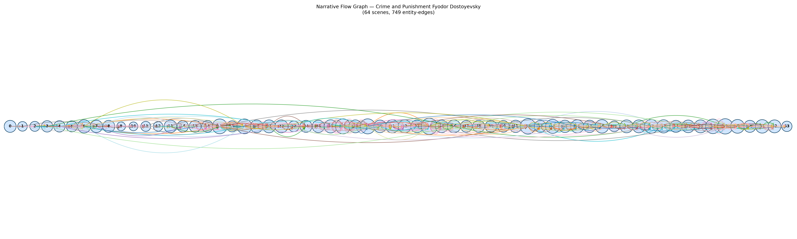

# Crime and Punishment
### by Fyodor Dostoyevsky

208,782 words · a Tragedy arc — a fevered life sliding, by degrees, from small triumphs into the long dark of conscience

## The shape of the story

Read as a felt experience, Dostoyevsky's novel has the physics of a slow collapse. The book opens on a small crest — the early pages carry a shiver of "triumph, fantastic, won, amused, excited" as Raskolnikov flatters himself with a private theory and the giddy conviction that he can step outside ordinary law. That elation is thin ice. By the one-third mark the floor gives way, and the trough that follows is thick with "cock, prick, torturing, torture, hell, dead" — the vocabulary of a man discovering that the deed he thought clean has infected his blood and his sleep.

The middle offers a false convalescence. Around the two-fifths point the arc lifts on the language of family reunion — "rejoiced, overjoyed, ecstatic, won, devoted, delighted" — as his mother and sister arrive, as Razumihin buoys him, as Sonia's steady tenderness begins to work. A second crest at roughly two-thirds gathers "amazing, win, fantastic, rejoice, great, joy," the sound of a soul reaching after grace it isn't sure it deserves. But the deepest valley of the book waits just beyond it, near the three-quarters mark, bruised black with "torture, terror, anguish, hysterical, vile, terrified" — the Svidrigaïlov chapters and the confession's approach. Even the closing pages refuse tidy consolation, ending on "tortured, angry, worry, anguish, disgust, anger," a redemption earned only through more suffering. The volatility is low, which suits the book: this is not a story that lurches so much as it presses down, steady as a thumb on a bruise. The reading is high-reliability, and the long downward line the arc traces is unmistakable.

<figure><figcaption>A quiet, insistent descent: three small crests of hope, three deeper troughs of dread, and a final page that still aches.</figcaption></figure>

## Who lives on the page

Raskolnikov towers over every other figure — his name appears more than twice as often as anyone else's, and the book feels like a chamber built around his skull. Circling him are the two women who stand for his two possible fates: Sonia, patient and luminous, and Dounia, his sister (who also appears under her formal name Avdotya Romanovna further down the list — the counter has read one person as two). Svidrigaïlov looms as the shadow-self, the man who has followed Raskolnikov's theory to its coldest conclusion. Razumihin is the warm rebuke to it, Porfiry Petrovitch (listed twice, once by surname alone) the patient inquisitor who lets Raskolnikov convict himself. Katerina Ivanovna, Pyotr Petrovitch Luzhin, Pulcheria Alexandrovna, Nastasya, Zossimov, Rodya (Raskolnikov's own diminutive, misread as a separate presence) — the whole Petersburg household is here. The tagging occasionally stumbles on Russian patronymics and nicknames, splitting one person into several, but the human weight of the cast comes through cleanly.

<figure><figcaption>A crowded roll call anchored by a single obsessive consciousness; activity thickens through the middle and late sections where confession and pursuit tighten.</figcaption></figure>

## The weave of scenes

Sixty-four scenes stretch across the novel like the beads of a rosary, and the connective threads between them multiply as the book advances. The opening chapters are lean — small rooms, few faces — but from roughly the seventh scene onward the counts swell into the teens and twenties, and one late scene gathers twenty-eight named presences at once. The densest tangles cluster around the middle-to-late acts, exactly where Porfiry's interviews, the funeral dinner, Luzhin's downfall and Svidrigaïlov's schemes overlap. Threads don't run in tidy parallels here; they braid, cross, double back. Raskolnikov keeps colliding with the same handful of people in rooms he cannot escape, and the graph's crowded middle catches that suffocating recurrence.

<figure><figcaption>A long, braided rope of scenes — sparse at the ends, densest through the middle where every face seems to know his secret.</figcaption></figure>

## What a reader takes away

You close the book carrying a heaviness that isn't quite grief and isn't quite hope. Dostoyevsky lets you feel how conscience keeps its own weather, how a single act can bend every subsequent room out of shape, and how love — patient, unglamorous, kneeling — is the only thing that meets that weather without flinching. The arc goes down; the reader, somehow, comes out clearer.
