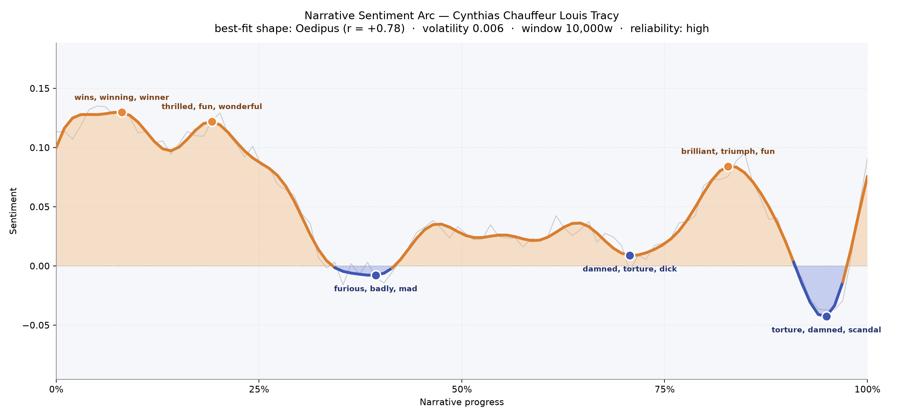
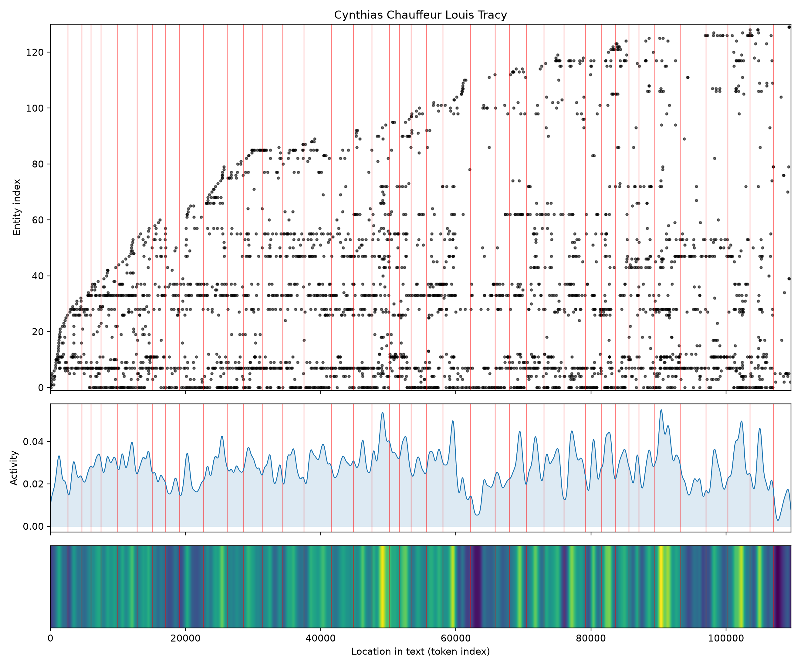
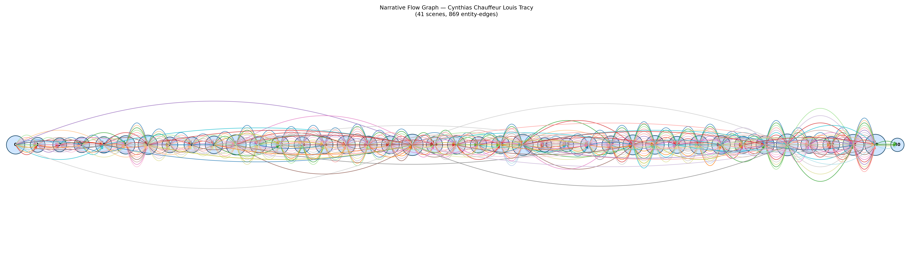

# Cynthia's Chauffeur
### by Louis Tracy

Roughly 84,000 words of Edwardian motoring romance — an Oedipus arc, a life lifted early and quietly undone at the close.

## The shape of the story

Read as a felt experience, this book begins in sunshine and ends in a bruise. The first quarter runs on the giddy exhilaration of a summer tour: the earliest crest reads brightly of "wins, winning, winner, funny, win, triumph," as if every mile of road were a wager cheerfully collected. A second crest not long after glitters even harder, thick with "thrilled, fun, wonderful, miracle, brilliant, amazing" — the sound of a young woman falling in love with the countryside, the car, and, though she does not yet know it, the man at the wheel. Then, near the two-fifths mark, the road turns. The first valley darkens with "furious, badly, mad, dumb, anger, hate," a lover's-quarrel weather that never quite clears. There is a brief, gallant recovery late on — a burst of "brilliant, triumph, fun, amazing, delightfully, good" around the four-fifths mark — but the very last dip, at the ninety-fifth percentile of the story, sinks into "torture, damned, scandal, foul, anger, ridiculous," a scandal-shadowed hush before the curtain. The best-matching contour is Oedipal in temperament: not violent tragedy, but a life raised on high spirits and quietly humbled by the world's small cruelties. The signal is trustworthy — a long book, smoothly modulated, with low volatility — so the mood you feel is the mood the book actually keeps.

<figure><figcaption>A bright opening dims into a scandal-tinted close — the Oedipus curve of a charmed drive that meets the world.</figcaption></figure>

## Who lives on the page

Two names dominate almost in a dead heat: Medenham, the titular chauffeur (in truth a well-born gentleman in disguise), appears almost four hundred times; Cynthia, the American heiress he drives, is barely a step behind. That near-parity is itself the plot — the whole romance turns on whether these two can meet as equals despite the uniform between them. Circling this pair is a small ensemble of watchers and rivals: Devar the shrewd companion, Vanrenen the protective father, the smooth Frenchman Marigny, and Fitzroy hovering at the edges. Simmonds and the Earl fill the corners. The map also throws up honest place-names — London, Bristol, Hereford — the coaching stops of the tour, plus Mercury (the motor-car itself, treated as a character) and "dale," which is likely a fragment of English scenery rather than a person. A stray "American" and "Frenchman" are nationalities the tagger has promoted to figures; a gentle reminder that the machine sees roles as readily as it sees names.

<figure><figcaption>Medenham and Cynthia run as twin lines the whole length of the book, with a small cast weaving through the English road-map beneath them.</figcaption></figure>

## The weave of scenes

The scene-weave reads like a long ribbon of road: forty-one stops, densely stitched, with almost nine hundred connections binding the cast together. It is not a novel of parallel plots; it is one continuous braid, thickening wherever the tour halts for a meal, an argument, or a chance meeting. The middle stretches — scenes eleven, nineteen, twenty-four — bulge with presences, as if inns and hotels keep sweeping new figures into the circle. The final scenes tighten again around a smaller knot, the way a mystery closes on the few people who really matter. Only the very last scene thins out, a small clean circle at the end of the ribbon: everyone gone home, the road put away.

<figure><figcaption>One long braided road — forty-one halts, each pulling new faces into the same cheerful, crowded car.</figcaption></figure>

## What a reader takes away

*Cynthia's Chauffeur* leaves behind the particular tenderness of a bright day slightly overcast by evening — the memory of laughter on an open road, and the small, adult recognition that even charmed journeys must answer to scandal, rank, and the tempers of other people. You close the book fond of its lovers, wistful for the roadside inns, and a little quieter than you began.
