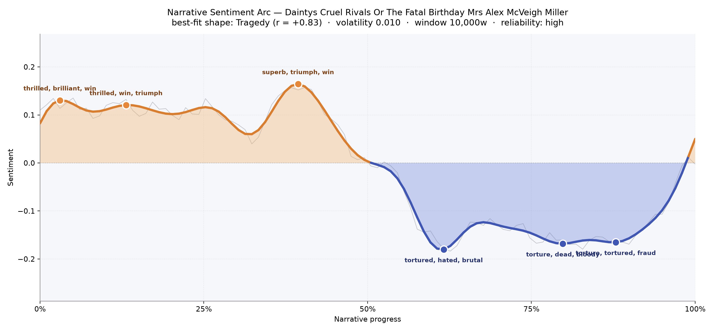
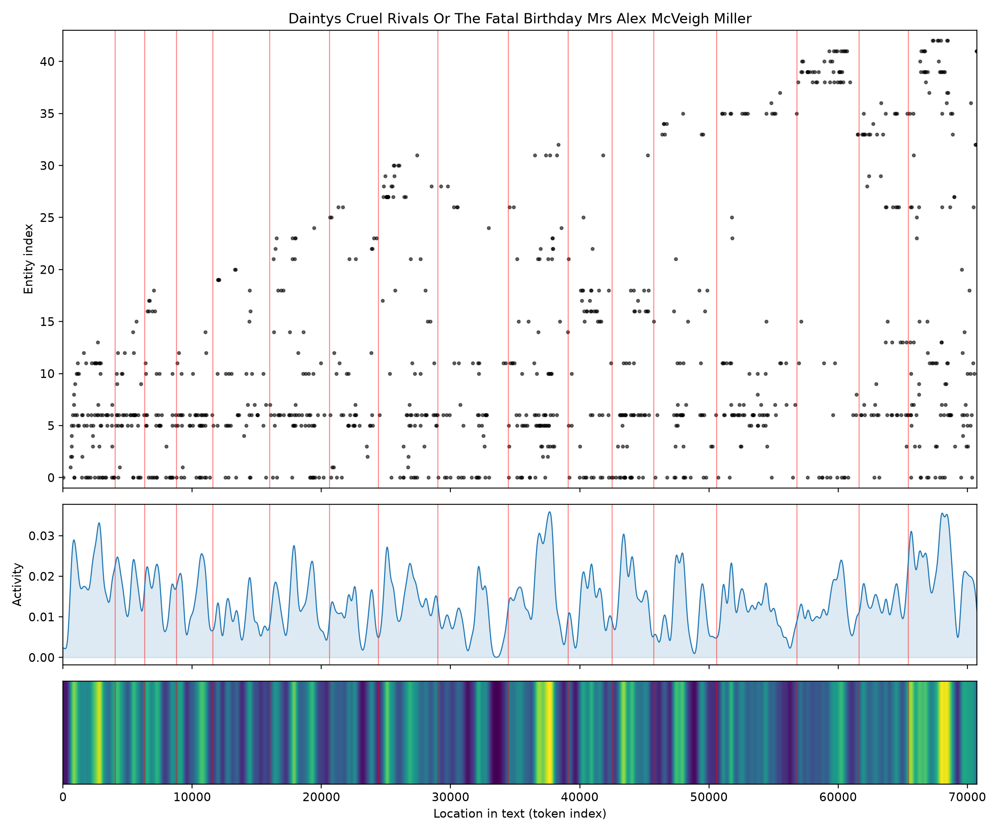

# Dainty's Cruel Rivals; Or, The Fatal Birthday
### by Mrs. Alex McVeigh Miller

54,744 words · a Tragedy arc — a life that opens in ribbons and ballroom light, then slides, inch by inch, into cruelty

## The shape of the story

If you were to trace this novel with a fingertip, you would feel the earliest pages catch on brightness and the last third grow rough, bruised, hard to hold. Miller does not begin in gloom; she begins in a kind of debutante glow. The first small crest arrives almost immediately — a passage "thrilled, brilliant, win, ecstatic, rapturous, triumph" — the vocabulary of a young woman being admired, courted, adored. A second lift a few chapters in leans into the same happy register, "thrilled, win, triumph, winning, fun, fantastic," as though Dainty is still being carried on the shoulders of her own good fortune. The novel's highest rise, near the two-fifths mark, is the brightest of all, thick with "superb, triumph, win, rejoiced, wins, loved" — a summit of engagement and belonging.

And then the ground gives way. Just past the midpoint the tone turns sharp; the deepest valley bruises with "tortured, hated, brutal, terrible, victims, crime," and the story never truly recovers its early sweetness. A later dip carries "torture, dead, bloody, hated, loss, terrible," and the third trough, near the four-fifths mark, is nearly unspeakable — "torture, tortured, fraud, dying, cruel, destroyed." This is the classical Tragedy shape at close to eight-tenths agreement, and the felt experience matches: a girl offered the world, then punished for accepting it. The rise is short, the fall is long, and the final small twitch upward at the very end reads less like rescue than exhaustion.

<figure><figcaption>An early bright plateau, one true summit near the two-fifths mark, then a long slide into a valley of torture and fraud.</figcaption></figure>

## Who lives on the page

The book belongs, overwhelmingly, to two names. Ellsworth appears more than two hundred times — the surname of the lover, Lovelace Ellsworth, whose family fortune sets the whole plot spinning — and Dainty herself, the heroine, is named 162 times, with a further pool of "Dainty Chase" mentions binding her to her surname. Around this pair orbit the rivals and confidantes: Ela, sharp-edged and constant; Olive, whose name recurs enough to feel like a second antagonist; the Chase family; Ailsa; Sheila (also Sheila Kelly); Franklin; Platt; Peters; and the tender, older presence called Mammy, who reads as domestic anchor rather than plotter. One label, "richmond," is a place rather than a person — the Virginia city where the novel's society whirls — and a few names double up because both first-and-last and standalone forms were caught. The cast is small enough to feel claustrophobic, which is exactly the temperature a story of rival cousins and inheritance needs.

<figure><figcaption>Ellsworth and Dainty thread every stretch of the book; new figures accumulate as the rivalries widen toward the end.</figcaption></figure>

## The weave of scenes

Seventeen scenes, laid out like beads on a wire, with 187 threads of shared presence running between them. The early scenes are modest, holding nine to fourteen figures each — parlors and gardens, a few faces at a time. The middle stretches thicken as the intrigue gathers, and the final scene blooms suddenly to thirty-one distinct presences, more than twice any other. That last swell is telling: Miller crowds her stage for the reckoning, dragging every rival, servant, cousin, and witness into the light for the birthday's fatal turn. The connective braid grows denser as you move rightward, the earlier chapters neat and separable, the later ones tangled — a visual rhyme for the way the plot's small deceits knot into one another.

<figure><figcaption>A single spine of seventeen scenes; the final chamber swells with nearly every figure the book has introduced.</figcaption></figure>

## What a reader takes away

You close this novel with the taste of a bright morning gone wrong. Miller wrote in the sensational key of her age — jealous cousins, a stolen fortune, cruelties dressed as manners — and the arc bears her intent out honestly. The feeling that lingers is not despair but disquiet: the sense that a girl's happiness, in this world, is a candle set too near an open window, and that "cruel rivals" is less a title than a weather.
