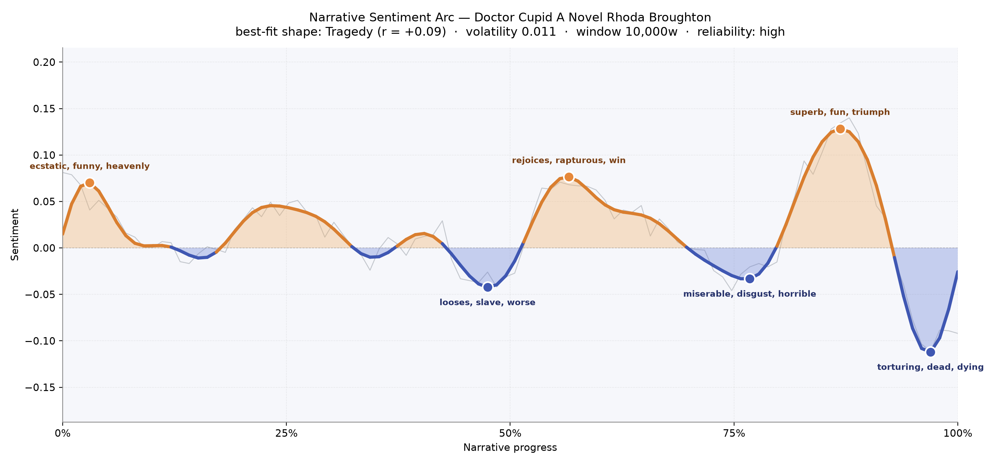
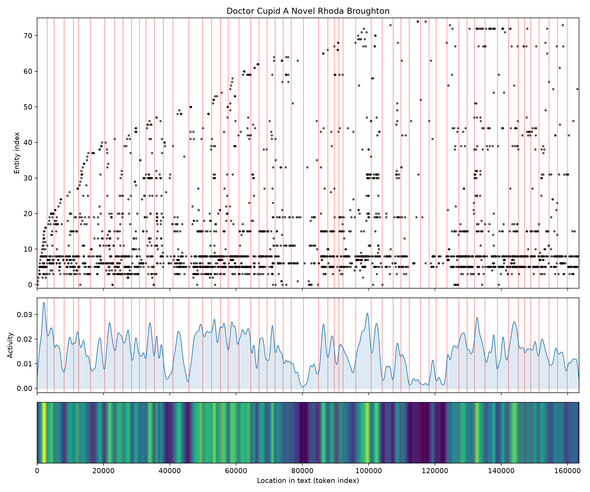
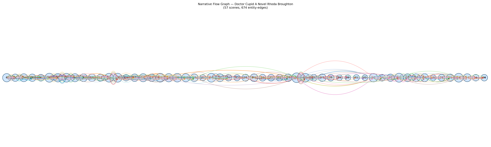

# Doctor Cupid: A Novel
### by Rhoda Broughton

128,288 words · a Tragedy arc — a courtship comedy that darkens by degrees, its laughter drawn thin against a closing shadow

## The shape of the story

Rhoda Broughton opens *Doctor Cupid* the way she opens a garden gate: sunlight, chatter, an air of nothing being seriously the matter. The earliest crest of the arc glimmers with "ecstatic, funny, heavenly, pleased, pleasure" — a young woman's first flush of being loved, and the domestic comedy Broughton is famous for. But the sentiment line, though it wobbles gently for hundreds of pages, is steadily leaning down. This is a Tragedy in the softest Victorian register: not thunderclap catastrophe, but a slow leakage of joy.

The middle valley, around the halfway mark, thickens with "looses, slave, worse, crisis, catastrophe, arrested" — the moment where flirtation curdles into obligation, where a promise made in one weather cannot be kept in another. Broughton then permits a brief resurgence: near the two-thirds turn the page brightens with "rejoices, rapturous, win, wonderful, joy," a false spring that any reader of hers will recognise as a warning. Sure enough, the late chapters cool into "miserable, disgust, horrible, desperately, murderous, cruelty," and by the final trough the language has gone bare and terminal: "torturing, dead, dying, ridiculous, die, killed." A last brittle peak of "superb, fun, triumph, funny, funnier" flares just before that closing pit, the way parlour laughter can sound cruellest in the room next to a sickbed. The arc is impressively steady for so long a book — volatility is low, the reading holds — which makes its downward tilt feel less like accident and more like temperament.

<figure><figcaption>An almost level ribbon of feeling that Broughton lets sag, gently, toward grief.</figcaption></figure>

## Who lives on the page

Two names dominate everything: Peggy, mentioned five hundred times, and her sister Prue, almost as often. This is fundamentally their book — two sisters, one bright and headstrong, one fragile and adoring, and the marriages and half-marriages that pass between them. Around that central pair Broughton arranges Betty, Margaret and Freddy, then the men whose surnames tell you their weight in the plot: Talbot (with John Talbot doubled in the count), Harborough, Evans, Roupell, and the shadowy Ducane, whose name the tooling read as an institution but who is very much a person on the page. Franky and Lily flicker in as younger presences, Jacob as a domestic fixture. London is the one place-name that surfaces, and rightly — it is the distant magnet that pulls characters out of the country house and into trouble. The list is refreshingly clean of noise: no stray honorifics, no chapter numbers, just a household and its orbiting suitors.

<figure><figcaption>Peggy and Prue anchor a dense middle; the cast thins to a hush in the final stretch.</figcaption></figure>

## The weave of scenes

Fifty-seven scenes, six hundred and seventy-four ties between them — a long, closely braided rope. The scene-by-scene head count climbs early, peaking around a crowded gathering of twenty-six named presences near the two-thirds mark, exactly where the tooling also finds that false-spring peak of "rejoices, rapturous, win." That is Broughton's method in miniature: she stages her happiest crowd scenes right before her cruellest turns. After that swell, the weave narrows: several late scenes hold only four, five, or six figures. The novel closes not with a ballroom but with a sickroom, with the cast pared down to the two or three people who cannot look away. The visual score shows exactly this — a bright, congested middle, then a thinning toward the right edge, a rope fraying to its last threads.

<figure><figcaption>A crowded social middle giving way to intimate, sparsely peopled endings.</figcaption></figure>

## What a reader takes away

*Doctor Cupid* leaves the taste of a summer that lasted a little too long. Broughton is often shelved as a comic novelist of flirtation, and the early chapters earn that reputation; but by the last hundred pages she has quietly rewritten the terms, and the reader closes the book understanding that Peggy's brightness was always the thing being spent. It is the inheritance of a certain Victorian wisdom — that charm is not protection, that a promise costs whatever a life costs, and that the funniest people in the room are often the ones with the most to lose.
