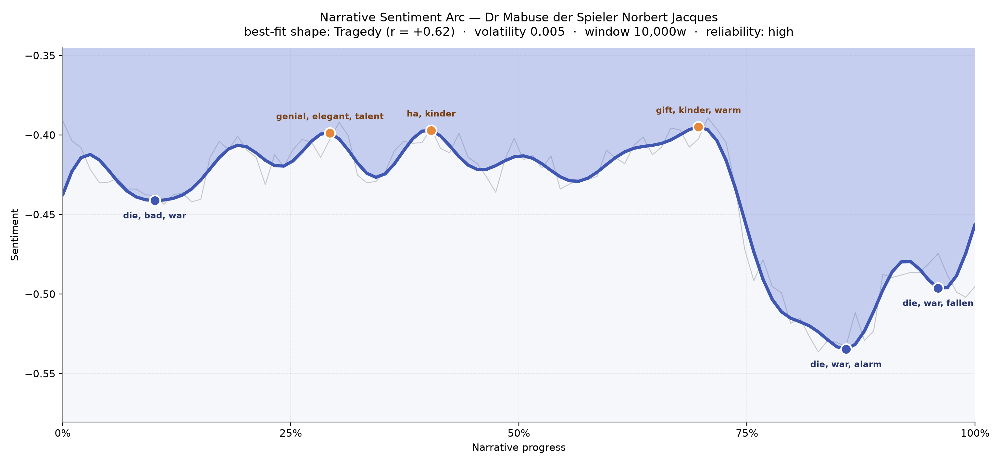
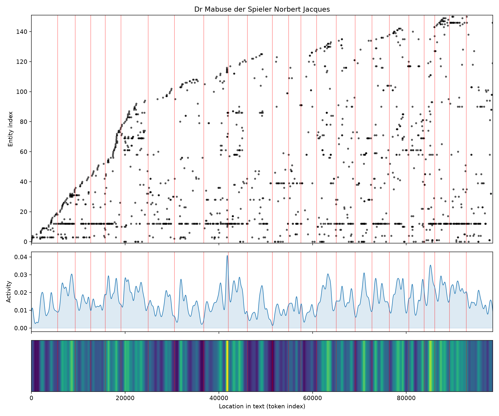
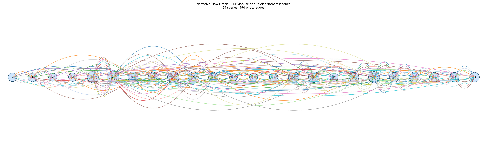

# Dr. Mabuse, der Spieler
### by Norbert Jacques

Roughly 73,900 words in German — a tragedy's slow slide, the light dimming from the first page rather than falling from a height.

## The shape of the story

Most tragedies begin in daylight and end in shadow. This one begins already in shadow, and the shadow only deepens. From the earliest pages, the smoothed emotional line sits below the waterline, and it never quite surfaces. What looks like a peak here is really a shallower trough — a pause in the descent, not a reprieve from it. Reading Jacques feels like walking into a Munich apartment at dusk and finding the lamps already lit against a weather that will not lift.

The book's first dip, near the tenth of the way in, bruises with "die, bad, war, lied, fallen, lag" — a German-English tangle where "die" is more likely the definite article than the English verb, but the strong companions (fallen, lag, lied) still tell of bodies gone still and truths gone rotten. The middle of the novel offers Jacques's version of relief: three small hills tagged "genial, elegant, talent" and later "gift, kinder, warm." These are the Mabuse-effect glimmers — the hypnotist's charm, the doctor's talent, the beguiling parlour trick — and they read exactly as they should: intoxicating but never quite lifting the mood above the horizon. Then the final third collapses. The deepest valley, near the eighty-five-percent mark, thickens with "alarm" and "war" and "lag"; the last long dip closes with "fallen, stricken, block." The German word "Gift" means poison, which is grimly perfect for a book about a man who poisons every room he enters.

<figure><figcaption>A tragedy that begins beneath the surface — the small peaks are only pauses in the fall.</figcaption></figure>

## Who lives on the page

The name that towers over every count is **Wenk** — State Attorney von Wenk, Mabuse's hunter — and his 363 appearances tell you everything about the novel's centre of gravity. This is not, curiously, Mabuse's book by name; it is Wenk's, because Wenk is the one doing the looking, and Jacques's camera rides on the shoulder of the pursuer. Mabuse himself surfaces about a hundred times across his own name and its declined form "Mabuses," a spectral presence circled rather than inhabited. Around them cluster **Hull** the young count, **Spoerri** the addicted servant, **Georg**, **Carozza** the cabaret singer (misfiled here as a place, a small tag-error to shrug at in a German text), and **Weltmann** — Mabuse's stage-magician alias.

The cities are their own cast: **München**, **Konstanz**, and **die Schweiz** trace the novel's geography from Bavarian salons to the Swiss border, a chase route as much as a setting. A few of the entries — "told," "augenblick" (moment), "zeit" (time), "basch" — are simply the tagger stumbling over German morphology. Filter them out and what remains is remarkably clean: a hunter, a phantom, a doomed lover, a broken servant, and the three cities they haunt.

<figure><figcaption>Names enter early and pile on steadily — Wenk's world grows denser the longer he chases.</figcaption></figure>

## The weave of scenes

Across twenty-four scenes and nearly five hundred connective threads, the narrative flow reads like a braided rope pulled tight at the middle. The early scenes are lean — small casts, tight rooms — and then, roughly a quarter of the way in, the population explodes: scene five carries thirty-seven names, scene six forty-five, scene nine thirty-nine. This is Jacques opening the aperture on Mabuse's whole racket — gambling dens, séances, stock-market rigs, the counterfeit factory. The threads then thin briefly around scenes eleven through thirteen (a chamber piece, perhaps Carozza's cell or Wenk's private brooding) before swelling again toward the finale, where scenes nineteen through twenty-four carry a steady twenty-five to thirty presences each. Nothing frays at the ends; the rope is taut all the way to the last knot.

<figure><figcaption>A braided middle, a taut ending — the pursuit tightens instead of scattering.</figcaption></figure>

## What a reader takes away

You close *Dr. Mabuse, der Spieler* the way you close a shutter against a storm — not because the storm has passed, but because you can no longer bear to watch it. Jacques gives you a Weimar Germany already hollowed out, and a villain who is less a man than a symptom of the hollowing. The peaks were only pauses. The last word belongs to the dark.
