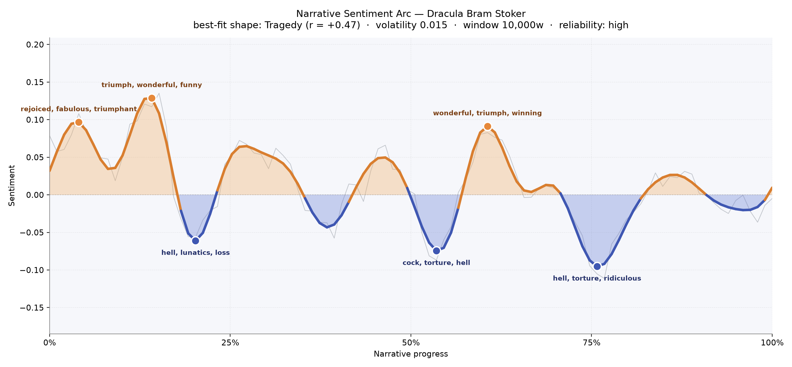
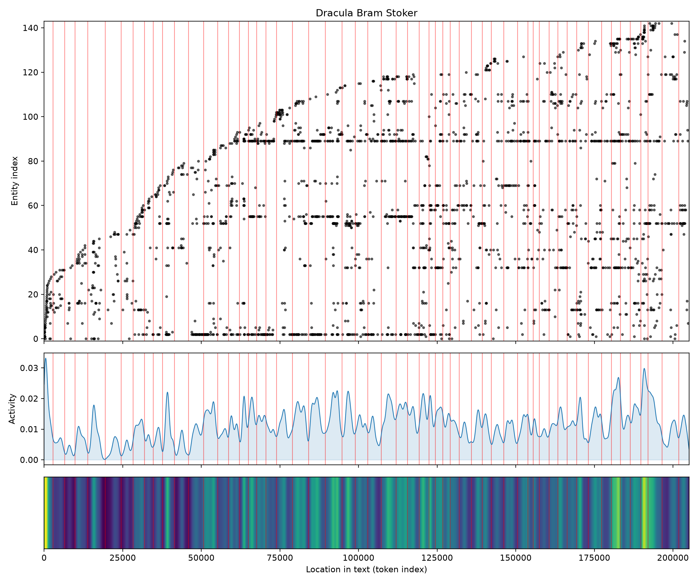
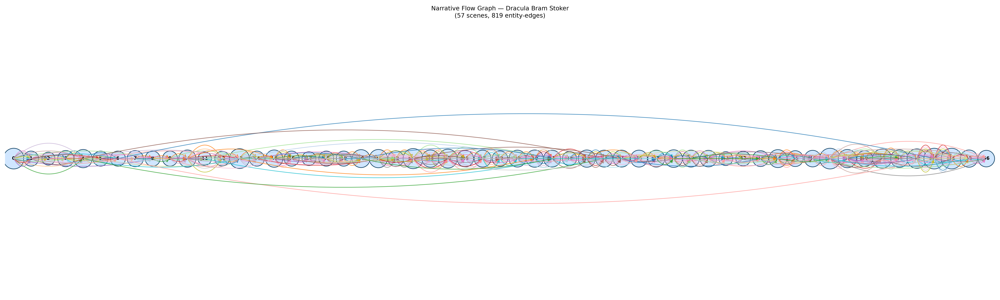

# Dracula
### by Bram Stoker

A 163,000-word descent — a Tragedy arc, a long slow slide from lit windows into a mouth of teeth.

## The shape of the story

Dracula begins in daylight and ends in shadow. The arc traced across its 163,000 words is, at its clearest match, a Tragedy — not the sudden fall of *Icarus* or the muddy pit of *Man in a Hole*, but the older, sadder line of a light that dims and dims and never quite comes back. The novel opens on high ground: those first hundred pages ride a small surge of good weather — Jonathan's Continental journey, the postcards, the wedding plans — and the earliest crest of the arc glitters with "rejoiced, fabulous, triumphant." A second bright bump comes near the one-seventh mark, still travel-lit and social, thick with "triumph, wonderful, funny, fun, winning, great," the last happy party before the house begins to breathe wrong.

Then the ground gives. The first proper valley — around the one-fifth mark, roughly the point Lucy begins to suffer — bruises with "hell, lunatics, loss, angry, mad, despairing," and you can feel Seward's asylum walls pressing in. The middle of the book briefly rallies — a false dawn of "wonderful, triumph, winning, win, greater, great," the hunting party gathering itself into purpose — but the deepest trough waits at roughly three-quarters through, wet with "hell, torture, ridiculous, plague, worry, worried." Even the small upward flick at the very end is muted; the red dashed trend-line of the Tragedy shape slides steadily down through the book like a barometer before a storm. The volatility is low, the reliability high — which means this is not a jittery mood-map but a genuinely darkening room.

<figure><figcaption>A long, patient darkening — two candlelit peaks at the start, three cold hollows below.</figcaption></figure>

## Who lives on the page

The most frequently named figure in the novel is not the Count at all — it is Van Helsing, the Dutch doctor who arrives late but talks most, and whose 276 mentions crowd the second half. Behind him sits Lucy Westenra (264), whose slow poisoning is the emotional engine of the first half, and then the epistolary quartet who write the book into being: Jonathan, Arthur, the surname Harker (Jonathan and Mina both), Dr. Seward, Quincey Morris, and the tragic patient Renfield. Mina appears too, though the tagger has mis-sorted her as an organisation — a small tell of how the machinery reads a Victorian honorific like "Madam Mina." "Seward's diary" surfaces as a name because of how often the chapters are headed with it; treat it as a book-keeping ghost rather than a character. London and Whitby stand as the two English poles of the story — the great sooty city and the cliff-top harbour where the *Demeter* runs aground. Godalming is not really a place here but Arthur's inherited title. Dracula himself, tellingly, hardly speaks in his own name in the top listings — he is felt, not named, which is the whole point of him.

<figure><figcaption>The cast crowds in around Lucy's illness and again around the hunt — two dense storms of names.</figcaption></figure>

## The weave of scenes

Fifty-seven scenes, 819 threads of connection between them — Dracula's narrative flow reads as an unusually long, tightly braided rope. There is no thin patch at the edges; even the first scene bursts with twenty-nine named figures, because Jonathan's Transylvanian journal drops us at once among peasants, coach drivers, and half-mythic mountains. The middle sags only briefly — a few small scenes with a dozen names each, the private diary passages — before the density climbs and stays high for the last third: scene after scene of nineteen, twenty-four, twenty-nine presences, the whole hunting party stitched together across London, Varna, and the Borgo Pass. What the picture shows is a novel written as a chorus. Every scene is entangled with several others by shared names, because the letters and diaries deliberately overlap testimony — one event told twice, from Mina's hand and then Seward's. It is not a single line of story but a rope of them, and toward the end the strands cinch tight.

<figure><figcaption>A long horizontal rope — many voices, thickened at the hunt, never fraying at the edges.</figcaption></figure>

## What a reader takes away

Dracula leaves you with a peculiar residue: the sense of having been saved and having lost. The hunters win — the Count is dust, Mina is clean — but the arc never quite lifts back to where it began. Something has gone out of the world with Lucy, and the book knows it. You close the last page carrying candlelight, garlic-smell, and the slow, tragic tilt of a lamp turning down.
