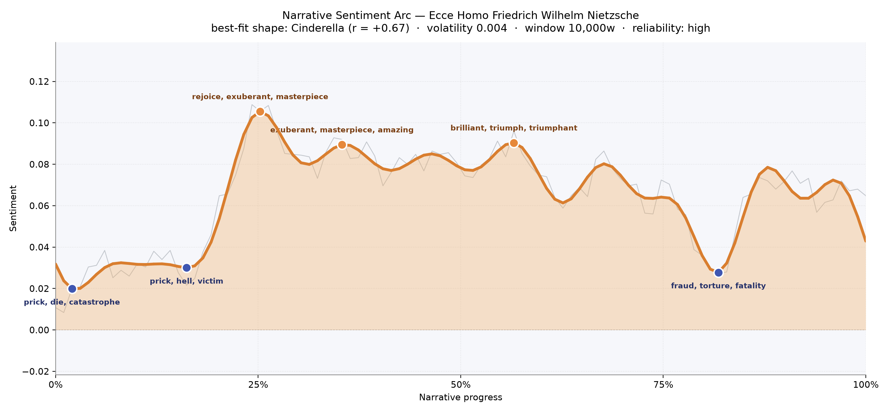
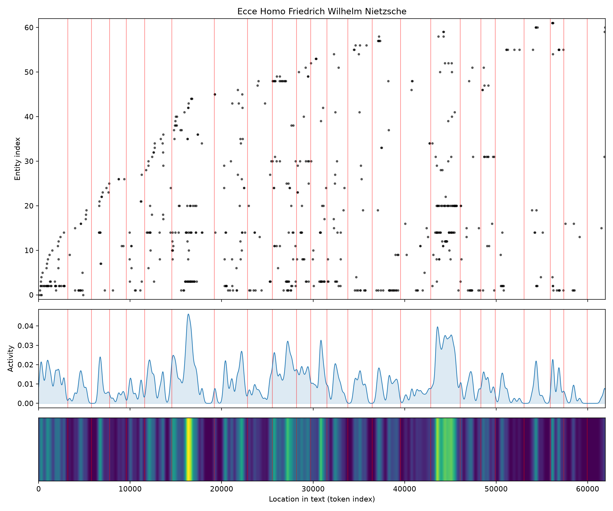
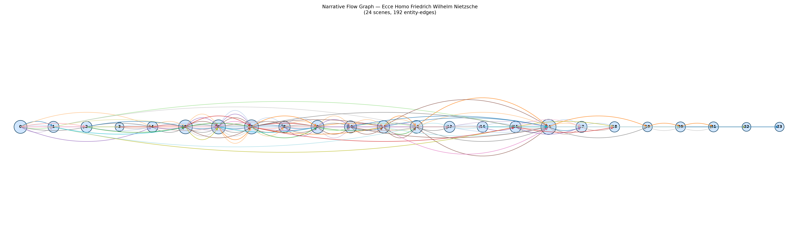

# Ecce Homo
### by Friedrich Wilhelm Nietzsche

47,576 words · a Cinderella arc — a self that rises out of shadow into its own festival of light

## The shape of the story

Ecce Homo is Nietzsche's last long breath before silence, and it moves like a philosopher walking uphill in bright weather, pausing only to look back at the pits he climbed out of. The felt shape is that of a Cinderella climb: an opening tone that is wary, wounded, almost defensive, followed by a long ascent into self-celebration, then a shadowed dip near the end where the writer glances again at his enemies. Early on, the prose flinches: the first small trough is chilled by "prick, die, catastrophe, evil, lost, losing," as if Nietzsche were tallying the injuries — bodily, familial, cultural — that formed him. A second dip soon after presses harder, thick with "prick, hell, victim, bad, destructive, guilt," the vocabulary of a man refusing Christian shame while still using its lexicon to name what he refuses.

Then the mood tilts. Around the quarter-mark, the arc lifts into its brightest ridge, glittering with "rejoice, exuberant, masterpiece, amazing, triumph, supreme" — the register of a writer telling us, without embarrassment, "why I write such good books." A companion peak just past a third of the way in keeps the same jubilant vocabulary aloft. The great mid-book crest, near the fifty-seven percent mark, is where the music of the book truly opens: "brilliant, triumph, triumphant, rejoiced, supreme, wonderful." It is the pitch of a man crowning himself in advance of the world's refusal. Only late, around four-fifths through, does the ground darken again into "fraud, torture, fatality, terrible, suck, died" — the polemical closing chapters where he turns on Christianity and Germany with a knife. The volatility is unusually calm; this is a high-reliability arc for a book that reads, on the page, like a fever.

<figure><figcaption>A slow, sunny climb through self-praise, bracketed by two shadows — the wounded past and the polemical end.</figcaption></figure>

## Who lives on the page

The most-named presence is not a person but a book: Zarathustra, cited more often than Nietzsche names himself. That inversion is the whole poetics of Ecce Homo — the author speaks of his own writing as a separate, holier figure walking ahead of him. Wagner shadows the pages too, the friend-turned-adversary whose ghost the book cannot stop touching. Schopenhauer arrives as a lesser companion, the older teacher being outgrown. The rest of the cast is not really a cast at all: "german," "germans," "germany," "christianity," "christian," "european," "greek," "french" — a map of tribes and creeds Nietzsche argues with. Dionysus and the Dionysian close the roster like a private god. A stray "thou" among the names is only the King-James pronoun from his Zarathustra-quotations, not a character. This is a memoir where nations are the antagonists and one prose-poem is the protagonist.

<figure><figcaption>Zarathustra and Wagner burn brightest; whole peoples — Germans, Christians, Europeans — move as weather in the background.</figcaption></figure>

## The weave of scenes

The scene-weave reads as a single long braid rather than a plotted staircase. Twenty-four sections cluster densely through the middle third, with the heaviest tangles right where the mid-book crest sits — the chapters on Zarathustra and the great books draw in almost every figure the writer has to hand. The two brightest activity spikes fall near the sixteen-thousandth and forty-four-thousandth words: the first is the intoxicated ascent, the second the polemical avalanche. The final scenes thin out to a near-solo voice, a handful of presences per section, as if the book empties the room before its last shout.

<figure><figcaption>A thick central knot of self and works, unraveling into a lonely, declamatory finale.</figcaption></figure>

## What a reader takes away

Ecce Homo leaves the strange aftertaste of a party thrown by a man who knows the house is on fire. Its arc climbs into radiance and refuses to come down until forced, and even then the descent is anger, not defeat. You close it holding two things at once: a triumphant self-portrait, and the shiver of watching a mind bless itself just before the dark.
