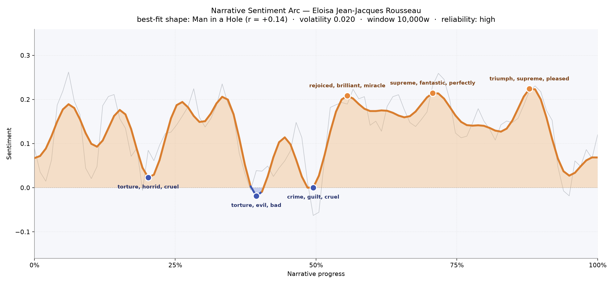
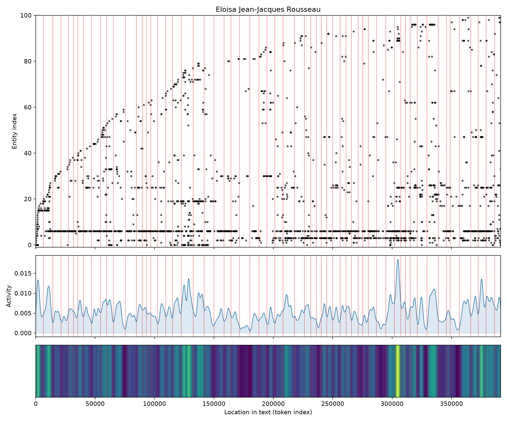
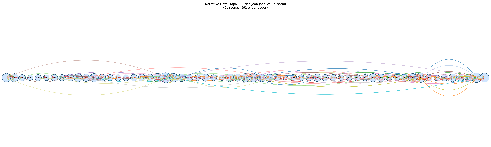

# Eloisa
### by Jean-Jacques Rousseau

a vast epistolary novel of roughly 319,000 words — a Man in a Hole arc, where a long moral bruise slowly resolves into rooms warmed by triumph and pardon

## The shape of the story

Rousseau's Eloisa unfolds like a long confession read by candlelight. The feeling is not the swift plunge of tragedy nor the tidy rise of romance; instead, the arc dips early, lingers in the shadow of conscience, and then, after the midpoint, tilts patiently upward toward something that resembles peace. The reader spends the first third inside a moral trough where the language itself bruises — the earliest valley curls around "torture, horrid, cruel, crime, destruction, despair", as if the lovers were being interrogated by their own hearts. A second dip near the middle deepens into philosophical self-accusation, thick with "torture, evil, bad, destructive, betrays, lost", and just before the arc turns, a third valley closes the case against innocence with "crime, guilt, cruel, bad, betrayed, abusing".

Then the light comes back. Past the halfway mark, the emotional weather clears in three broad, gentle peaks. The first is a sudden gladness that rings with "rejoiced, brilliant, miracle, pleasure, joy, sparkling" — the tone of a household finally at rest. The second, further on, hums with "supreme, fantastic, perfectly, greater, pleasure, delightful", the calm satisfaction of a life ordered by principle. The last and highest crest carries "triumph, supreme, pleased, love, greater, affection", the note of a moral victory earned at cost. The volatility is low and the reading is reliable; this is not a jittery book but a slow, steady piece of weather, moving from remorse toward reconciliation.

<figure><figcaption>Three early troughs of conscience give way to three warm, sustained peaks — Rousseau climbing out of the hole he dug for his lovers.</figcaption></figure>

## Who lives on the page

The book belongs unmistakably to Eloisa, whose name is spoken nearly seven hundred times, more than three times as often as anyone else. Around her orbit the three figures who shape her life: Wolmar, the grave husband whose reason organizes the second half; Clara, her confidante and mirror; and St. Preux, the tutor-lover whose absence powers the letters even when he is off-page. Orbe, Fanny, and Laura circle at the edges as correspondents and companions. The counter sometimes miscategorizes — Clara and St. Preux are flagged as places rather than people, and "thou" and "R." slip in as noise from the epistolary voice and the editor's initials — but the human center of the novel is unmistakable. Around these lives sit the real places that anchor the moral geography: Paris the city of temptation, Geneva and Clarens the pastoral hearth, France and London the wider theater of the age.

<figure><figcaption>A dense, continuous population of names — the letters keep the same small circle in view for the length of a very long book.</figcaption></figure>

## The weave of scenes

The narrative flow spreads across sixty-one scenes joined by nearly six hundred threads, and the picture is remarkable for how *even* it looks. Rather than a novel that clenches around a single climax, Eloisa reads like a long braided rope: cluster after cluster of correspondents, each letter drawing in a handful of familiar names, then handing them forward to the next. Two thicker knots stand out — one near the two-thirds mark, where the household at Clarens gathers its full cast, and another close to the end, where the same figures reassemble for the book's tenderest and most fateful passages. The margins are thinner, as one expects from opening and closing letters, but the middle never truly loosens. This is a novel of sustained company, not of solitary crescendo.

<figure><figcaption>Sixty-one linked scenes running nearly level — a long, patient conversation among a small, faithful circle.</figcaption></figure>

## What a reader takes away

Eloisa leaves the reader with the strange calm of a storm survived by conversation. Its lovers do not escape their scruples; they talk them into a shape they can live inside. To close the book is to feel that virtue, in Rousseau's hands, is not the opposite of passion but its slow, humane afterlife — a warmth that arrives only once the heart has admitted its worst names for itself, and then chosen kindness anyway.
