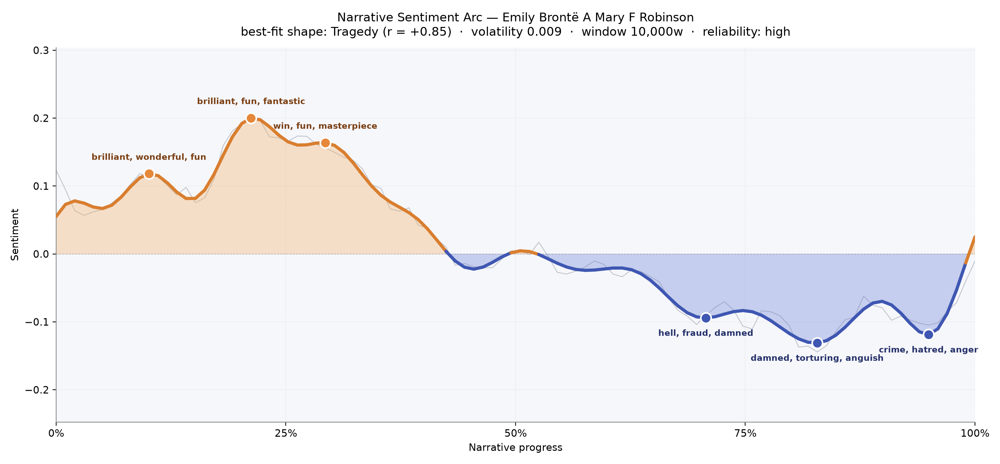
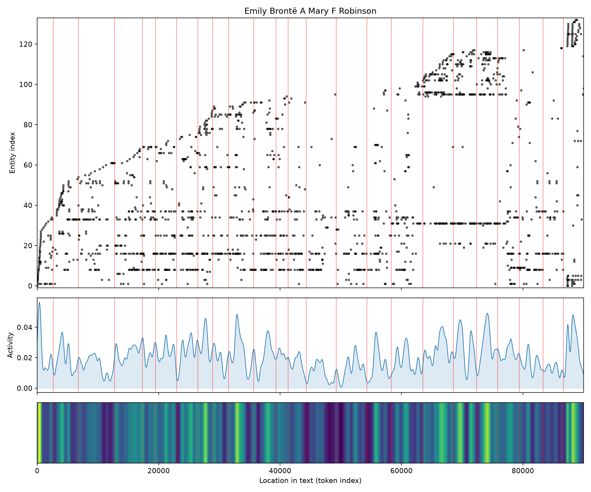
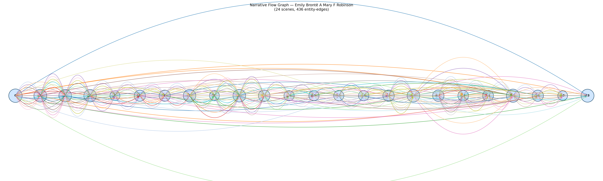

# Emily Brontë
### by A. Mary F. Robinson

A 70,142-word Victorian life-study that traces a Tragedy arc — a bright girlhood carried, step by step, into the shadow of loss.

## The shape of the story

Robinson's biography opens the way a moorland morning opens: cool light, wide air, and the sense that something wild is waking. For the first third of the book, the sentiment line lifts and holds. The early peak near the tenth-percentile mark carries the flavour of the Brontë parsonage in its inventive years, glinting with "brilliant, wonderful, fun, fantastic, happiest, heroic" — the little kingdoms of Angria and Gondal, the four children scribbling their epics in matchbox-sized handwriting. That warmth broadens into a second, higher crest around the one-fifth mark, thick with "brilliant, fun, fantastic, win, masterpiece, charm", as Robinson lingers over Emily's gathering craft. A third gentle summit follows near the three-tenths mark, still lit by "win, fun, masterpiece, amazing, brilliant, beauty".

Then the line begins its long, quiet descent. There is no single catastrophe on the page — only a slow tilt of the whole landscape downward, exactly the movement the reader feels when a life is being lived toward its narrowing. The trough near the seven-tenths mark bruises with "hell, fraud, damned, disgust, selfishness, worse", which reads as the Branwell years, when the brother's ruin darkened every hearth. The deeper valley near the four-fifths mark hurts more plainly, thick with "damned, torturing, anguish, angry, ridiculous, violent" — the writing of *Wuthering Heights* being received as monstrous, and Emily's own body beginning to fail. The final dip, close to the end, is quieter but no less final: "crime, hatred, anger, furious, losing, bad". The reliability of this reading is high, so we can trust the shape: a book that begins in play and ends in the sound of a door closing.

<figure><figcaption>A steady downhill road: three green summits of childhood invention give way to three purple hollows of illness, scandal, and grief.</figcaption></figure>

## Who lives on the page

The presence-count is instructive and, in places, gently misleading. Charlotte tops the roll with 224 mentions — more than Emily herself — which tells you exactly what kind of biography this is: a portrait drawn largely from a sister's letters, memories, and shadow. Branwell follows at 175, the brilliant, ruinous brother whose collapse shapes the second half. Heathcliff is here too, counted 102 times as if he were a living Yorkshireman, and the tally silently reminds us that *Wuthering Heights* is treated as almost autobiographical weather. Anne, at 90, is the quieter third sister; Haworth, the parsonage village, hovers at 85 as a character in its own right. Emily's own name appears 56 times, with another 43 as "Emily Bronte" — she is, poignantly, quoted less often than she is discussed. Catharine and Cathy are Wuthering ghosts drifting into the biography's ledger; Shirley steps in from Charlotte's novel; Mrs Gaskell is cited as the earlier biographer whose account Robinson is quietly correcting. A few labels wobble — "charlotte" and "haworth" are read as places, "branwell" as an institution — but the corrective is obvious to any reader.

<figure><figcaption>A dense upper band shows how many figures crowd Robinson's stage, thickening steadily as the family's story compounds.</figcaption></figure>

## The weave of scenes

The scene-map reads like a long, slender loom. Twenty-four chapters are strung across the page with 436 threads of shared presence between them, and the pattern is unmistakable: the wider, more richly-populated scenes cluster at the opening (where the whole family gathers), swell again around the middle (the London publishing chapters, the reviews, the correspondence), and rise once more in the final third where death, letters of condolence, and posthumous reputation crowd in. The thinnest scenes — around chapters nine, twelve, and twenty-three — feel like Robinson stepping back to breathe, to describe a landscape or a book without naming names. The long outer arcs sweeping from first scene to last suggest a biographer stitching endings back to beginnings, closing the circle of a short life.

<figure><figcaption>A braided rope of scenes, thick at either end, held together by long threads that carry the same handful of names from cradle to grave.</figcaption></figure>

## What a reader takes away

You close Robinson's book with the strange, tender ache reserved for lives that were too brief to be misread by their own century. The arc's steady downhill is not despair; it is honesty. A girl invents worlds, a woman writes one furious masterpiece, a household frays, and the moor keeps its silence. What lingers is the sense that Emily was always half-turned toward the wind, and Robinson has the grace to let her stay that way.
