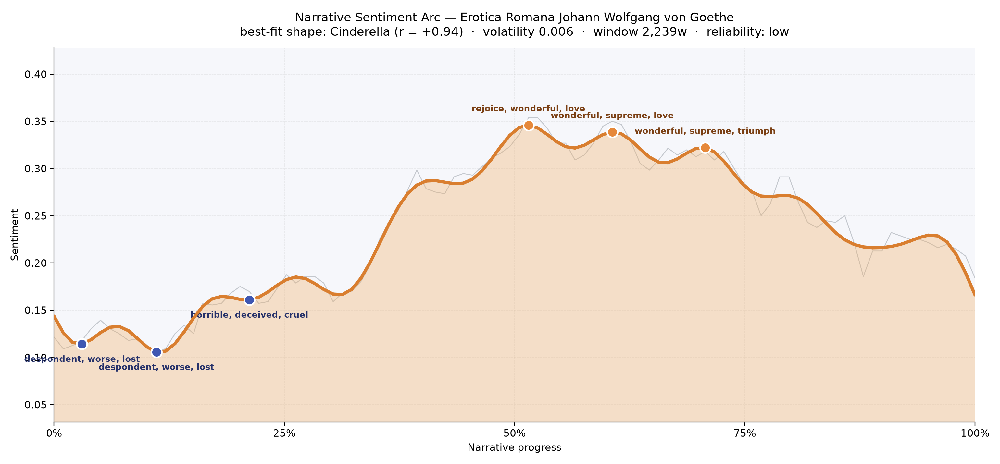
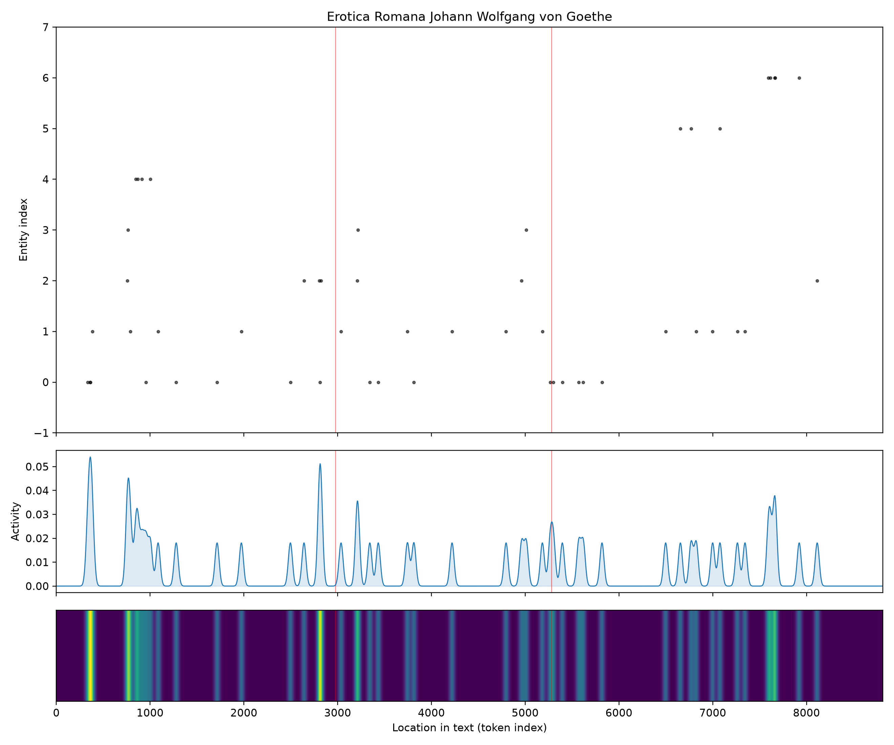
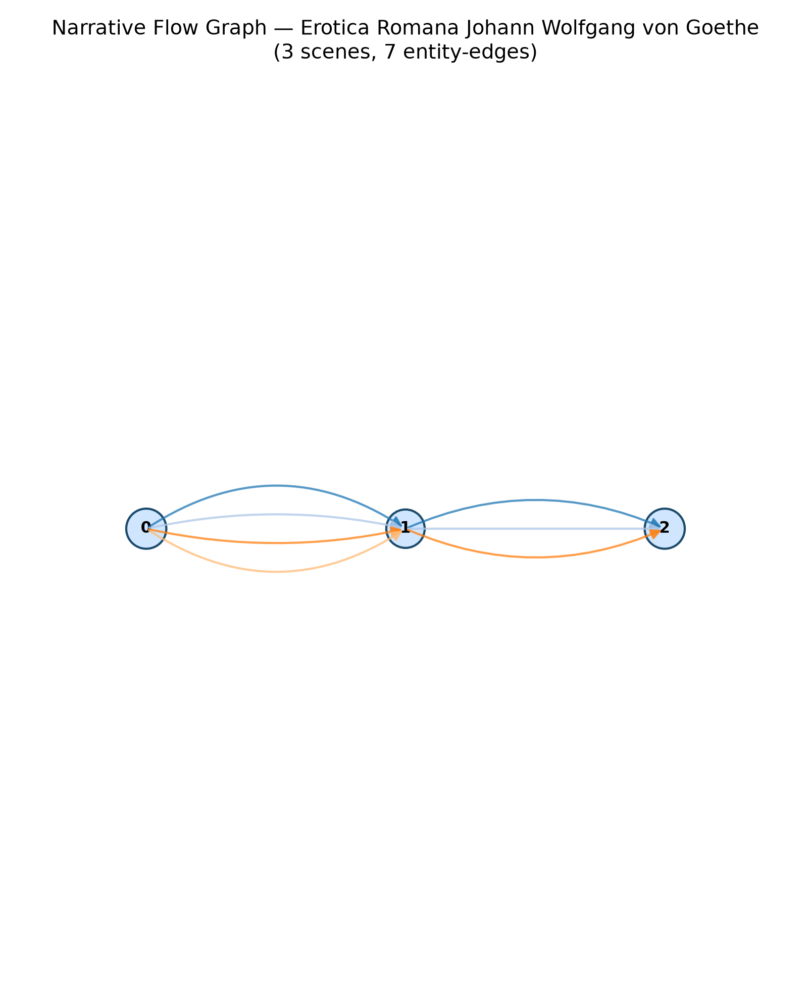

# Erotica Romana
### by Johann Wolfgang von Goethe

roughly 6,800 words · a Cinderella arc — an ache soothed into rejoicing, then a slow, contented settling

## The shape of the story

Goethe's little Roman book opens in shadow. The earliest pages sit low, weighed down by an unmistakable ache — the opening trough is thick with "despondent, worse, lost, horrible, deceived, cruel", as if the poet has arrived in the eternal city still nursing a wound carried across the Alps. Twice in that first tenth of the reading, the same bruised chord repeats, and by the time we reach the eighth minute the vocabulary of loss has hardened into moral bruise: "horrible, deceived, cruel, guilty, guilt, hated". It is a very small book, so this melancholy is best understood as a mood-fragment rather than a plotted despair — an impressionistic hush before the warmth arrives.

And warmth does arrive. Around the halfway mark the arc lifts into its brightest weather, and the language turns unabashedly sensual. The first crest glows with "rejoice, wonderful, love, sweetest, beloved, celebrate"; the second doubles down on "wonderful, supreme, love, loves, best, delicious"; the third settles into a satisfied victory of "wonderful, supreme, triumph, winning, celebrate, delicious". This is the Cinderella movement in miniature — not a rescue from cinders, but a lover's slow conversion from grief to appetite, from northern penitence to Roman honey. The final quarter eases downward without collapsing, the way an afternoon in a warm room fades into evening. Because the reading is short, the arc is impressionistic rather than definitive, but its trajectory feels remarkably clean: sorrow, then celebration, then a contented sigh.

<figure><figcaption>A curve that climbs from bruise to rejoicing and settles like sunlight leaving a Roman piazza.</figcaption></figure>

## Who lives on the page

The most-named presence here is not a person at all but a place: Rome, invoked seventeen times, saturates the book like the light itself. Cupid follows close behind, less a character than a mischievous household god — the poem treats him almost as a roommate, an interruption, a small tyrant of the writing desk. Then the pantheon files in: Jupiter, Juno, Hercules, and Midas, each a mythic silhouette borrowed to gild a mortal appetite. Only one flesh-and-blood echo threads through: Werther, the poet's own earlier ghost, glancing in from Goethe's northern past like a chastened younger self.

There is, tellingly, no named beloved on this list — the woman at the center of the elegies is addressed but never labelled, and so she slips through the counting. That absence is itself a kind of confession. What we get instead is a landscape of place and myth, with the lovers moving through it half-clothed in classical drapery. The tagging, which reads Cupid as an organisation and Jupiter as a location, is a small comedy of a modern reader trying to file the Olympians — a gentle reminder that this text belongs to older gods than any list can catalogue.

<figure><figcaption>Rome and Cupid tower over a small chorus of borrowed gods and one northern ghost.</figcaption></figure>

## The weave of scenes

The reading falls into three broad movements — an opening of northern melancholy, a central bloom of Roman love, and a closing coda of reflection — with roughly the same handful of presences threading through each. Rome and Cupid stitch the whole together; the gods rise briefly in the middle to lend the affair mythic scale; Werther haunts the edges. It is less a braided plot than a triptych, three panels of the same room seen at different hours, each populated by the same small cast of statues, lovers, and shadows.

<figure><figcaption>Three panels of the same warm room, stitched by a handful of recurring presences.</figcaption></figure>

## What a reader takes away

What lingers after Erotica Romana is warmth — earned warmth, the kind that follows a real chill. Goethe lets us feel the wound first, then the wine, then the drowsy contentment of a body reconciled to its own pleasures. It is a short, generous book that argues, almost slyly, that grief is a room one can walk out of, and that Rome — with its old gods, its bright windows, its willing beloved — is one of the doors.
