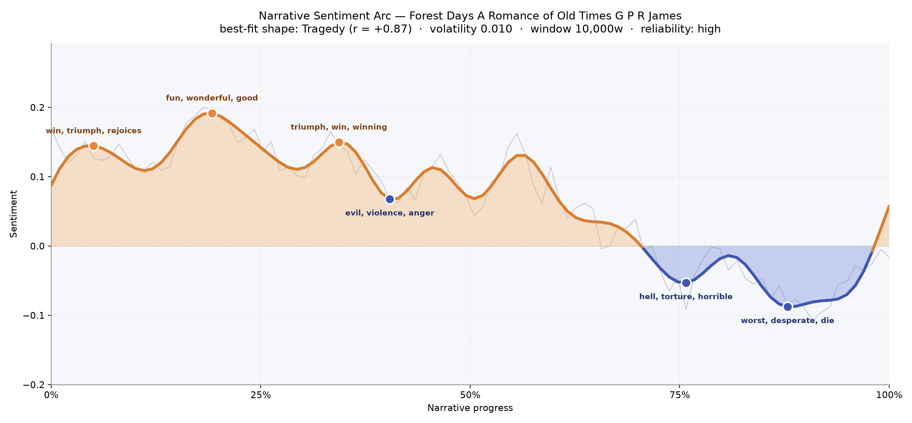
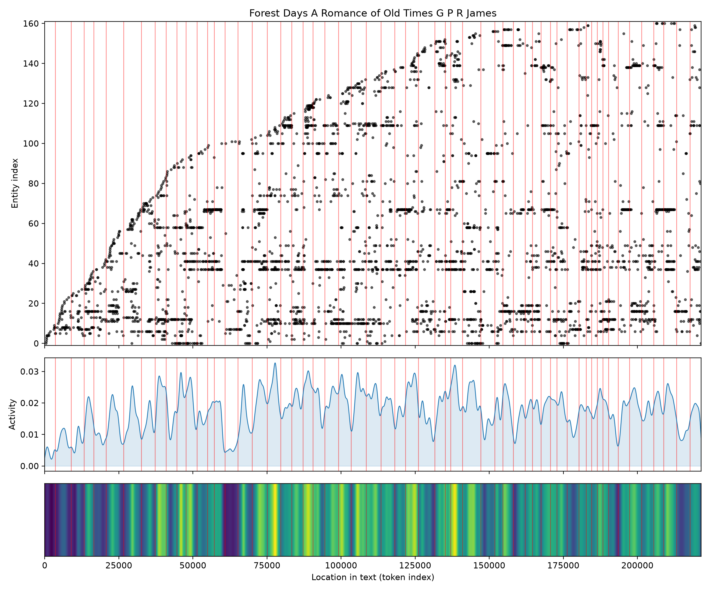

# Forest Days: A Romance of Old Times
### by G. P. R. James

171,372 words of medieval English romance — a Tragedy arc, sunlit revels that slowly give way to torchlight and terror

## The shape of the story

James opens in a green mood. The first stretch of *Forest Days* reads like a long summer afternoon under Sherwood's oaks — courtship, feasting, ballad-making — and the arc lifts accordingly, brightening early with "win, triumph, rejoices, merry, good, loved" as knights and outlaws swap oaths and Lucy's presence lights the pages. That warmth deepens into the book's brightest crest near the one-fifth mark, a stretch thick with "fun, wonderful, good, charm, merry, greater," where the romance seems to promise the reader an easy passage. A third crest, near the story's midpoint, hums with "triumph, win, winning, good, love, faithful" — the last true daylight before the weather turns.

Then the wind changes. Just past the halfway mark the mood cools into a first bruised dip flecked with "evil, violence, anger, violent, chastise, angry," and the tale never quite recovers its high spirits. The deep trough at roughly three-quarters is genuinely dark — a passage steeped in "hell, torture, horrible, horrified, terror, miserable" — and by the late-eighties percentile the story is at its lowest ebb, ashen with "worst, desperate, die, dying, guilt, evil." This is the classic downward curve of tragedy: joy squandered, favour withdrawn, the world tightening around the honourable. The arc's slope is unusually steady, and with a book this long the reading is trustworthy — not a moody quiver but a real, measured descent.

<figure><figcaption>A long, sunlit rise across the first half; a slow, unignorable fall through the last third.</figcaption></figure>

## Who lives on the page

The cast is quintessentially James: baronial, forest-shadowed, historically bookish. Hugh de Monthermer, the young hero, dominates the count — once by his given name and again in full title — and stands at the emotional centre of the romance. Beside him rides Lucy, the book's most-named woman and the axis around which the peaks of "loved" and "faithful" turn. Richard de Ashby prowls the story as its darker gravity, a name that recurs whenever the arc bends toward "evil" and "violence." The Earl (of Ashby, one suspects) presides over councils. Edward — the future Edward I — glimmers in and out with the wider politics of the Barons' War, and de Montfort's faction weighs on the plot's second half.

Woven through it all is the legendary furniture of the greenwood: Robin, Robin Hood, Kate, and the sharp-tongued Tangel — companions who let James braid outlaw balladry into his baronial history. Guy de Margan haunts the antagonist's side. A few of the top presences are really places wearing character-tags — "Nottingham" and "England" among them — and one or two labels like "earl" and "ashby" blur between rank and family name; but the pattern is clear enough. This is a romance of houses and their allegiances, of a young couple bracketed by treachery and civil war.

<figure><figcaption>Hugh and Lucy anchor the foreground; Richard de Ashby and de Montfort press in from the wings.</figcaption></figure>

## The weave of scenes

Fifty-eight scenes carry the novel, and the middle stretch is where James really pours in his figures — chapters swell to thirty and forty named presences apiece as barons, outlaws, and courtiers converge. Early chapters are leaner, more intimate, a slow gathering of threads. Then, around the two-thirds mark, the weave thickens dramatically: crowds, councils, ambushes, the greenwood colliding with the king's business. The scene-to-scene braid is dense with cross-links, suggesting a plot that never fully separates its outlaw and courtly worlds — Robin's men keep drifting into Hugh's fate and back out again. Late chapters slim once more as the story funnels toward its downcast close, fewer voices left standing to speak.

<figure><figcaption>A book that widens at its middle and narrows at its ending — a tightening net around Hugh.</figcaption></figure>

## What a reader takes away

*Forest Days* leaves the taste of a summer that lasted too briefly. James lets us believe, for a good long while, that the greenwood can hold — that Hugh and Lucy will keep their glow, that Robin's laughter will outlast the barons' quarrels. The last third disabuses us gently but firmly. What lingers is not despair but the ache of a chivalric world watching its own light dim: honour intact, happiness spent.
