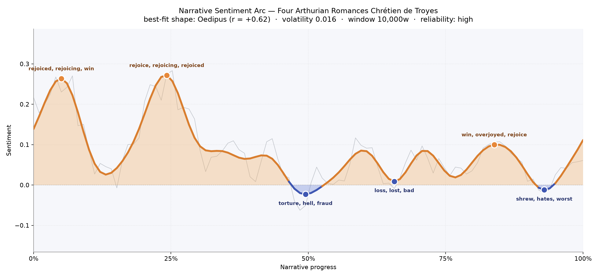
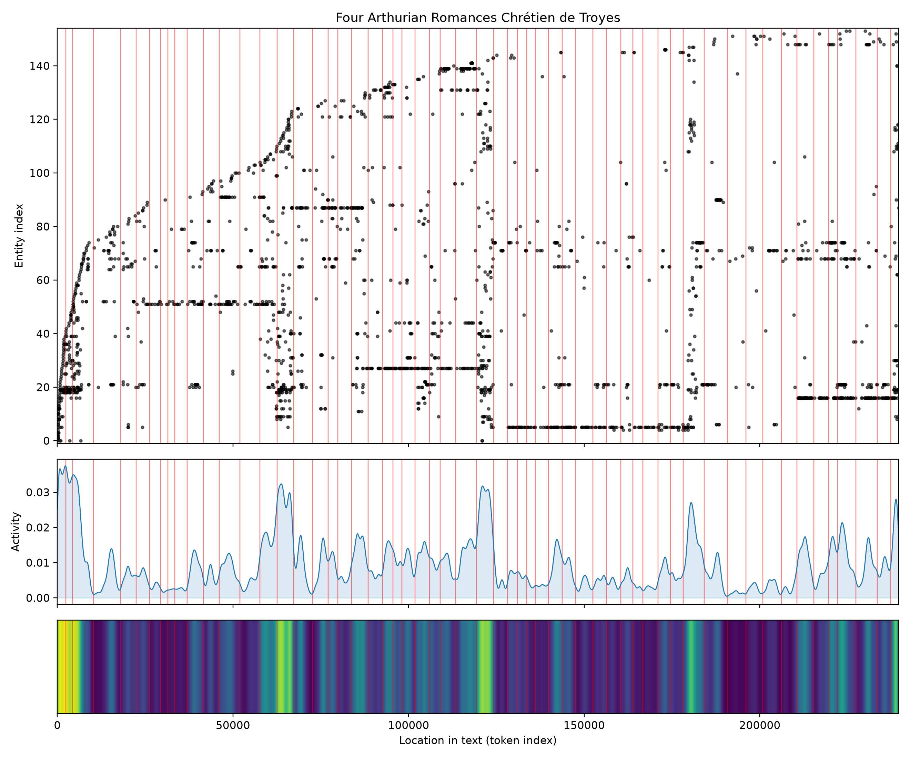
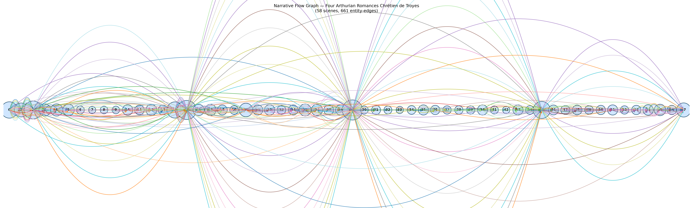

# Four Arthurian Romances
### by Chrétien de Troyes

roughly 191,000 words · an Oedipus arc — a story lifted early into joy, then let down by degrees into hurt

## The shape of the story

Chrétien opens in sunlight. In the first quarter of the book the mood climbs quickly, cresting on words that keep repeating themselves like bells at a wedding — the early summit shines with "rejoiced, rejoicing, win, rejoice, winning, victory", and a second, taller crest near the one-quarter mark thickens with "rejoice, rejoicing, rejoiced, win, loved, pleased". These are the courtship pages, the pages of victory feasts and welcoming halls, when a knight's return is greeted by trumpets and the queen's smile. It is hard to read them without softening.

Then the road turns. The middle of the book slides into shadow. The deepest trough — right at the halfway mark, roughly six hours into a slow reading — bruises with "torture, hell, fraud, bad, lost, worse", and the second valley two-thirds of the way through darkens further with "loss, lost, bad, killed, dead, kill". A brief false dawn near the four-fifths mark, quietly lit by "win, overjoyed, rejoice, greatest, pleased, great", is not enough to hold the arc up; the final pages sink again into "shrew, hates, worst, violently, hated, hate". A story lifted only to be undone: the arc is high in trust, high in reliability, and it says plainly that these are romances that begin as celebration and end in something harder — vows tested, loyalties broken, love that must survive violence rather than crown it.

<figure><figcaption>Two early crests of feast and victory, a plunge at midpoint, and a long slow descent that never fully rises again.</figcaption></figure>

## Who lives on the page

The court is crowded, and the counts tell you which knights carry the weight. Yvain leads by a hair, with Lancelot and Gawain close behind and Cligés not far after — the four heroes whose tales Chrétien braided into this volume. Kay the seneschal appears often enough to feel like a fixture of the hall, and Alexander, Erec, Enide, and the young lovers of the Cligés strand round out the ensemble. King Arthur and his queen preside less as protagonists than as gravity: their counts (66 and 64) mark the recurring frame every quest returns to.

A few of the top names deserve a gentler eye. "Chrétien" is the poet himself, stepping in as narrator. "Thou" and "king" are honorifics the tagger mistook for names — a small imperfection of medieval English translation. And "Enide" is filed under organisations rather than people, which is a mislabel, not a demotion: she is one of the book's most vividly written wives. Read past those small stumbles and you get exactly the cast you would expect from a court poet — knights first, ladies just behind them, the sovereign always in the middle distance.

<figure><figcaption>Four knights carry four romances; Arthur and his queen hover as the fixed point they all ride out from.</figcaption></figure>

## The weave of scenes

Fifty-eight scenes threaded together by six hundred and sixty-one shared-figure connections — a very dense weave for a book that gathers four separate romances between one set of covers. The scene-by-scene counts tell a familiar shape: the opening chapters are populous (forty, twenty-seven, fifty faces on the page), then the volume settles into leaner set pieces of three or four figures at a time, the way a quest empties the hall and puts one knight alone in a forest. Spikes at scenes fifteen, sixteen, and above all thirty pull the cast back together — tournaments, courts, reunions — and the great swell at scene thirty (sixty-four figures) reads like a full-court gathering, likely the hinge between two of the four tales. The final movement, scene fifty-eight, closes on twenty-eight figures: an ensemble farewell, not a lonely one. The flow diagram itself looks like a long braided rope, arcs looping over and under a straight spine — exactly the shape a reader feels when the same knights keep passing through the same court between adventures.

<figure><figcaption>Four romances braided together — dense at every court scene, thin along the roads between.</figcaption></figure>

## What a reader takes away

Chrétien writes joy generously and then makes his knights earn it back. You leave these four romances with the sound of hooves on a spring road and, underneath, the darker knowledge that the courts they return to will not be the courts they left. Rejoicing at the start, hatred at the close — and, in between, the whole apparatus of chivalry being asked, patiently and repeatedly, whether it can survive its own ideals.
