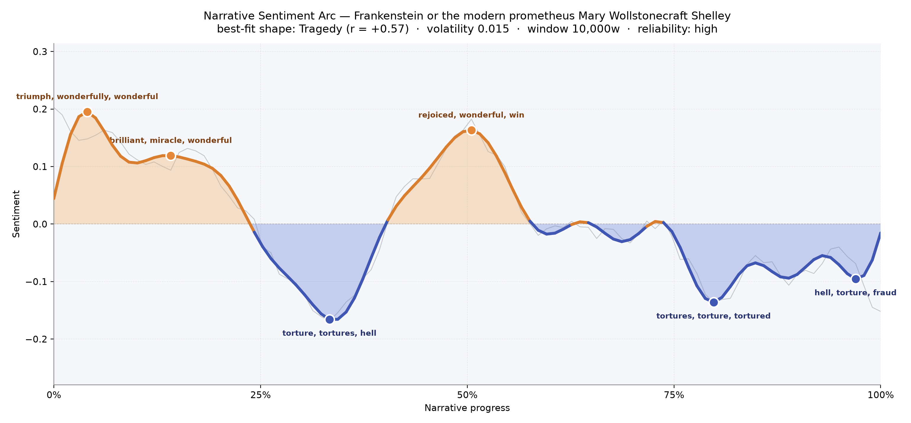
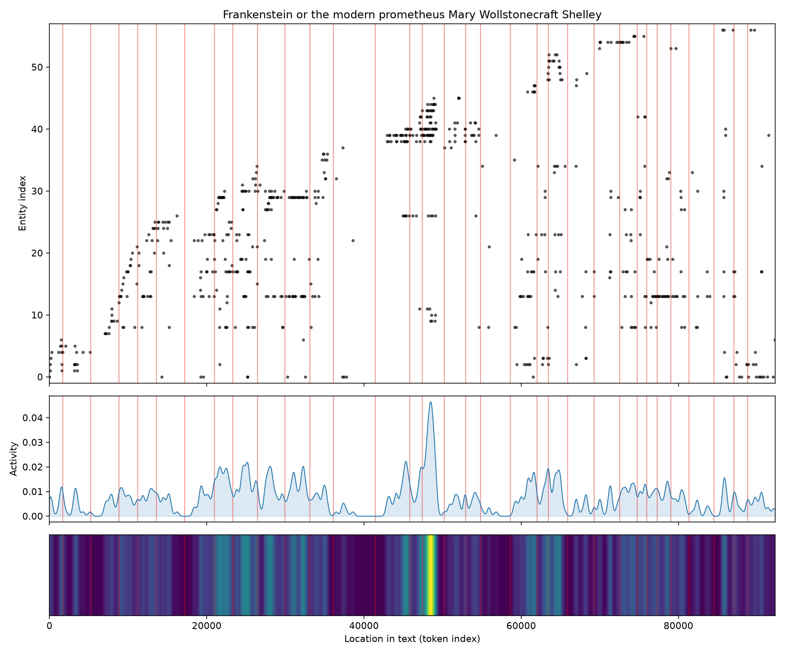
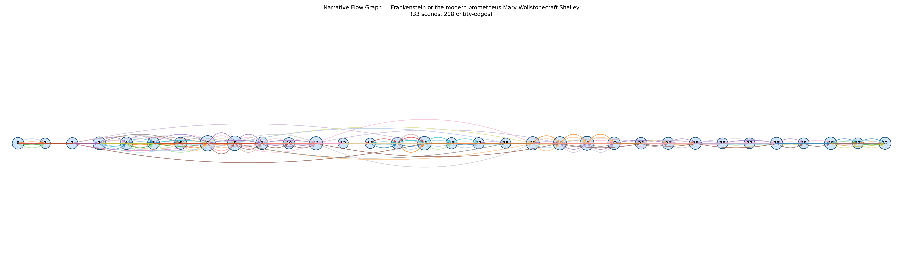

# Frankenstein; or, The Modern Prometheus
### by Mary Wollstonecraft Shelley

75,297 words · a Tragedy — a light that flares in youthful ambition and then guts itself, chapter by chapter, into ash

## The shape of the story

Frankenstein opens in a kind of pale sunrise. The first stretch of the book carries a hush of promise: Victor's early student days glow with "triumph, wonderfully, wonderful, overjoyed, beloved, excited," the vocabulary of a young mind that believes the world will yield to it. A second crest at the fourteen-percent mark still hums with "brilliant, miracle, wonderful, supreme, winning" — the moment before the spark, when knowledge feels like a benediction. And near the midpoint the arc lifts once more, buoyed by "rejoiced, wonderful, win, ecstatic, perfectly, paradise," a false Eden of family reunion and lakeside air.

Then the floor falls out. The reader feels the descent as a slow suffocation rather than a sudden shock: the arc's steepest trough, a third of the way through, is choked with "torture, tortures, hell, lost, destroyed, crime" — Justine's execution, William's small coffin, the first realisation that the creature Victor made will grind through everyone he loves. From there the line refuses to rise again. Around the four-fifths mark it sinks into "tortures, torture, tortured, miserable, terrible, cheat," and the closing pages seal the shape with "hell, torture, fraud, tortured, evil, loss." This is Shelley's peculiar cruelty as a shaper of feeling: she gives us three separate summits so the fall from each feels earned, and then denies us any final ascent. The arc reads like a candle guttering — bright, brighter, then dark for good.

<figure><figcaption>Three summits of hope, then a long grey descent into torture and loss — the felt curve of Shelley's tragedy.</figcaption></figure>

## Who lives on the page

The most striking thing about Frankenstein's cast, seen from a distance, is who *isn't* at the top. Elizabeth Lavenza dominates the roll with eighty-nine mentions — the moral centre Victor keeps invoking and failing. Justine Moritz follows, less a character than a wound the book returns to. Then Henry Clerval, the warm foil; Felix, Agatha, and Safie, the cottagers whose small kindnesses school the creature in language and longing. Victor himself sits lower on the list than one might expect, and "Frankenstein" is counted separately — a quiet reminder that this novel is a chorus of testimonies about him rather than a solo confession.

Geneva and England anchor the geography; Ingolstadt, the university city where the spark is struck, appears too. A couple of the labels wobble — "Frankenstein" the surname and "Victor" the given name are split apart, and "Safie" and "arabian" have been sorted into odd bins — but the human shape is clear: a domestic circle of siblings, cousins, and friends whom Victor will, one by one, hand over to the thing he made. The creature, tellingly, has no name to appear on any list. He is the silence at the centre of every column.

<figure><figcaption>A domestic constellation — Elizabeth at the centre, the cottagers on the rim, and a nameless maker's-child pulling every orbit toward ruin.</figcaption></figure>

## The weave of scenes

Thirty-three scenes braid the book, and the density map tells its own quiet story. The opening chapters are sparsely peopled — a ship on the ice, a boy in Geneva — but the mid-book swells thick with figures: the cottage sequence, where the creature watches Felix, Agatha, Safie, and the blind De Lacey, is the busiest single stretch, seventeen presences crowded into one frame. Another cluster gathers as Victor circles England and the Orkneys, gathering companions and dread in equal measure. Toward the close, the weave thins again: fewer names, more ice, a pursuit across the polar dark where only two figures matter. The visual score reads like a symphony that opens with a soloist, floods into a chorus at its heart, and empties back down to two voices calling to each other across the white.

<figure><figcaption>A crowded middle, thinned ends — the social world Victor loses, one strand at a time.</figcaption></figure>

## What a reader takes away

Frankenstein leaves you with a chill that has nothing to do with the Arctic. It is a book about the moment after wonder — the long, unappeasable afterlife of a decision made in a fever of brilliance. Shelley's arc insists that the price of the summit is the fall, and that the fall, once begun, does not level out. What lingers is not the monster but the quiet: the empty chairs at the Frankenstein table, and a maker still calling, across the ice, for the child he refused to love.
