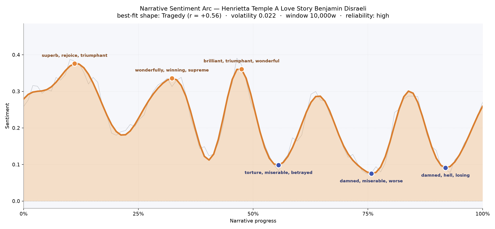
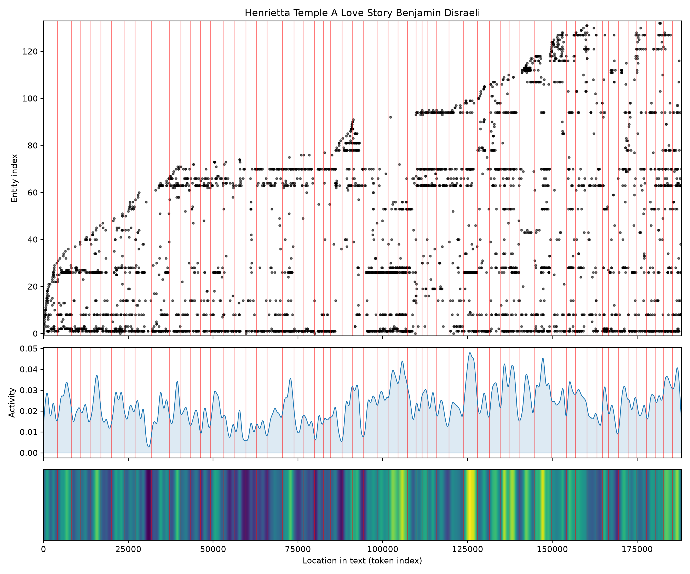

# Henrietta Temple: A Love Story
### by Benjamin Disraeli

143,908 words · a Tragedy arc — three bright crests of courtship, then the long twilight of a heart caught between vow and desire

## The shape of the story

Disraeli's novel walks its reader up three separate hills of feeling and then, with a courtly bow, escorts them into shadow. The first ascent comes early, near the eightieth minute of reading, when Ferdinand Armine's world glitters with words like "superb, rejoice, triumphant, brilliant" — the language of a young heir returning to his family seat, dazzled by his own prospects. A second peak arrives around the third mark, thick with "wonderfully, winning, supreme, rapturous, ecstatic," the vocabulary of first love as it takes hold in the gardens of Armine. The third and highest crest sits almost exactly at the book's midpoint, radiant with "brilliant, triumphant, wonderful, happy, happiness, grateful" — the private summer of a secret engagement.

And then the light goes out. The first valley, near the fifty-fifth percentile, is a soft bruise of "torture, miserable, betrayed, deceit, lost, victim" — the moment the reader realises Ferdinand is already promised to his cousin Katherine, and that every rapture has been shadowed by another woman's claim. The trough deepens through the three-quarter mark, curdling into "damned, miserable, worse, anger, abuse, anguish," and by the ninety-percent turn the book is muttering "damned, hell, losing, worse, bad, die." The final register lifts only faintly. This is a genuine tragedy of feeling — not sudden, but slow, and rung out three separate times, as though Disraeli wanted us to feel joy fully before he asked us to give it up.

<figure><figcaption>Three courtship crests, three answering troughs — the emotional gait of a divided heart.</figcaption></figure>

## Who lives on the page

Ferdinand towers over the count, with more than nine hundred mentions — this is his book, plainly, a young man's crisis stretched across five hundred pages. Henrietta answers him from the title inward, appearing both as her first name and, more formally, as "Henrietta Temple," her doubled presence a nice measure of how public and private selves collide in her. Around them gather the family and confidants who make the plot's machinery: old Glastonbury, the loyal priest-tutor whose name recurs almost five hundred times; Katherine, the cousin-fiancée whose quiet claim is the story's fulcrum; Lord Montfort, whose steady kindness offers Henrietta an alternative; and Count Mirabel, Lord Grandison and the money-lending Levison who circle Ferdinand's affairs. The tagging is imperfect — "Armine" and "Temple" are called organisations, but these are the family names, the two houses whose reconciliation the marriage plot must engineer. England appears too, a whisper of the wider world outside these drawing rooms.

<figure><figcaption>Ferdinand's line runs the length of the page; new figures arrive in bands as the London scenes begin.</figcaption></figure>

## The weave of scenes

Fifty-nine scenes braid across the book, linked by more than eight hundred threads of recurring presence. The visual score shows a beginning of moderate density — Armine, Glastonbury, Ferdinand, a small ancestral world — thinning through the middle chapters when the lovers are alone at Ducie and the cast contracts to almost nothing. Then, from roughly the two-thirds mark onward, the strands multiply and cross more thickly: London arrives, Bellair and Mirabel and Montfort enter, and the arcs sweep wider as debts, duels and drawing-room manoeuvres pull more people into the same scenes. The densest weave sits near the final quarter, exactly where the arc's sentiment has fallen furthest — a crowded stage for a private undoing.

<figure><figcaption>Thin at the pastoral middle, thickly braided at the London climax — the geometry of a widening crisis.</figcaption></figure>

## What a reader takes away

Henrietta Temple leaves the taste of a joy one is not permitted to keep. Disraeli lets his reader feel three separate summers of Ferdinand's happiness at full strength before the accounting begins, and the effect is less bitter than melancholic — the sense that in this world love and honour must be paid for in the same coin, and that a young man can be triumphant, betrayed and forgiven all inside the same volume. It is a courtly, forgiving tragedy: the sort of book that trusts you to grieve for characters even as it works, discreetly, to save them.
