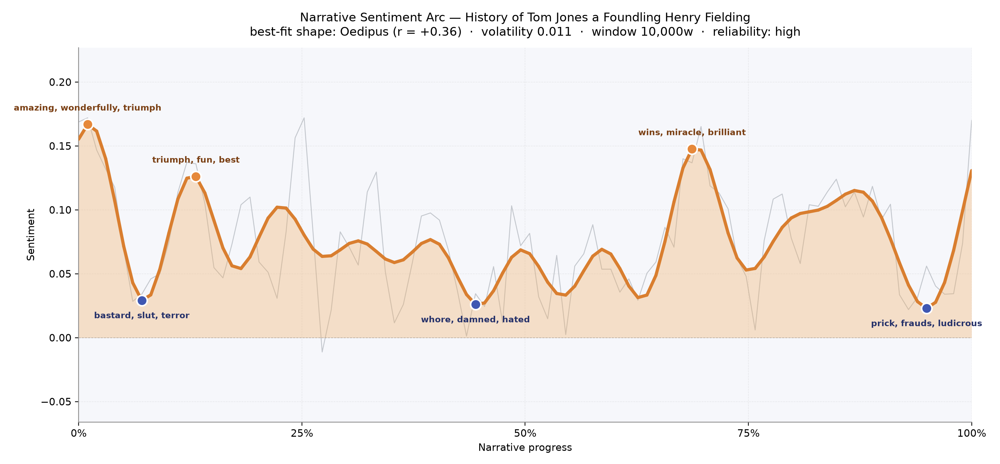
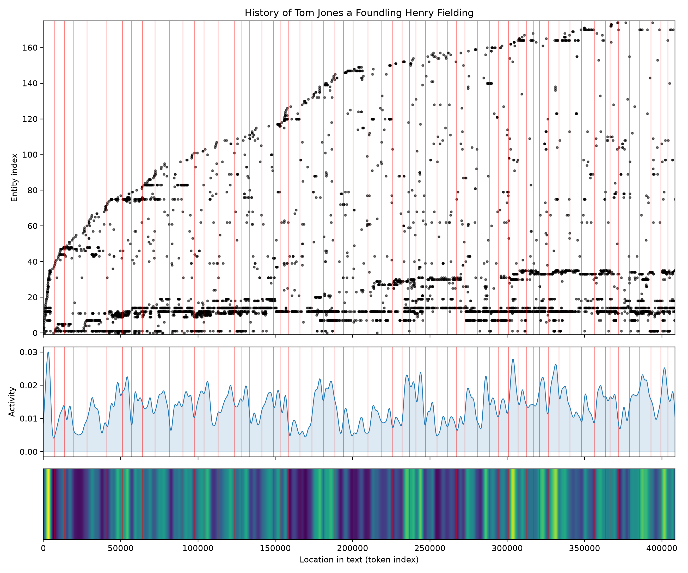

# History of Tom Jones a Foundling
### by Henry Fielding

A 352,733-word comic epic whose emotional weather traces an Oedipus arc — a young life lifted high, brought low, and never quite permitted the ease its author seems to promise.

## The shape of the story

The felt life of this enormous book is the sensation of being repeatedly hoisted onto a wave only to be dropped from it. Fielding opens in a register of almost boisterous good cheer — the first crest is thick with "amazing, wonderfully, triumph, heavenly, great, pleased," which is exactly the sound of a foundling being taken up by fortune, a baby laid at a good man's door and welcomed. A second bright ridge just past the tenth of the way in keeps the mood aloft with "triumph, fun, best, heroic, soothe, good," the vocabulary of a boy loved by his benefactor and cheerfully mischievous in a green county.

Then the ground opens. The first true valley, near the seventh of the book, is bruised with "bastard, slut, terror, cruel, guilt, slave" — the language of a village turning on a young man for the sin of his birth. Deeper still is the trough at the book's middle, where the sentiment thickens with "whore, damned, hated, bad, destroying, destruction": Tom cast out, on the road, and the reputation of women he cares for being systematically pulled apart. A late, unexpectedly luminous peak arrives past the two-thirds mark on "wins, miracle, brilliant, wonderful, perfect, good" — the London reversal, the rich patronage, the sense that fortune has remembered its favourite. But Fielding is not done. Almost at the last page, the arc dips again into "prick, frauds, ludicrous, abusive, abused, dead," as if to remind the reader that even a comic providence must first walk the hero to the gallows door before turning the key. The volatility stays modest across all this — nothing lurches — but the pattern is unmistakable: a life lifted, dropped, lifted, dropped again, and only then allowed to breathe.

<figure><figcaption>Two early ridges of cheer, two long troughs of disgrace, a bright London reversal, and one last shadow before the curtain.</figcaption></figure>

## Who lives on the page

The tally reads like a Fielding dramatis personae written in miniature. Jones himself dominates, at over thirteen hundred mentions — the book's sun, and everything else in orbit. Sophia follows at a distance, named nearly eight hundred times, which is the shape of Fielding's affection: she is spoken of, sought, remembered, more often than she is on stage. Partridge — the loquacious, superstitious barber who becomes Tom's shadow on the road — clocks in third, ahead even of the benevolent Allworthy, and that feels right for a picaresque: the servant-companion out-speaks the guardian. Blifil, the sanctimonious rival, holds his ground; Thwackum the flogging tutor is present enough to be felt; Squire Western's blustering pursuit is there in the count. Honour, the pert lady's-maid, appears as a proper name and rightly so — Fielding uses her almost as a character-adverb. Bellaston, Nightingale, Miller, Fitzpatrick, Molly the gamekeeper's daughter — every station of the plot is represented. London sits at the bottom of the list as the one city named often enough to leave a mark; Sophia and Partridge and several others are mistagged as places, but the reader recognises the people underneath. It is a novel populated the way an eighteenth-century inn-yard is populated: everyone here has business.

<figure><figcaption>One foundling at the centre, one beloved at the horizon, and a bustling road of tutors, rivals, servants, and squires between them.</figcaption></figure>

## The weave of scenes

Read as a visual score, the flow of sixty scenes and nearly a thousand connecting threads looks less like a knot and more like a great braided river. The opening scene is the busiest of all — thirty-nine named presences crowding around the cradle, as if the whole county has come to gawp at the foundling. From there the flow narrows and thickens by turns: a lean stretch in the twenties as Tom is exiled and the cast shrinks to the road, then a rich swell in the middle thirties as the London world opens and the population of the page balloons back into the twenties. The closing scenes settle to a steady sixteen or seventeen figures apiece — the tidy Fielding finale, everyone brought back on stage to be paired off, forgiven, or unmasked. It is the geometry of a comic epic: a crowded beginning, a lonely middle passage, a crowded end.

<figure><figcaption>A braided river of sixty scenes — crowded at the cradle, thinned on the road, brimming again at the reckoning.</figcaption></figure>

## What a reader takes away

You close Tom Jones carrying the pleasant conviction that a good heart, roughly handled, will finally be recognised — and the quieter conviction that Fielding took his sweet time about it. The emotional inheritance is generosity: toward foolish young men, toward well-meaning old ones, toward maidservants with opinions, toward a world that punishes warmth before it rewards it. It is a book that dips you twice into disgrace before it lets you back into the drawing room, and it is the better for the dipping.
