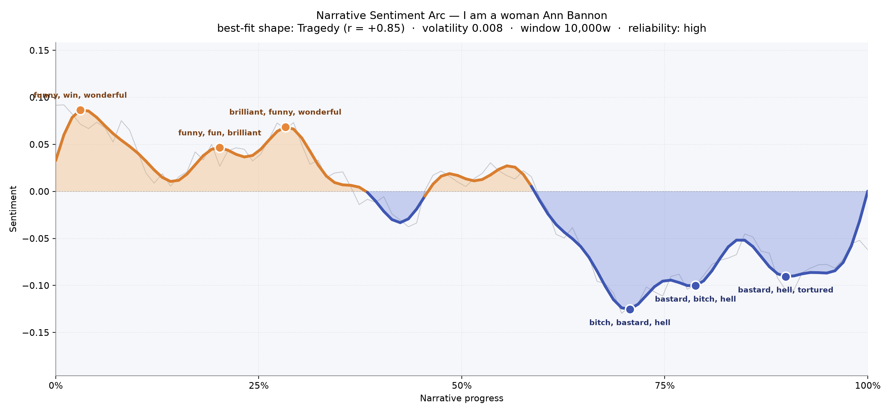
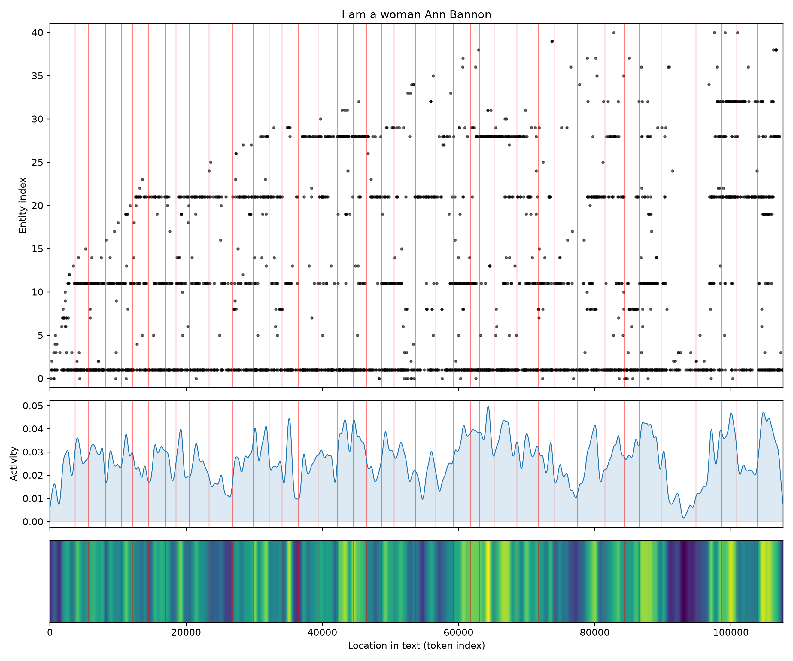
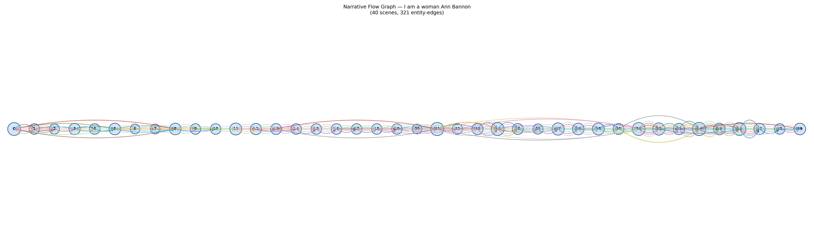

# I Am a Woman
### by Ann Bannon

78,277 words · a Tragedy arc — a life that brightens into hope before the floor gives way

## The shape of the story

Bannon's novel opens with a nervous, giddy lightness: Laura arrives in the city with a heart still learning what it wants, and the early pages bloom with "funny, win, wonderful, fun, nice, perfection." That first crest, barely into the book, feels like a young woman leaning into a new life — a bar's neon, a first drink, a first look held too long. The buoyancy holds through the second and third rises around the twenty and twenty-eight percent marks, where the reader keeps meeting scenes touched by "brilliant, funny, wonderful, terrific, wonderfully, fun." These are the Village nights, the flirtations, the electric feeling that the world might, for once, permit her.

Then the arc begins its long, unbroken descent. From roughly the middle onward, the sentences accrue weight, and by the seventy-percent point the trough is thick with "bitch, bastard, hell, ass, tortured, damned." The next dip, near the seventy-eight-percent mark, is only a shade less severe, colored by "bastard, bitch, hell, damned, tortured, bad." Even the final valley, deep into the last tenth, still bruises with "bastard, hell, tortured, ass, kill, awful." This is Tragedy in its truest reader-felt sense: not sudden calamity but a slow spoiling, the light of the early chapters draining out drop by drop. Laura's story rises toward a self she almost dares to claim, then closes with the taste of a door being shut from the other side.

<figure><figcaption>Three bright hills give way to a long, sinking coast — a Tragedy in the fullest emotional sense.</figcaption></figure>

## Who lives on the page

Laura is the book's gravitational center, named more than twice as often as anyone else — the frequency alone tells you whose interior we're inhabiting. Around her orbit the three figures who will shape her downfall and her stubborn survival: Marcie, the roommate whose warmth is always a little too calculated; Jack, the wry, generous gay man who becomes her confidant; and Beebo, the swaggering butch presence whose arrival changes the weather of every room she enters. Smaller presences — Sarah, Terry, Beth, Jean — flicker through as friends, rivals, ghosts of other lives. Merrill Landon reads less like an organization and more like a person the tooling mis-sorted; treat it as another figure at the edges. The cities that hold this drama, New York and Chicago, appear as brief geographic anchors rather than settings that speak. A few noisier tokens ("laur", the possessives) are just fragments of Laura's own name doubling back. The cast is small, tight, and claustrophobic in the way mid-century queer novels often are — the world outside the door does not really exist.

<figure><figcaption>Laura at the sun, with Marcie, Jack, and Beebo as the closest, most consequential orbits.</figcaption></figure>

## The weave of scenes

Across forty scenes the connective tissue is dense — hundreds of overlapping links between figures — and the density rises noticeably in the back half. Early scenes tend to gather around seven or eight named presences at a time; the later stretches balloon to twelve, fourteen, even fifteen, as if the emotional pressure keeps pulling more people into the same room. You can feel the braiding: Marcie's thread crosses Jack's, Jack's tangles with Beebo's, and Laura sits at the knot of all of them. The scenes near the climax are the busiest and most crowded, which matches the sentiment plunge — misery, in this book, is a social event. The final scenes thin only a little, leaving Laura more isolated than the roster suggests.

<figure><figcaption>A steadily thickening braid — the closer the ending, the more crowded and entangled the rooms.</figcaption></figure>

## What a reader takes away

*I Am a Woman* leaves behind the particular ache of a self almost realized. Bannon lets Laura reach — toward Marcie, toward Beebo, toward a version of her own name she can say aloud — and then documents, with unshowy honesty, how the world of 1959 made that reach cost her. The early laughter is not a lie; it is what makes the ending unbearable. What a reader carries away is not despair but a stubborn tenderness for a woman who kept trying anyway.
