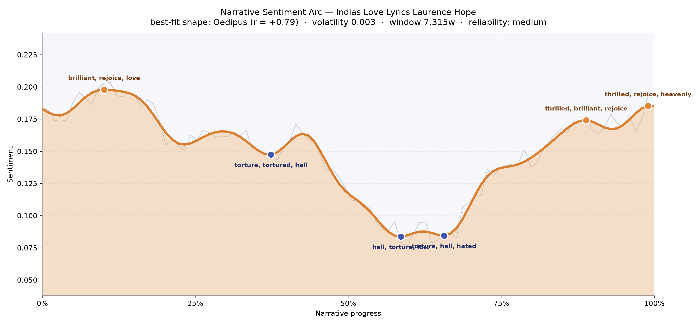
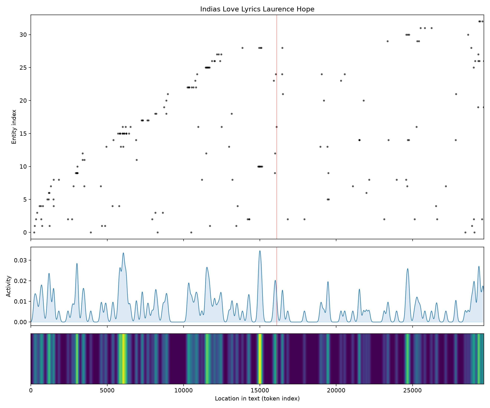
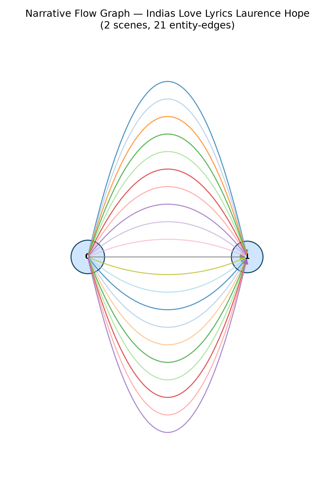

# India's Love Lyrics
### by Laurence Hope (Adela Florence Nicolson)

A slim book of roughly 22,000 words — an Oedipus arc, a life lifted only to be undone and lifted again in the last breath.

## The shape of the story

Read as a felt curve, this book of poems begins in a mood of ecstatic possession and ends in something close to religious astonishment, but between those two brightnesses it walks a long, punishing floor. The opening tenth is the sweetest air of the whole volume — a peak that shimmers with "brilliant, rejoice, love, delights, loved, great", the language of a lover so certain of her beloved she can afford superlatives. Then, past the first third, the ground opens. A trough near the thirty-seven percent mark bruises with "torture, tortured, hell, died, despairing, dead" — the collection's first admission that these songs are addressed to men who leave, die, or turn cruel. The floor deepens further around the halfway line, where the darkest valley of all is thick with "hell, torture, lost, hated, killed, worse", and the misery holds through the two-thirds mark with "torture, hell, hated, died, despairing, dying". This is the Oedipus turn: not merely a slow decline but a sustained residency in grief, the songs refusing to let the reader up for air. Only at the very end does the arc climb again — twin final peaks ringing with "thrilled, brilliant, rejoice, heavenly, wonderful, miracle", the poet reaching, in the last handful of lyrics, for a devotional or almost hallucinatory joy. Because the book is short, read the curve as a mood-graph rather than a proof; but the direction is unmistakable: rapture, ruin, and a strange transfigured rapture at the close.

<figure><figcaption>A bright opening, a long punishing floor, and a final transfigured lift — the Oedipus shape of a lover who refuses to look away.</figcaption></figure>

## Who lives on the page

The count of who lives on these pages is, appropriately for a book of anonymous laments and addresses, a little unruly. "Fate" tops the list at fifteen — not a person but the poems' most-named force, an antagonist worshipped and cursed by turns. Moghra, the jasmine-scented Indian night-flower, is the second most-mentioned presence, functioning almost as a character in the lyrics of longing. Aziza appears among the few named beloveds, alongside jasmin as both flower and figure. The rest of the top list is landscape and mood promoted to presence: the east, the desert, the temple, the river, the sea, the almond tree, youth, death — the reader should treat these gracefully as what they are, the recurring furniture of Hope's Anglo-Indian imagination rather than people in the ordinary sense. The counter has, in its literal-minded way, told us something true anyway: this is a book whose real cast is fate, flower, and geography, with human lovers half-glimpsed through their scent and their weather.

<figure><figcaption>Fate and flower rise above the human names — the true company of an Anglo-Indian song-cycle.</figcaption></figure>

## The weave of scenes

The scene graph reads not as a plot but as a two-panel screen. Only two scenes are found, laced by twenty-one threads of shared presence — one panel holding twenty-nine figures, the other twenty-five, with heavy overlap between them. In a novel this thinness would be alarming; in a lyric collection it is honest. The two halves are less "acts" than moods — the first crowded with the named beloveds and the sacred places, the second thinning slightly as the poems turn more inward, more elegiac. The dense braid between them shows how relentlessly Hope's imagery returns: the same river, the same temple, the same almond, the same fate, walking from song to song like a small company of ghosts. It is the visual score not of a story but of a sensibility.

<figure><figcaption>Two panels braided by twenty-one shared threads — a lyric cycle's small, recurring company.</figcaption></figure>

## What a reader takes away

You leave India's Love Lyrics the way you leave a long, hot evening in which someone has sung to you without pause — flushed, a little wrung out, oddly consoled. The book's argument is the shape of its curve: love arrives as brilliance, love passes through hell, and something on the other side of hell still knows how to say "miracle". Hope's Anglo-Indian ventriloquism is of its era, and the modern reader will hear that; but the ache is not borrowed. It is the ache of a woman who understood that desire and grief are the same weather, and who was willing to stand in it until the last lyric turned bright again.
