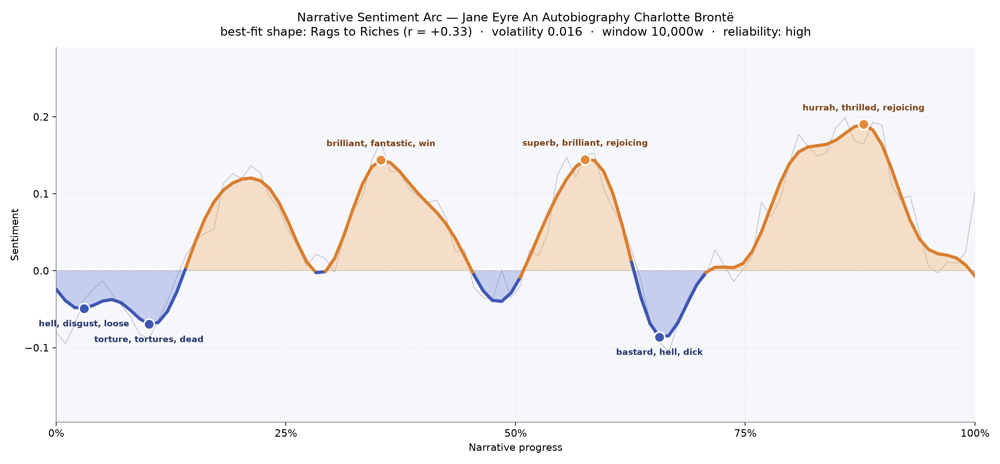
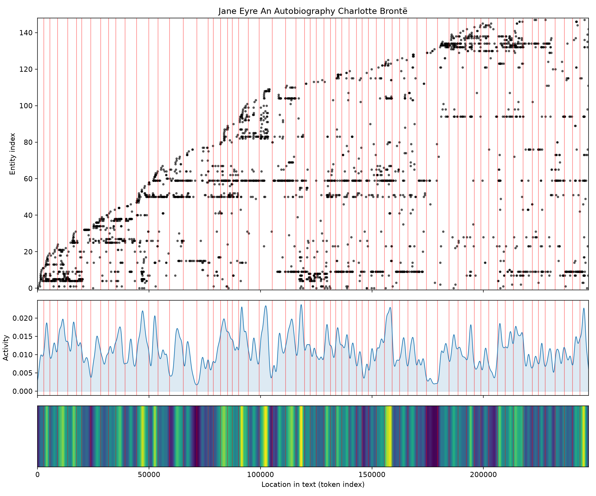
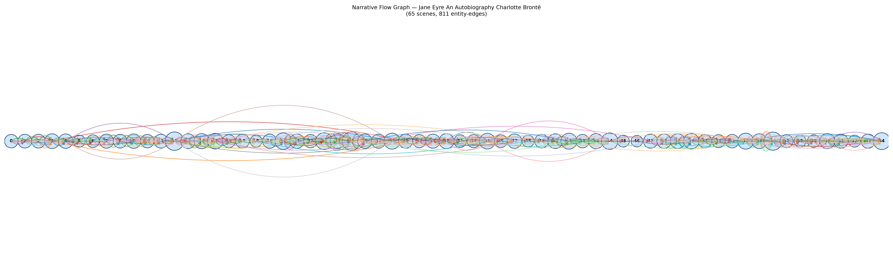

# Jane Eyre: An Autobiography
### by Charlotte Brontë

189,418 words · a Rags to Riches arc — a small, cold girl who walks out of the dark into her own weather

## The shape of the story

Read as a felt experience, the arc of Jane Eyre climbs the way a candle warms a cold room — slowly, unevenly, and against a persistent draft. It begins in the low, bruised air of Gateshead and Lowood, where the first trough near the opening is heavy with "hell, disgust, loose, abhor, killed, violence", and the deeper dip that follows carries "torture, tortures, dead, died, lost, bad" — the vocabulary of a child being educated in cruelty before she is educated in books. Then the sentiment surfaces. A first bright plateau roughly a third of the way in glitters with "brilliant, fantastic, win, wonderful, fun, handsome" — Thornfield's chandelier-lit evenings, the first startling pleasure of being seen. A second rise near the middle carries "superb, brilliant, rejoicing, triumph, win, beloved" — the courtship, the ring almost on the finger.

Then, precisely where a lesser novel would coast to a marriage, Jane Eyre plunges. The steepest valley in the whole book sits just past the two-thirds mark and is dark with "bastard, hell, dick, tortured, foul, cruel" — the attic revealed, the wedding halted, the walk out onto the moors with nothing. The final swell, near the close, is the warmest of all, thick with "hurrah, thrilled, rejoicing, winning, wonderfully, handsome" — Ferndean, the reunion, a hand found in the dark. The overall climb is unmistakable but the ride is corrugated: this is not a triumph handed to Jane, it is one she has to keep climbing back up to. The reliability of the reading is high and the volatility low, which suits the book's temperament — steady prose, felt beneath the surface like a slow tide.

<figure><figcaption>Two rises, three troughs, and a final warm plateau: the temperature chart of a life that keeps insisting on itself.</figcaption></figure>

## Who lives on the page

Rochester towers over the census of names — he is spoken of, spoken to, and spoken about more than anyone, even Jane herself, which tells you exactly what kind of book this is: a first-person narrator so honest she lets the man she loves crowd her own pages. Jane follows close behind, and around them orbit the household and kin who shape her: Mrs. Fairfax the good gray housekeeper, Bessie the first kind hand, the Reeds who cast her out, cousin John, and the sharp, salvational Rivers siblings — St. John, Diana, and Mary. Brocklehurst and Mason arrive as gargoyles on the roof of her life, and Miss Ingram as the glittering false rival. A few of the tagged names are actually places doing heavy narrative work — Thornfield and Lowood in particular — and the label "ingram" really points to the Ingram family rather than an institution; hear it as a surname, not a firm. Georgiana is a person, not a place, whatever the tagger thinks. The list, gently corrected, reads exactly like the cast of Jane's life.

<figure><figcaption>Rochester at the centre of the constellation, Jane just off-axis — the geometry of a narrator who won't quite claim the middle chair.</figcaption></figure>

## The weave of scenes

The scene-weave runs to sixty-five panels stitched with hundreds of connecting threads, and the density of names per scene keeps ticking upward wherever the plot thickens: the middle chapters of Thornfield swell to nearly thirty presences at a time — houseguests, servants, secrets, and the woman upstairs — and again near the end, when the Rivers household gathers and every loose thread is drawn tight. The thinner scenes sit at the hinges: the coach rides, the walks across the moor, Jane alone at Lowood's window. Read as a visual score, the book alternates between crowded parlours and solitary corridors, which is exactly how Jane herself moves through her life — pressed into company, then slipping away to think.

<figure><figcaption>Sixty-five panels, braided densely at Thornfield and Moor House, thinned at every threshold Jane crosses alone.</figcaption></figure>

## What a reader takes away

You close Jane Eyre with the feeling that dignity is a muscle. The book does not promise that the world will be kind — it shows a child being nearly broken, a woman being nearly deceived, and a heart nearly given away on the wrong terms — and then it insists, quietly and repeatedly, that a person can still walk out of any of those rooms with her own name intact. The final warmth is not a reward; it is a rest.
