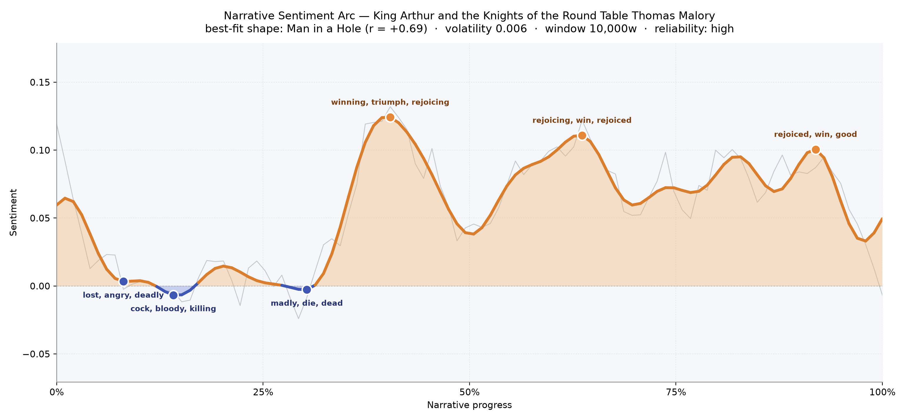
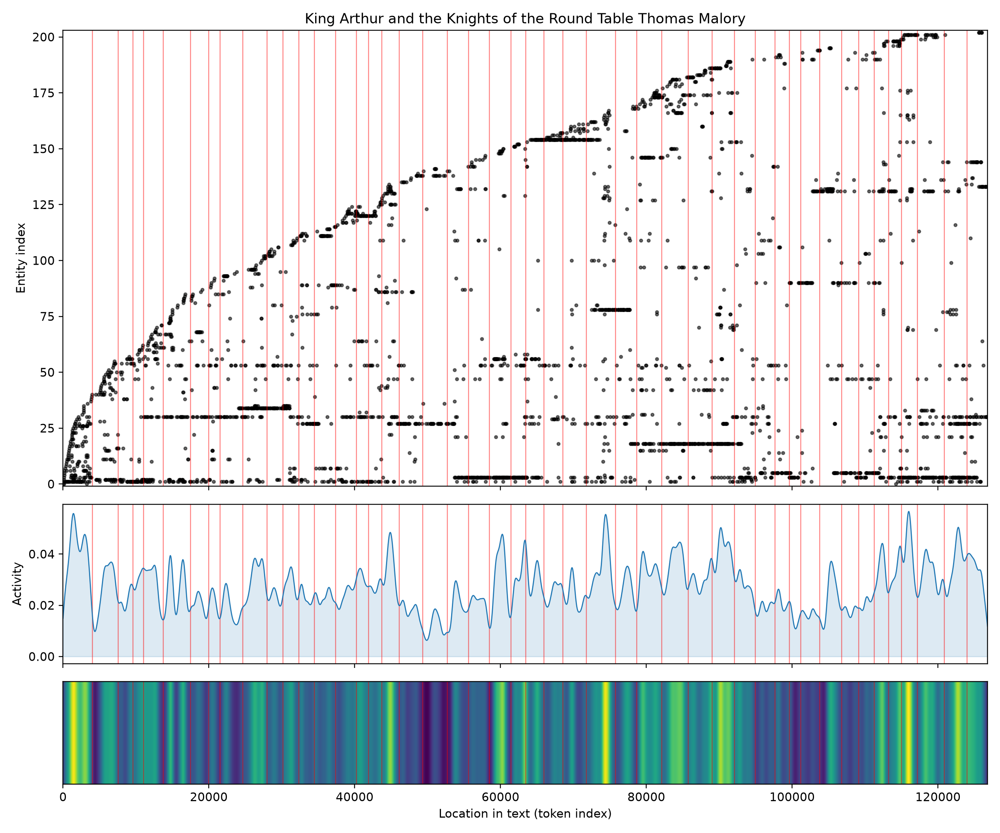
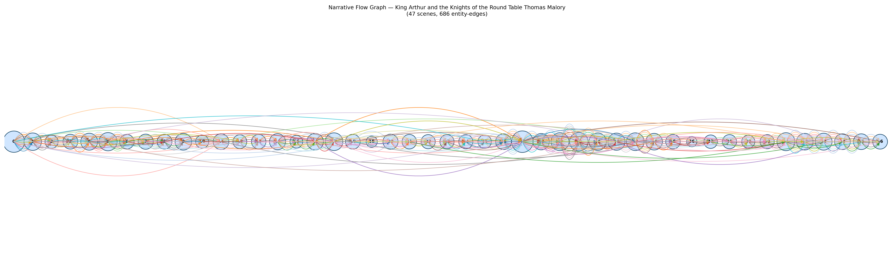

# King Arthur and the Knights of the Round Table
### by Thomas Malory

roughly 98,900 words · a Man-in-a-Hole arc — a kingdom dropped into shadow at its beginning, then hoisted for the long, gleaming daylight of chivalry.

## The shape of the story

Malory opens in the cold. The first stretch of the book — before Camelot has quite become Camelot — reads as a low, dark trough, and the language of that trough proves it: the earliest valley is shot through with "lost, angry, deadly, destroy, treason, chastise", as though the realm cannot stop bruising itself. Push a little further and the darkness thickens into a second dip that hums with "cock, bloody, killing, anger, destroyed, hatred". A third slump near the one-third mark carries "madly, die, dead, foul, charged, mad" — grief and battle-fury blurring into one another. This is not tragedy in the classical sense; it is a country in a hole, waiting for its king.

Then, around the two-fifths mark, the arc lifts. And Malory does not lift it timidly: the first peak breaks open with "winning, triumph, rejoicing, wonderful, overjoyed, win", the language of tournaments and coronations and knights returning alive. A second crest at roughly the two-thirds mark hums with "rejoicing, win, rejoiced, winner, love, good" — courtly love braided into martial glory. A third, near the closing tenth, still glimmers with "rejoiced, win, good, best, great, greater". The book climbs out of its early dark and stays climbed. The feeling is of a chronicle that remembers how bad things were before Arthur, and is unwilling to let that gloom back in until the very last pages — where the smoothed line finally softens, hinting at the twilight the reader knows is coming.

<figure><figcaption>The realm falls into treason and blood, then rises into a long plateau of tournament joy.</figcaption></figure>

## Who lives on the page

Lancelot is the sun of this book. His name appears far more often than any other — nearly twice Arthur's own tally — and that alone tells you where Malory's affection sits. Arthur is the frame, the throne, the reason; Lancelot is the beating heart. Behind them comes a long procession of the Round Table: Gawain, Tristram, Beaumains, Merlin, Galahad, Bors, Balin, Gareth, Percival, and Sir Kay (the counter picked him up as "key", a small hiccup that mistook a name for a noun — worth noting with a smile). A few other entries are honest noise: "thou" is Malory's own Middle-English pronoun leaking through, and "anon" is his favourite little bridge-word, both mis-read as figures. The rest, though, is a fair census of Camelot — a court crowded with named men and thin on named women, exactly as Malory left it.

<figure><figcaption>New knights keep arriving; the roll of names never stops growing until the final chapters.</figcaption></figure>

## The weave of scenes

The narrative flow reads like a long tapestry unrolled across a great hall. Forty-seven scenes sit in a nearly even line — this is an episodic book, and it looks episodic: quest follows quest, tournament follows tournament, each little bubble roughly the same size, each connected to its neighbours by a busy embroidery of shared names. The densest knots come in two places. The opening scene is enormous, packed with forty-one distinct figures — the founding of the realm asks for everyone at once. Then, roughly three-fifths through, another bulge of forty-plus presences swells up: the Grail years, when knights fan out and cross paths and come home changed. The threads never really thin; even at the close, the weave stays busy. Malory does not taper — he simply stops, mid-song.

<figure><figcaption>An almost even chain of episodes, thickened at the founding and again around the Grail.</figcaption></figure>

## What a reader takes away

You come away from Malory with the memory of a light that lasted longer than it should have. The book begins bruised and ends bright, and in between it teaches you that a fellowship is a fragile, radiant thing — worth naming, worth counting, worth grieving. The arc does not warn you about the fall to come; it simply hands you the rejoicing, and trusts you to hold it.
