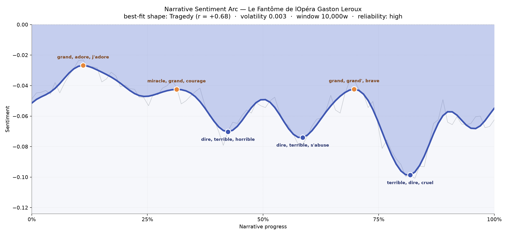
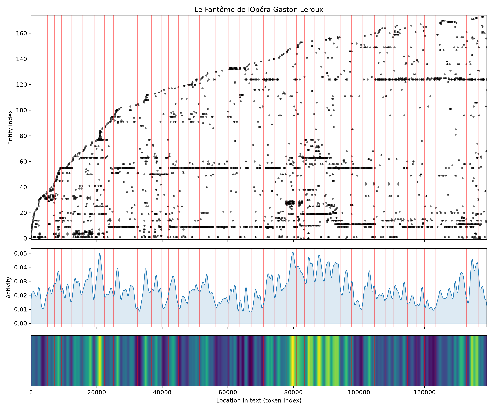
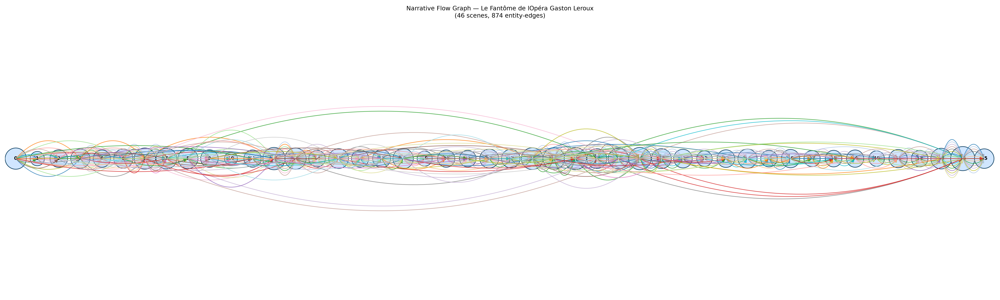

# Le Fantôme de l'Opéra
### by Gaston Leroux

A French novel of roughly 102,700 words that traces a Tragedy — a slow, patient darkening of the stage lights until only one lamp remains.

## The shape of the story

Leroux's novel does not so much fall as it *settles*, the way a heavy curtain settles after the last note of an aria. The felt experience is one of steady descent — every attempted brightness is answered, a few chapters later, by a deeper hush. Early on, near the eleventh part of the book, the tone brushes something almost tender, with "grand, adore, j'adore, grand'mère, compliments, confidence" glowing around Christine and her memories; you can hear a young voice trying to be brave. A little further in, hope makes another attempt — "miracle, grand, courage, brave, pardon, fond" — as if the story itself wanted to believe in a rescue.

But those small daylights only make the shadows crueler. The middle of the novel opens onto a trough thick with "dire, terrible, horrible, cruel, fatal, catastrophe", and just past the halfway mark the language grows tighter and more airless, humming with "dire, terrible, s'abuse, catastrophe, violence". The final and deepest valley, near the four-fifths mark, is the book's true underground: "terrible, dire, cruel, fatal, crimes, horrible" — the vocabulary of a man who has stopped pretending to be anything other than what he is. A late peak fights back with "grand, brave, prudence, chances, pardon", the way a candle flares before going out. It is a Tragedy in the old, operatic sense: not a shock, but an inevitability.

<figure><figcaption>A smooth, mournful descent — three small hopes, three deeper griefs, and a final plunge into the cellars beneath the Opéra.</figcaption></figure>

## Who lives on the page

Three names carry the novel almost entirely. Raoul appears most often, the young viscount whose devotion is both his engine and his blindness. Christine — the singer he loves, appearing both as "christine" and under her full "christine daaé" — is the axis around which every other figure orbits. Erik, the Phantom himself, is named less often than either of them, and that scarcity is part of his terror: he is more felt than seen, a presence measured by absence. The mysterious Persan (the Persian) haunts the second half as a witness and guide, while the managers Richard and Moncharmin, and the old dresser Mame Giry, bring the comic, bureaucratic humanity that makes the horror land.

The tools also surface the Opéra itself as a character — because it *is* one — along with the underground lac and the diva Carlotta. A few labels are honest noise the French text produced: "m." is the honorific Monsieur, "--je" is a dialogue fragment torn from its sentence, and "sorelli" (a dancer) and "carlotta" get mis-sorted as places rather than people. Read past those small stumbles and the cast list is exactly right: two lovers, one masked composer, and the vast machine of the Opéra breathing around them.

<figure><figcaption>Raoul, Christine and Erik form the taut triangle; the Opéra and its lake press in as a fourth, silent presence.</figcaption></figure>

## The weave of scenes

Across forty-six scenes the novel braids rather than parades. The opening chapter is unusually populous — thirty-one figures crowding the foyer on the night of the retiring managers' gala — and Leroux keeps returning to that Opéra-wide density whenever he wants dread to feel public. Two of the most crowded scenes sit near the climax, in the mid-thirties of the sequence, where every corridor and dressing room seems to spill open at once, and the very densest scene (forty-two figures) arrives close to the end, when the search parties, the police, the singers and the ghosts all converge. Between those swells, the book thins to almost intimate duets — the smallest scene has only seven presences — hushed pockets where Christine and Erik, or Raoul and the Persian, share a single lamp. The weave is exactly the shape of an opera: chorus, aria, chorus, aria, and a final packed ensemble before the curtain.

<figure><figcaption>Crowded gala openings and a thronged finale bracket a series of quiet duets in the cellars.</figcaption></figure>

## What a reader takes away

What lingers is not the mask, but the ache beneath it. Leroux hands you a love story disguised as a ghost story and, by the last page, reveals it was a story about loneliness all along — a tragedy sung, with the Opéra's chandeliers dimming one by one.
