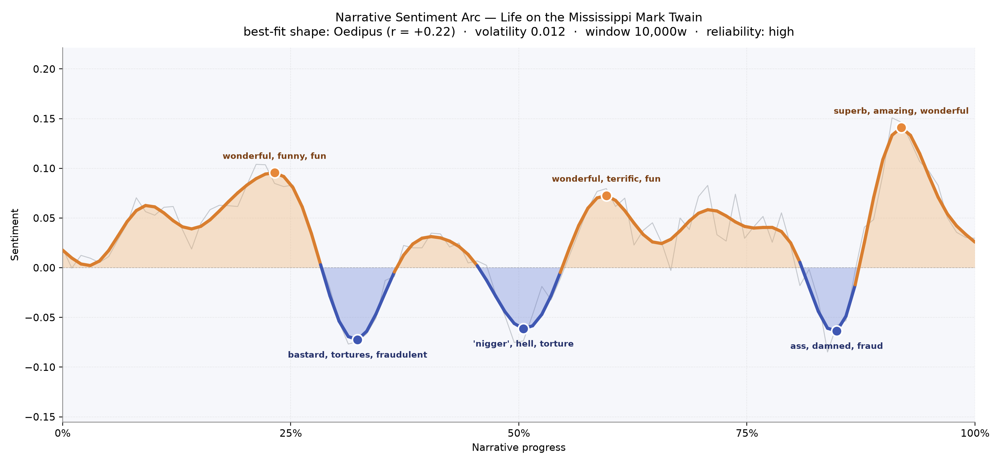

# Life on the Mississippi
### by Mark Twain

148,560 words riding the current of an Oedipus arc — a life raised on wonder, plunged into shame, then lifted again by the river's own brightness.

## The shape of the story

Twain's memoir moves the way the river itself moves — long, muscular, deceptively calm — and then it stumbles. The best-fit reading is an Oedipus arc: a climb, a fall, a fragile late redemption. Early on, near the quarter mark, the sentiment lifts into a young cub-pilot's rapture, thick with "wonderful, funny, fun, triumph, great, perfection" — the exhilaration of learning the shapes of the water under Mr. Bixby's tutelage. Then the mood buckles. A third of the way through, the arc dips into a trough where the language turns rank with "bastard, tortures, fraudulent, idiotic, bad, hideous," the old feuds and steamboat cruelties surfacing like snags. Midway, at the book's ugliest hour, the current darkens further into "'nigger,' hell, torture, awful, disastrous, terrible" — Twain looking hard at the antebellum South he can neither forgive nor stop loving. A brief mid-book brightness (a return to the pilothouse) glitters with "wonderful, terrific, fun, brilliant, fantastic," but the arc plunges again near the four-fifths mark into "ass, damned, fraud, die, badly, dead," a passage bruised with disillusion. Only at the very end does the river climb into its final radiance — "superb, amazing, wonderful, rejoices, brilliant, sparkling" — as Twain hands the reader the sunset over the delta and the sheer mile-wide astonishment of the Mississippi at its mouth.

<figure><figcaption>A working river's emotional weather: three peaks of wonder braided into three troughs of grievance, ending in light.</figcaption></figure>

## Who lives on the page

The most-named presences here are, unmistakably, *places* — and that is the truest fact about this book. **Mississippi** and **New Orleans** tie at the top, each mentioned one hundred and twenty-one times, followed by **St. Louis**, **Cairo**, **Memphis**, **Vicksburg**, **St. Paul**, **Missouri**, and **Arkansas**. The river is the protagonist; the towns strung along it are the supporting cast. Only two human figures rise clearly out of the water: **Bixby**, the exacting pilot who teaches the young Twain the twelve hundred miles of channel by heart, and **Brown**, the tyrant pilot whose cruelty scars an early chapter. "Napoleon" and "Stephen" appear as towns and names both — small-town Napoleon on the Arkansas shore, and the pilot Stephen whose borrowing habits Twain roasts. A couple of entries ("indian," "south") are really regions and peoples rather than characters, and that's the honest texture of a travelogue-memoir: the human is dwarfed by geography, and Twain wanted it that way.

<figure><figcaption>The river and its port towns hold the frame; only Bixby and Brown step forward as people.</figcaption></figure>

## The weave of scenes

Read as a visual score, the fifty-seven scenes of *Life on the Mississippi* are anything but even. The opening chapters bloom dense — forty-four and thirty-eight distinct presences crowding the first two scenes as Twain unfurls the whole geography and history of the river before he lets a single steamboat leave the dock. The middle stretches thin: a handful of scenes with only three or four figures, the intimate pilothouse chapters where Bixby and the cub are almost alone with the water. Then the weave thickens again in the mid-to-late chapters — the return voyage, the surveying of changed towns, the reunions and comparisons — with counts of twenty-eight, twenty-five, twenty-four building a braided, populous back half. The book ends thin and quick, three or four presences per scene, the way a long trip ends: fewer people, more sky.

<figure><figcaption>Dense at the delta of the opening, sparse through the pilothouse chapters, braided again on the return north.</figcaption></figure>

## What a reader takes away

You come away from *Life on the Mississippi* the way you come away from any long river trip — sunburnt, a little humbled, carrying a working man's vocabulary and a boy's leftover awe. Twain lets you love the river without letting you off the hook for what happened on its banks. The final brightness is real, but earned; it rejoices because it has already grieved.
