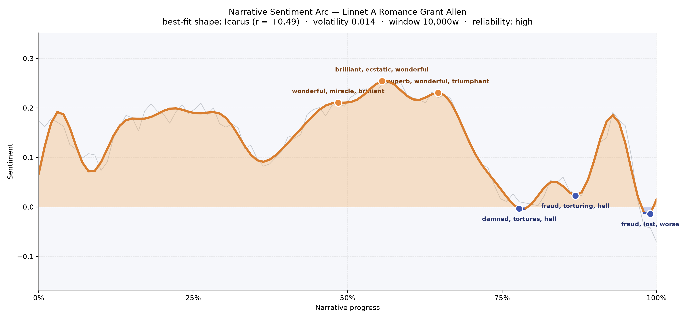
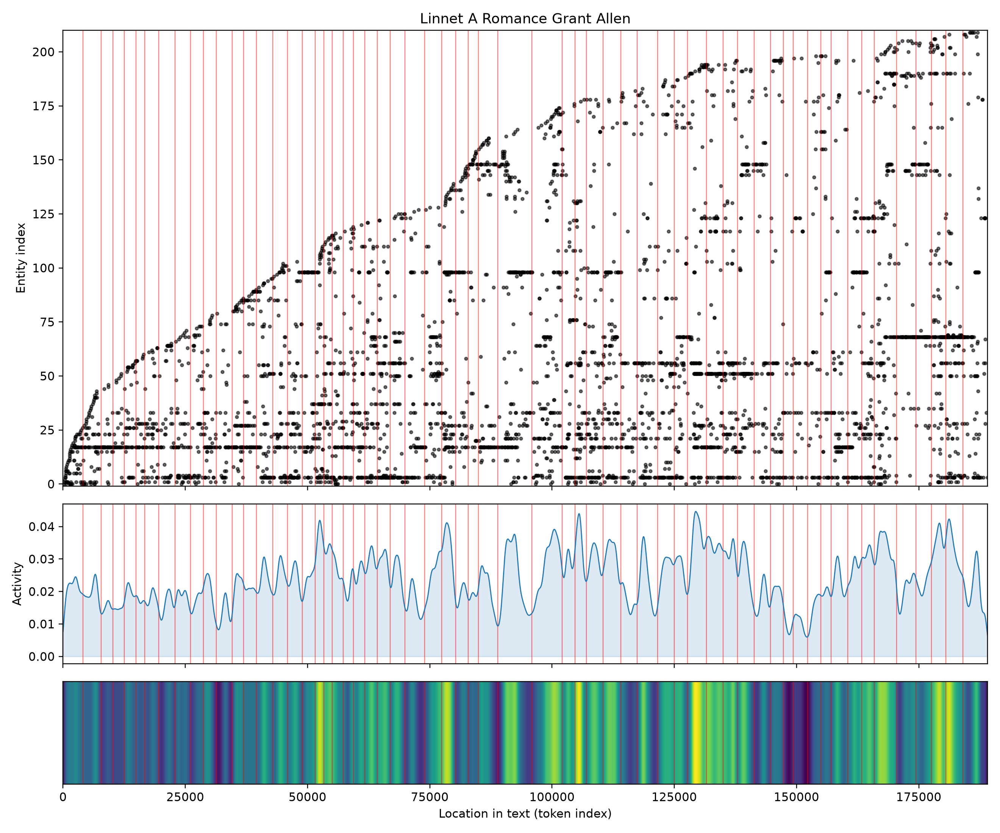

# Linnet: A Romance
### by Grant Allen

A 146,948-word Alpine romance shaped as an Icarus arc — a voice lifted into brilliance, then singed by the fall.

## The shape of the story

Grant Allen's Linnet climbs the way a mountain song climbs: steady, sunlit, gathering warmth through the first half, then losing altitude in the thin air of its final quarter. For most of the book the sentiment breathes above the line, buoyed by the sweetness of first love and the roar of a debut applauded by opera-going London. The three crests cluster around the middle third — the reader lives inside a passage "wonderful, miracle, brilliant, triumphant" as the Tyrolese girl steps onto the stage, and again on the far side of that triumph where "brilliant, ecstatic, wonderful, amused" fill the wings. A third crest, tender rather than dazzled, glimmers with "superb, wonderful, triumphant, rejoicing, adores" — the sound of a woman being loved and known.

Then the barometer drops. Past the three-quarter mark the arc pitches into shadow, the trough near seventy-eight percent thick with "damned, tortures, hell, dreadful, warning, violently" — a marriage revealed as a cage. A second sag around the eighty-seventh percentile burns with "fraud, torturing, hell, terribly, cruelty, violence," and the ending itself refuses easy consolation: the final valley closes on "fraud, lost, worse, bad, miserable, swindling." That is the Icarus signature — the higher the flight, the sharper the plunge — and Allen commits to it. The volatility is quiet, the reliability high, so this is not mood-swing but structure: a long ascent, a short, unmistakable fall.

<figure><figcaption>An Alpine ascent to stage-lit triumph, then a deliberate descent into the language of fraud and ruin.</figcaption></figure>

## Who lives on the page

Two names hold the book upright: Linnet, the Tyrolese singer, appears more than five hundred times; Florian, the aesthete who discovers her, nearly as often. Around that central duet Allen arranges a small chorus — Rue, the American heiress with her own moral gravity; Andreas Hausberger, the zither-master turned impresario; Will Deverill, the Englishman whose steadier love waits in the wings; Franz and the shadowy Philippina. London itself becomes a presence, the counter-mountain against St Valentin's chapel and its snowfields. A few labels are worth noting with a light touch: "seer" is a role, not a person, and the tags that call Florian a nationality or Philippina a place are the tagger mistaking Grant Allen's continental cast for something more geopolitical. Read past the mislabels and the ensemble is coherent — Tyrolese village, German-speaking Alps, American money, English drawing-rooms — the four quadrants of a late-Victorian romance about a peasant girl sold into fame.

<figure><figcaption>Linnet and Florian anchor a steadily widening cast, with new figures entering as the story moves from mountain to metropolis.</figcaption></figure>

## The weave of scenes

Across sixty-one scenes the book braids rather than sprints. The scene-by-scene density is calm through the opening chapters — parties of twenty or so recurring figures — then thickens sharply around the middle, where a single crowded scene bulges to sixty-five presences: the concert-hall London chapter, one imagines, where every earlier acquaintance surfaces at once. A second bulge near scene fifty-six, running to sixty presences, feels like the reckoning — the crisis that gathers everyone back into one room. Between these swellings the flow narrows to intimate two- and three-hander moments, especially in the late seventies where the scene counts drop to seven and twelve: the private wounds, the closed-door confrontations that carry the arc's descent. The web of connections leans heaviest at the London climax and again near the end, exactly where the sentiment dips — a visual echo of a story whose crowds and catastrophes coincide.

<figure><figcaption>A long horizontal braid that swells at the London triumph and again at the final reckoning, thinning in the private hours between.</figcaption></figure>

## What a reader takes away

Linnet leaves you with the ache particular to Icarus stories — the memory of the ascent complicating the grief of the fall. Allen writes the mountain girl's rise with genuine wonder and the marriage-plot machinery of ruin with genuine anger, and the book's parting words in the language of fraud and loss feel less like defeat than indictment. What survives is the singer's voice: heard once at altitude, remembered ever after in the dark.
