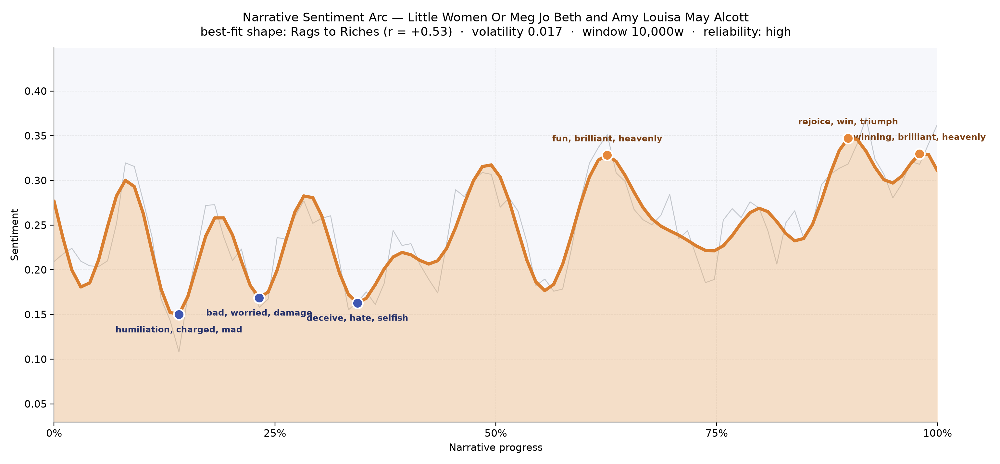
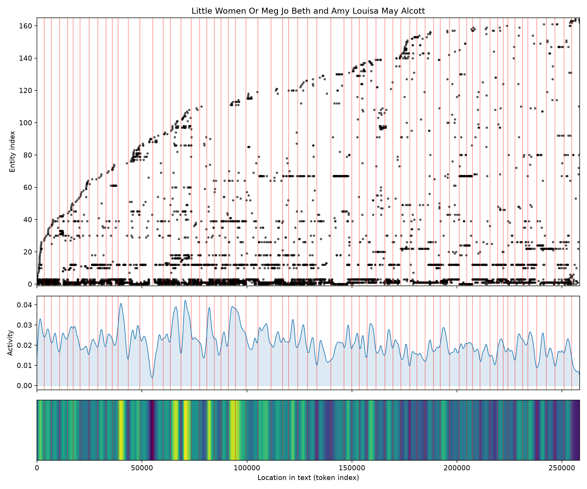
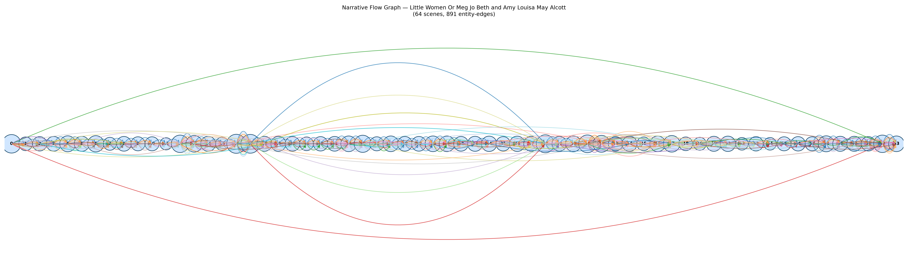

# Little Women
### by Louisa May Alcott

194,190 words · a Rags to Riches arc — a household lifted, slowly, out of hardship into hard-won joy

## The shape of the story

Alcott's novel behaves the way a New England spring behaves: it begins in a cold, tight place and works its way, week by week, toward warmth. The arc rises across the whole book, not in one sweep but in a series of small climbs and small setbacks, so that a reader feels the March family earning each stretch of light. Early on, the mood buckles. The first true trough near the fourteenth-percent mark is bruised with "humiliation, charged, mad, suck, disastrous, tyrannical" — the register of Amy's schoolroom shame and Jo's sharp temper. A second dip near the quarter mark broods in "bad, worried, damage, desperately, worst, selfish", the language of a family living thinly while their father is away. A third valley at roughly a third of the way in tightens further, thick with "deceive, hate, selfish, despondent, desperately, mad" — the domestic small-sins that Alcott takes so seriously.

Then the tide turns. The peak past the two-thirds line lifts on "fun, brilliant, heavenly, funny, good, pleased", and the closing chapters break open with "rejoice, win, triumph, funny, rapturous, winning" and, at the last, "winning, brilliant, heavenly, funny, rejoicing, miracle". The volatility is quiet — meaning the book never lurches; it grows — and the reading is trustworthy across nearly two hundred thousand words: a story that keeps its promise that patience, work, and love are rewarded.

<figure><figcaption>A steadily rising line of small hills — the March family climbing out of scarcity into rejoicing.</figcaption></figure>

## Who lives on the page

Jo dominates, and it is right that she does — 1,346 mentions, more than double any sister. Around her the household assembles in the order a reader remembers it: Meg, Amy, and, a step behind, Laurie the neighbor-boy, then Beth, whose smaller count is itself a quiet ache, the sister who lives softly and leaves early. John Brooke, Hannah the housekeeper, old Mr. Laurence, and the late-arriving Professor Bhaer round out the near circle; Teddy is simply Laurie under Jo's nickname, and Marmee, of course, is the mother whose warmth threads every chapter. A few labels drift — Meg, Amy, Laurence and Marmee are tagged as if they were institutions rather than people, a small quirk of the counting rather than the book. Demi, Sallie and Fred round out the edges of the parlor. What the roll call tells us is that Alcott built her novel around a sisterhood pulled toward its own center of gravity: Jo.

<figure><figcaption>New figures accumulate steadily as the March circle widens — suitors, in-laws, pupils — while the sisters stay lit throughout.</figcaption></figure>

## The weave of scenes

Read as a visual score, the flow graph is a long, gently swelling ribbon of sixty-four scenes bound by 891 connecting threads — more than a dozen overlaps per chapter on average. The densest arcs bow across the middle third, where courtships tangle, illnesses arrive, and the sisters' orbits cross and re-cross; the outer scenes are sparser, thinner in threads, marking a childhood beginning and a grown-up ending that live at the edges of the same family. There is no single climactic knot — this is not a plot with one hinge — but a braided pattern, four sisters carrying four threads that keep touching, parting, and touching again. The middle chapters — with their twenties- and thirties-strong gatherings — are the parlor scenes where everyone crowds in; the leaner scenes are the private ones, a sister at a bedside, a letter opened alone.

<figure><figcaption>A long braided ribbon: four sisters, one household, threads crossing scene after scene.</figcaption></figure>

## What a reader takes away

Little Women leaves you with the feeling of a lamp turned up slowly in a room you already loved. Its rewards are not spectacular but cumulative — a temper mastered, a debt paid, a piano gifted, a hand finally offered — and by the last page you have been taught, without ever being lectured, that a good life is stitched together out of very small acts of kindness performed steadily and on purpose.
