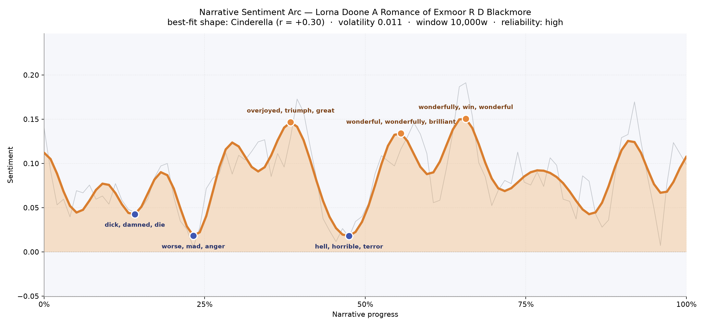
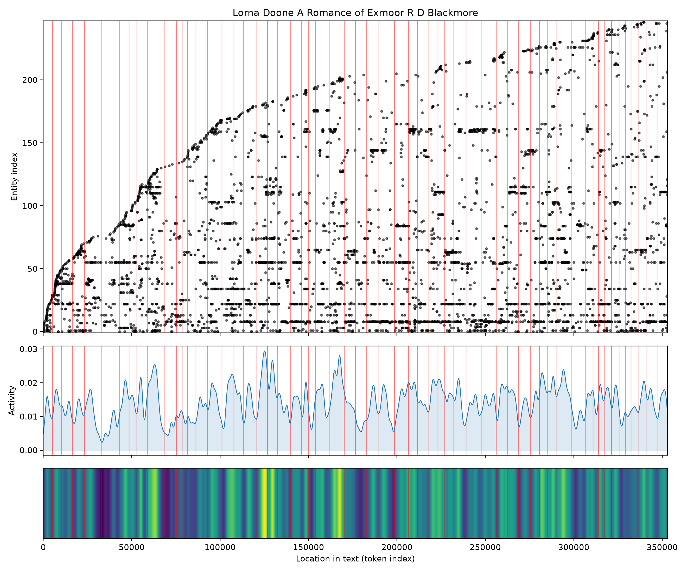
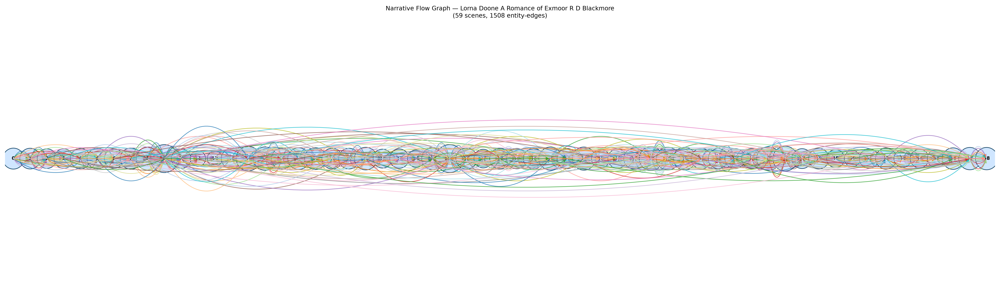

# Lorna Doone: A Romance of Exmoor
### by R. D. Blackmore

roughly 278,000 words across fifty-nine scenes — a Cinderella arc, the long climb of a farm boy who dares to love above his station.

## The shape of the story

Blackmore's Exmoor romance moves the way its hero John Ridd moves through the world: slowly, stubbornly, upward. The arc reads as a Cinderella lift — not a giddy ascent, but the patient rising of a life that has learned to keep its footing on rough ground. Early in the book the mood sinks into a low country pass. Not far in, at about a seventh of the way through, the tone bruises with "dick, damned, die, violently, losing, harassed," the shock of a father murdered on a lonely road. A little further, near the quarter mark, the trough deepens still with "worse, mad, anger, died, harassed, violence" — the household that never quite recovers from that loss, and the shadow of the Doones fattening on the moor.

Then the ground begins to climb. Past the one-third mark the prose brightens toward its first true peak, a chapter thick with "overjoyed, triumph, great, glad, pleasure, good" — John's early victories, the discovery of Lorna's hidden valley, the sweetness of first love. A single darker dip near the halfway point cuts through with "hell, horrible, terror, stupidity, cruel, crime" — the Doones closing in, the countryside terrorised — but the arc recovers quickly. By the second half two more crests roll in, one wide with "wonderful, wonderfully, brilliant, fantastic, great, delight," and the highest of all near two-thirds through, glowing with "wonderfully, win, wonderful, beautiful, glad, good." That is Blackmore's real signature: earned happiness, brightness paid for in blood and patience.

<figure><figcaption>The mood climbs like John Ridd himself — muddy boots, slow steps, a stubborn upward tilt across the moor.</figcaption></figure>

## Who lives on the page

The head of the cast is exactly who Blackmore wants it to be. Lorna towers over every count, named more than any other figure in the book, and John — sometimes just "John," sometimes the fuller "John Ridd" — comes next, as if the narrator's own voice keeps splitting between the boy and the man. Annie, John's warm-hearted sister, is a strong third, and the Doones themselves loom as a collective presence, less a family than a weather system on the moor. Around this core cluster Ruth Huckaback and Lizzie hold their smaller, sharper places, along with John Fry the farmhand, Tom Faggus the highwayman-cousin, Jeremy Stickles the king's messenger, and the sinister Counsellor Doone. London appears as a real destination, not just a name, and Exmoor itself sits high in the list — the country is a presence here, moorland and combe pressing in on every scene. A few tags read like honorifics rather than people, but the shape of the ensemble is unmistakable: a domestic circle, a criminal clan, and a landscape that outlives both.

<figure><figcaption>A widening cast: the early chapters are sparse, then figures accumulate like neighbours arriving for a long winter.</figcaption></figure>

## The weave of scenes

Seen as a visual score, the narrative flow is a long, densely braided rope stretched between two tapered ends. Fifty-nine scenes carry more than fifteen hundred connective threads, and the mass concentrates in the belly of the book — the middle third where the Doone valley, the farm at Plover's Barrows, and the London errands all keep tugging on the same rope. A couple of chapters swell into unusually crowded gatherings (weddings, sieges, the great winter), while a few thin passages between them read like solitary rides across the moor. The opening and closing scenes narrow to a whisper of connections, which feels right for a first-person memoir: a boy alone at the start, an older man alone at the end, and in between a life crammed with kin, enemies, and neighbours.

<figure><figcaption>A braided middle, tapered ends — the shape of a life remembered from its quiet edges inward.</figcaption></figure>

## What a reader takes away

Lorna Doone leaves behind the smell of peat smoke and the weight of a good man's patience. It is a book about slow strength — about loving without hurry, forgiving without softness, and standing your ground on land that has always been claimed by someone worse. The arc rises because John Ridd refuses to be rushed, and the reader inherits a little of that same steady heart.
