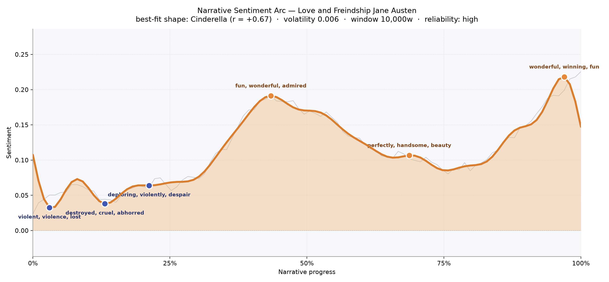
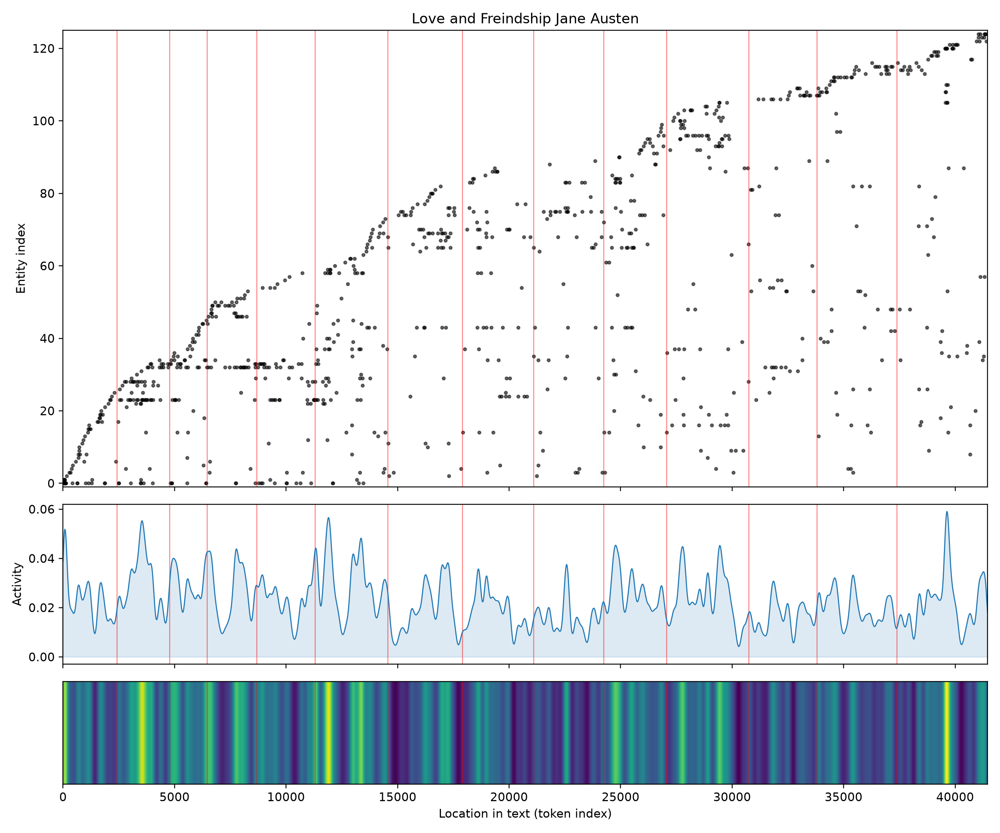
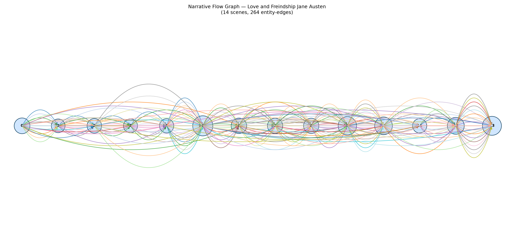

# Love and Freindship
### by Jane Austen

Roughly 33,900 words of teenaged mischief — a Cinderella arc, rising out of early ruin into a wide, glittering triumph.

## The shape of the story

Read from first page to last, this little epistolary romp behaves like a hearth that keeps catching brighter. The opening chapters sit in the shadows: near the very start the mood bruises with "violent, violence, lost, betray, cruel, vile," and a second sag not long after thickens with "destroyed, cruel, abhorred, arrested, deploring, violently" — the register of Gothic parody, a young Austen borrowing the bloodiest vocabulary of the sentimental novel only to giggle at it. A third dip around the one-fifth mark still shivers with "deploring, violently, despair, victim, cruelty, violence," but by then the joke is out: these swoons and betrayals are being staged, not suffered.

From there the line climbs, and climbs prettily. The first true crest, near the middle, hums with "fun, wonderful, admired, great, best, succeeded" — Laura at her most self-congratulatory. A gentler ridge two-thirds through rests on "perfectly, handsome, beauty, greatest, amuse, love," the language of drawing-room flattery. And then, right at the finish, the arc lifts to its highest point on "wonderful, winning, fun, praise, great, celebrated," a final flourish of triumph that reads less like earned happiness than like a mock-heroine taking her bow. The felt experience is of a story that begins in cartoon calamity and ends in cartoon glory — a Cinderella shape, but tilted, ironic, delivered with a raised eyebrow.

<figure><figcaption>An early frown of stagey woe, then a long, cheerful climb — the shape of a heroine who insists she has suffered everything and won anyway.</figcaption></figure>

## Who lives on the page

The cast is small and closely braided. Edward leads the count, with Laura almost his equal — the letter-writing narrator herself — followed by Sophia, then Matilda, Augustus, Lesley, Eloisa, and Augusta. These are the interlocking couples and confidantes of Austen's teenage burlesque: every friendship instant, every marriage impetuous, every faint theatrical. The tallies read like a party list, and the near-tie between Edward and Laura is the shape of the book itself, since so much of the story is Laura recounting Edward's follies with breathless approval.

Around them, place-names glitter in: Scotland, London, England, and a stray "Charlotte" that likely belongs to a house rather than a woman. A few labels are noise — "house," "husband," "freind" (Austen's own famous misspelling) — the machinery mistaking common nouns for named figures. Take them as a wink: the story really is about houses one bursts into uninvited, husbands one acquires in an afternoon, and friends one swears eternal devotion to on ten minutes' acquaintance.

<figure><figcaption>A steady arrival of new names throughout — as though every carriage that stops disgorges another cousin to be embraced or fainted upon.</figcaption></figure>

## The weave of scenes

The flow graph draws fourteen little islands strung along a line, and the threads between them are dense in the middle and dense again near the end — a fat knot of shared presences where Laura, Sophia, Edward, and Augustus overlap, and another cluster in the closing letters where Lesley, Matilda, and Eloisa crowd back in. The connections are numerous for so short a book, which fits its manner: everyone knows everyone, alliances form on sight, and the same handful of names keep looping back into each new scene. It reads less like a plot marching forward than like a chandelier — glinting, tangled, self-referential, every strand catching the light of every other.

<figure><figcaption>Fourteen tight scenes, threaded and re-threaded by the same small circle — a chandelier of gossip rather than a chain of events.</figcaption></figure>

## What a reader takes away

What lingers is the sound of a very young writer laughing at her elders' books. The stagey griefs of the opening are a costume; the sunlit crest of the ending is a costume too. Between them lies the pleasure of watching Austen learn her scalpel — the ear for self-flattering nonsense, the timing of an absurd reversal, the affectionate cruelty toward heroines who feel too much and think too little. It is slight, and knows it is slight, and is all the more delicious for it.
