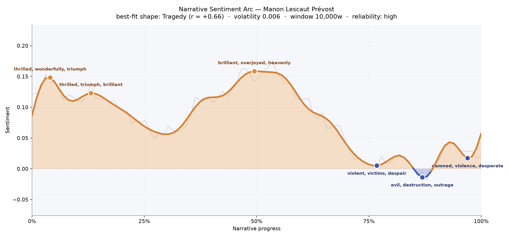
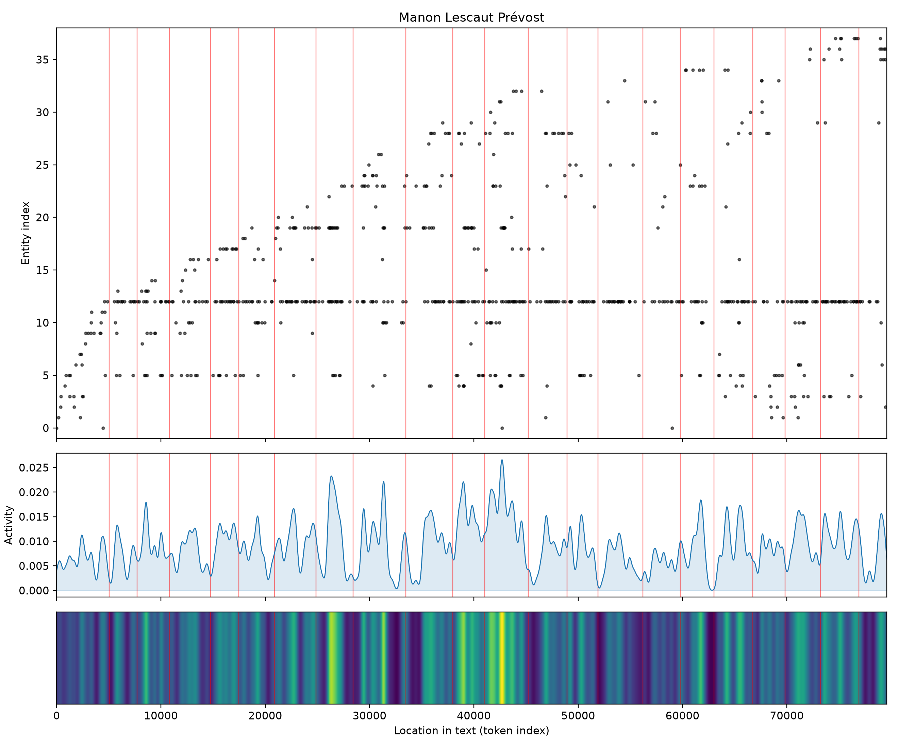

# Manon Lescaut
### by Abbé Prévost

63,013 words · a Tragedy arc — a bright infatuation slowly bled dry, ending in dust and grief

## The shape of the story

Prévost's novel opens in sunlight and closes in a shallow grave. The arc rides high through its first half — a chevalier stunned by love, a Paris that seems to promise everything — before the slow, steady erosion that marks any real tragedy sets in. The early crests are giddy with "thrilled, wonderfully, triumph, brilliant, triumphant, successful," the vocabulary of a young man convinced fortune will keep smiling. Even at the midpoint, near the two-hour reading mark, the story crests one last golden ridge with "brilliant, overjoyed, heavenly, supreme, rejoiced, triumph" — the deceptive peak just before the fall.

Then the descent, and it does not relent. Around the three-quarter mark the prose curdles into "violent, victims, despair, crime, destruction, abhor"; a little later the trough deepens with "evil, destruction, outrage, anger, kill, irritate"; and the last valley, almost at the closing page, is heavy with "damned, violence, desperate, catastrophe, losing, violent." You feel the story running out of light. It is not a sudden fall but a long exhalation — love mistaking itself for luck, then finally facing what it cost.

<figure><figcaption>The mood climbs through infatuation, holds briefly at a heavenly middle, then wears itself down toward exile and grief.</figcaption></figure>

## Who lives on the page

Manon herself is the gravitational center — her name recurs three hundred times, more than four times the mentions of any other figure, which is exactly right for a book that is really the chevalier's obsession made prose. The tagging occasionally mistakes her for a place, which is almost a fair joke: for des Grieux she is a place, the only country he ever truly lives in. Around her orbit her brother Lescaut, the steady friend Tiberge, the discreet "M. de T——" of the gambling nights, and young Amiens (misread as a person here rather than the town of their first meeting — a small slip worth noting).

The settings themselves crowd the page like characters. Paris presides. Then come the sites of confinement and flight: St. Lazare, the Hôpital, St. Sulpice with its seminary calm, Le Châtelet, the little house at Chaillot, and — at the far horizon — America, where the story empties into sand. Even Providence appears, more a hoped-for presence than a place.

<figure><figcaption>Manon's line runs unbroken across the book; the world of prisons, chapels, and distant Louisiana thickens around her as the tale advances.</figcaption></figure>

## The weave of scenes

Read as a visual score, the flow graph shows a book that thickens as it goes. The early scenes are lean — a handful of figures per chapter, the chevalier and Manon and Tiberge sketched against a bare stage. Around the twelfth scene the weave reaches its densest knot: sixteen presences braided together, the Paris of gamblers, guardians, rivals, and jailers all crowding in. Long ribbons arc from the opening scene all the way to the ending, a reminder that the chevalier is confessing this story in retrospect — the first and last nodes are tethered by memory itself.

The middle chapters carry the most tangled thread; the closing scenes thin again, as if the cast were being stripped away one by one until only the two lovers remain in the wilderness.

<figure><figcaption>The story braids tightest in its Parisian middle and unravels toward the American plains, where the crowd falls away.</figcaption></figure>

## What a reader takes away

What lingers after Manon Lescaut is not the scandal but the tenderness beneath it — the way passion refuses to learn its lesson, the way a young man's ruin is narrated with the courtly grace of someone who still, decades later, would do it all again. Prévost gives us a tragedy that never scolds its lovers. You close the book with sand in your hands and the odd, aching sense that some griefs are worth their whole cost.
