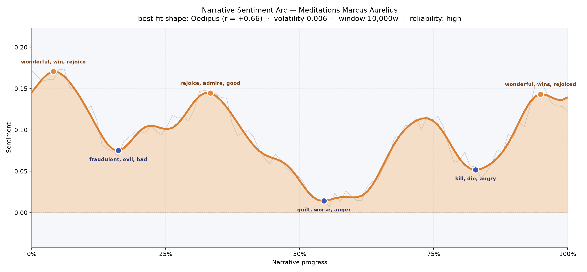
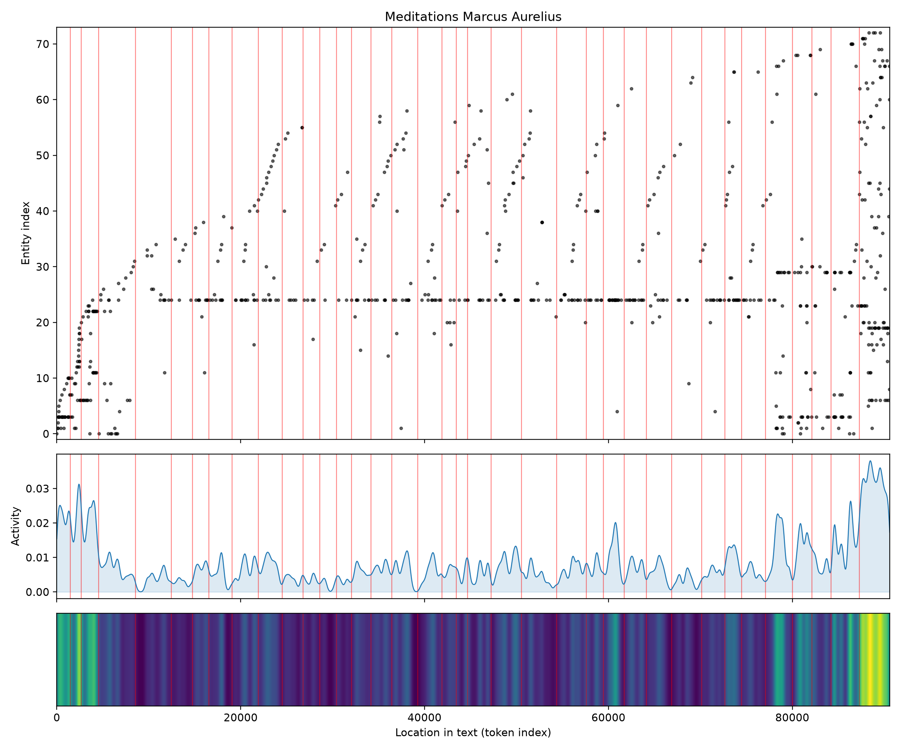
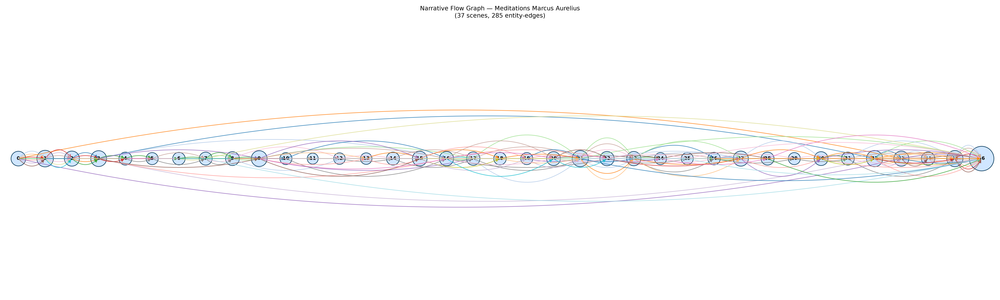

# Meditations
### by Marcus Aurelius

Roughly 72,000 words of a philosopher-emperor talking to himself — an Oedipus arc, a life lifted only to be undone.

## The shape of the story

Meditations is not a novel, and yet a novelistic hand can be traced across its private pages. The mood opens bright, almost surprisingly so — a first movement flushed with "wonderful, win, rejoice, happy, perfect, affection," the gratitudes of Book One where a grown man counts the gifts pressed into him by his mother, his tutors, his adopted father. The reader meets a soul at peace with its inheritance, tallying kindness.

Then the light lowers. A first dip near the sixteenth chapter of the way through is thick with "fraudulent, evil, bad, worse, dreadful, vile" — the Stoic beginning to school himself against the moral rot of the court, of humankind, of his own instincts. The arc recovers briefly around the one-third mark on a warm ridge of "rejoice, admire, good, perfect, pleased, happiness," as if the writer has remembered why virtue is beautiful.

But the middle sinks, and it sinks deep. The lowest valley, near the halfway mark, is quiet with "guilt, worse, anger, die, damage, dead" — the great meditations on death and the futility of vengeance, the pages where the emperor rehearses his own mortality until it loses its teeth. A second trough near four-fifths through hums with "kill, die, angry, chide, dead, guilty," an unmistakable memento mori pressed hard against the closing books. Only at the very end does the sentiment climb once more, closing on "wonderful, wins, rejoiced, rejoice, ominous, great" — a hard-earned serenity rather than triumph. That is the Oedipus feel of it: the man who ascends by wisdom only to be reminded, again and again, that he too must dissolve.

<figure><figcaption>Three bright ridges of gratitude thinning toward two long valleys where death is stared at plainly.</figcaption></figure>

## Who lives on the page

The dominant presence on the page is not a person at all — it is the archaic pronoun "thou," repeated more than two hundred times, the voice with which Marcus addresses himself. That single word carries the whole book: an emperor cornering an emperor in the mirror. Around that private "thou" cluster the expected proper names — Marcus, Marcus Aurelius, Fronto (his rhetoric master, whose letters shadow the introduction), Plato — and the great civilizational tags of Rome, Greece, the Roman, the Stoic, the Christian. A few labels are noise: "b.c." and the roman numerals xii, xiv, xv are chapter markers the counter mistook for figures, and "whatsoever" is a favored Stoic conjunction rather than a person. What emerges honestly, though, is the shape of a mind that lives among schools and cities more than among people. There are almost no domestic scenes here, no wives, no children — only the philosopher, his teachers, and the two civilizations he is trying to reconcile inside himself.

<figure><figcaption>A steady horizontal band of self-address, with names of teachers and empires flickering in and out.</figcaption></figure>

## The weave of scenes

The scene weave reads like a long, patient spindle. Thirty-seven scenes are strung end to end, most modest in size, threaded by a small recurring cast of ideas and names. The middle passages are the thinnest — three, four, five presences per scene — where the writing narrows to pure aphorism, one man and one thought. Then the final scene swells enormously, gathering forty-four figures at once: a closing tapestry in which everything Marcus has ever named — teachers, cities, gods, Stoic terms — is drawn together for a last rehearsal. It is less a climax than a summing, the way a diarist might, at the end, read back through every earlier page.

<figure><figcaption>A slender braid across thirty-seven meditations, blooming into one great confluence at the close.</figcaption></figure>

## What a reader takes away

You close Meditations quieter than you opened it. The book gives no story to hold onto — only the sound of a decent man arguing himself, night after night, into being decent again tomorrow. Its inheritance is not consolation but a kind of steady weather: die well, judge softly, expect nothing, be grateful anyway.
