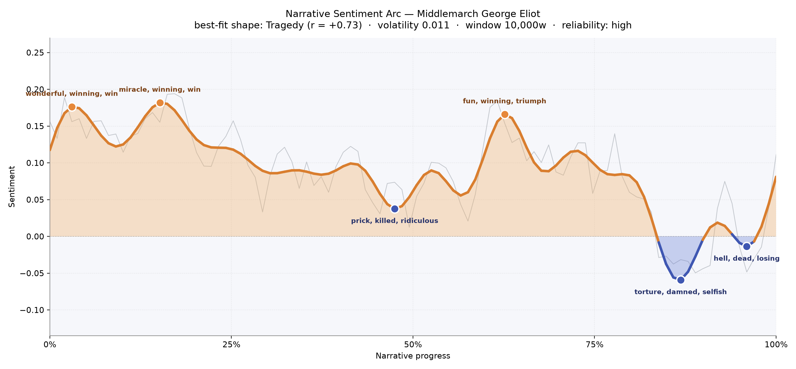
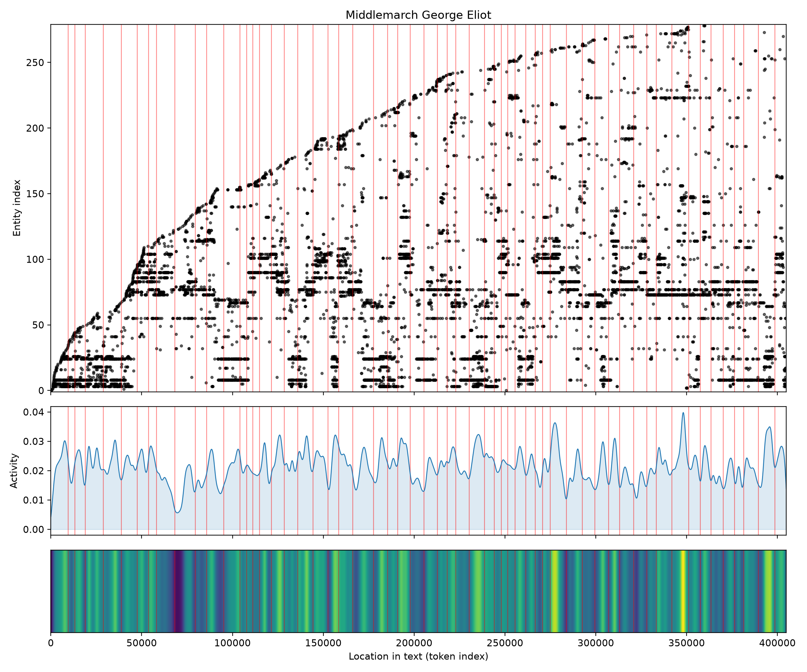

# Middlemarch
### by George Eliot

323,817 words — a Tragedy arc, the slow settling of provincial hopes into hard weather

## The shape of the story

Middlemarch begins in daylight. The first stretch of Eliot's great provincial novel glimmers with "wonderful, winning, win, excited, delightful, pleasure" — the buoyancy of Dorothea's early idealism, of Fred Vincy's careless luck, of a town still willing to imagine itself the birthplace of small revolutions. A second bright ridge near the fifteen-percent mark carries the same weather forward, thick with "miracle, winning, brilliant, best, good," as if the book were being written by the hopes of its youngest characters.

Then it turns. Around the halfway crossing, the arc dips into its first shadow — a valley bruised with "prick, killed, ridiculous, slavery, dreadful, evil" — the reader's first true premonition that these marriages and vocations are not going to arrange themselves kindly. A brief triumph flares near the two-thirds mark ("fun, winning, triumph, triumphant, loved") — Fred and Mary's straightening path, perhaps, or Lydgate's last confident hour — before the story descends into its long final darkening. The deepest trough, near eighty-seven percent of the way through, burns with "torture, damned, selfish, terror, worse, violent," and the closing pages sink again into "hell, dead, losing, terrible, terrified, cruel." This is the shape of a life-sized tragedy: not catastrophe, but attrition. A town's ambitions, one by one, worn down.

<figure><figcaption>Two sunlit peaks of early hope give way to a long, patient descent — Eliot's tragedy is provincial, quiet, and cumulative.</figcaption></figure>

## Who lives on the page

Dorothea Brooke stands above everyone, her name uttered nearly a thousand times — a moral center Eliot refuses to abandon. Around her cluster the great secondary lives of the novel: Bulstrode with his poisoned piety, Casaubon parched by his own scholarship, Lydgate the promising young doctor, Rosamond of the perfectly composed surface, Fred Vincy, Celia, Mary Garth, and Will Ladislaw. The Brooke, Vincy, Garth, and Farebrother households form the human weather of the book. Middlemarch itself — the town — appears often enough to feel like a character, which is exactly Eliot's design: place as pressure, place as fate. "James" almost certainly gathers Sir James Chettam, "Will" gathers Ladislaw, and "Mary" belongs to Mary Garth — the counting instrument sometimes shortens what the novel keeps whole, but the cast it surfaces is unmistakably Eliot's ensemble.

<figure><figcaption>A long, dense, evenly populated field — few figures leave for good, and new ones keep arriving deep into the book.</figcaption></figure>

## The weave of scenes

Fifty-nine scenes, more than sixteen hundred connecting threads: Middlemarch on the page looks like a woven cloth, not a straight road. The scene counts stay full — thirties and forties, cresting past fifty in the middle stretches — because Eliot rarely gives us one plot at a time. Dorothea's chapters answer Lydgate's; Bulstrode's shadow falls across Fred's fortunes; a conversation in one drawing room reappears, mutated, in another. The graph's densest braiding sits in the middle third, where the four great marriage plots and the medical reform plot and the Bulstrode scandal all begin to touch. The thinning at either end is only relative — even the opening and closing scenes carry twenty or thirty figures each. This is a novel that refuses to be about any single person, and the weave shows it.

<figure><figcaption>A continuous braid, not a spine — Eliot keeps every household alive in the reader's peripheral vision at once.</figcaption></figure>

## What a reader takes away

Middlemarch leaves you with the ache of unspent lives — of Dorothea, whose great deeds dwindle to good ones; of Lydgate, whose science shrinks to a practice; of a town that absorbs its dreamers and gives back only the ordinary. And yet the closing note is not despair. It is Eliot's famous consolation: that the growing good of the world is partly dependent on unhistoric acts. You finish the book quieter, kinder, less impressed by triumph and more attentive to the small braveries of the people beside you.
