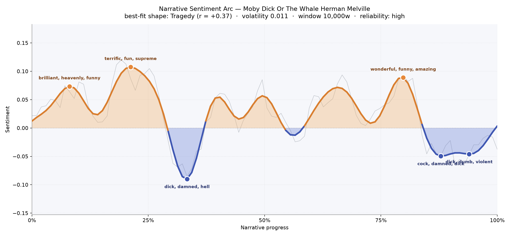
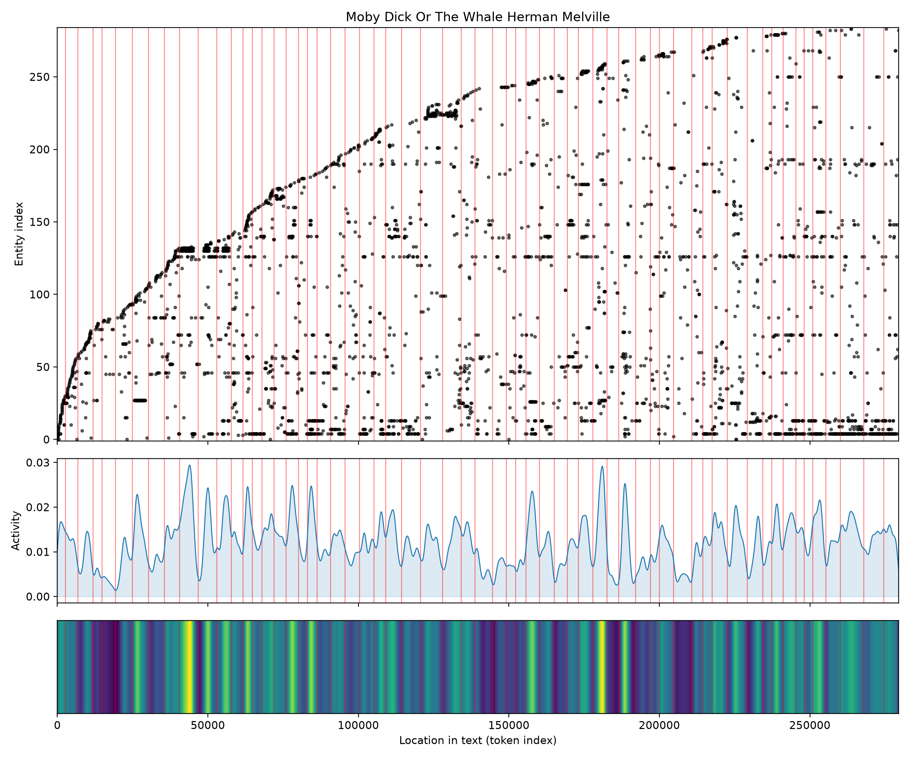
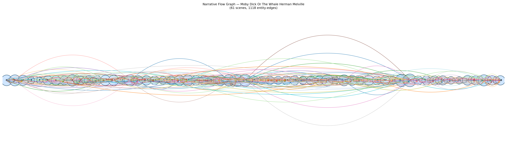

# Moby Dick; or, The Whale
### by Herman Melville

219,035 words · a tragic arc — a voyage that keeps lifting its face to the sun before the sea finally answers back

## The shape of the story

Melville's ocean rolls, and so does his mood. Early on the book is almost buoyant: the pulpit is warm, the Spouter-Inn is full of strangers becoming brothers, and the language shines with "brilliant, heavenly, funny, beautiful, beloved, bliss" — a young man setting out for sea, half-frightened and half-in-love with everything. That first swell rises again a fifth of the way in, when the Pequod slips her moorings and the world tastes of "terrific, fun, supreme, fabulous, best, delights" — the storyteller giddy at his own gathering fleet of men, oaths, and gospels.

Then comes the first true trough, right at the one-third mark, and the water goes black. This is the valley thick with "dick, damned, hell, mad, worse, murderous" — Ahab's quarterdeck vow, the doubloon nailed to the mast, the crew soldered by an oath none of them yet fully understand. From here the arc becomes a series of shallow reprieves — sermons on cetology, gams with other ships, the odd wonder-struck chapter that flares up with "wonderful, funny, amazing, terrific, grand, great" around the four-fifths mark, as if Ishmael were reminding himself that a whale is also a marvel and not only a monster. But those last chapters are unbroken dusk: the closing valleys carry "cock, damned, dick, dead, terrible, die" and then "dick, dumb, violent, fatal, lost, evil" — the chase, the smashed boats, the vortex. A tragic shape not because the book was ever cheerful, but because every joy in it was borrowed against this ending.

<figure><figcaption>Three bright crests of wonder, one deep midship trough, and a long dark tail into the whirlpool.</figcaption></figure>

## Who lives on the page

One name eclipses all others: Ahab, spoken 464 times — nearly two and a half times more than anyone else. He is the book's gravitational body; the rest of the crew orbits him. Starbuck, the conscience of the ship, is a steady second presence, arguing quietly and losing quietly. Flask and the harpooneer Tashtego stand in the middle distance, and behind them the shipowners Bildad and Peleg, comically pious, haggle their way into the early chapters. The white whale himself is spoken of less often than his hunter — Moby Dick and "the white whale" together are named just over a hundred times, which feels exactly right: he is more rumor than weather, more myth than man.

Some of the other frequent names are really places or presences: the Pequod is a ship, Nantucket a home port, the Pacific the killing ground, and Leviathan the mythic name behind the animal. Jonah surfaces because of Father Mapple's sermon, an early ghost hovering over the whole voyage. A stray "thou" among the names is just Melville's King-James cadence being mistaken for a person — a small charm of an old translation.

<figure><figcaption>New names crowd in during the early chapters, then the same core returns and returns.</figcaption></figure>

## The weave of scenes

Sixty-one scenes, more than a thousand connecting threads. Read the flow graph as a long swell along a shoreline: the beads of scenes run in a nearly unbroken line, and the arcs above and below them bulge fattest around the middle and again near the three-quarter mark — exactly where the Pequod meets other ships, where Ahab's monologues gather their choruses, where the cetology chapters braid the human drama into a great taxonomic tapestry. The thinnest passages are the very earliest and a lean stretch just past halfway, when Melville lets the reader breathe between gams. Everything after that broadens again and pulls forward into the final chase, where the same handful of names — Ahab, Starbuck, the whale — recur like a drumbeat.

<figure><figcaption>A long horizontal spine of scenes, with fat overhead arcs where the ship's world thickens with company.</figcaption></figure>

## What a reader takes away

You close Moby Dick with salt on your mouth. It has been comic, sermonic, absurd, encyclopedic, tender — and then, at the end, merciless. Its tragedy is not that Ahab loses; it is that he chooses. The book leaves you with the strange, permanent knowledge that a person can be beautiful and doomed in the same breath, and that the sea, indifferent, will roll on either way.
