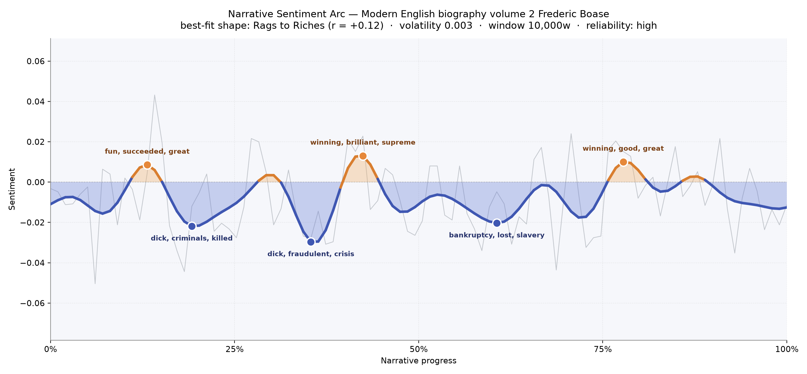
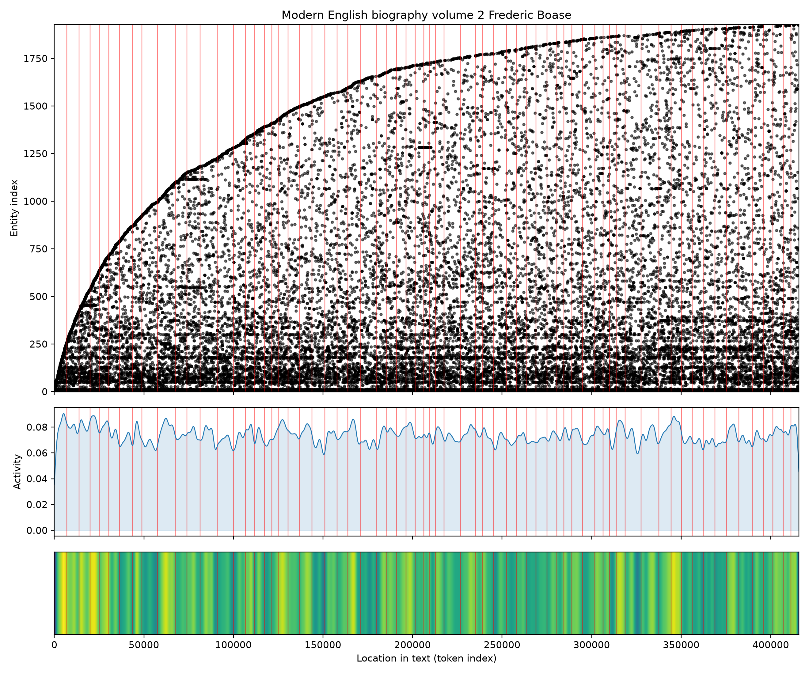

# Modern English Biography, Volume 2
### by Frederic Boase

609,946 words across sixty-eight scenes — a Rags to Riches arc, faint but persistent, threading light through a graveyard of nineteenth-century lives.

## The shape of the story

This is not a novel, and the arc knows it. Boase's compendium of Victorian dead is a book of stubbed candles — each entry a short, brisk obituary — and yet, laid end to end, the sentiment climbs. Very gently. The best-fit shape is a Rags to Riches curve, a slow lift from early darkness toward a warmer late afternoon, faint enough to feel like a mood rather than a plot. The book is enormous, so what small tides move through it can be trusted; volatility stays low throughout.

The dips are where the book grieves. Near the one-fifth mark the trough bruises with "dick, criminals, killed, lost, died, bankrupt" — a stretch dense with ruined men and short lives. A little past the third the deepest valley opens, thick with "dick, fraudulent, crisis, angers, lost, destruction," the language of collapse and courtroom shame. Past the halfway point another sag hums with "bankruptcy, lost, slavery, slave, conspiracy, charged," the empire's uglier ledgers surfacing. The crests, when they come, are quieter and kinder: an early lift carries "fun, succeeded, great, successful, perfect, beauty"; a middle summit shines with "winning, brilliant, supreme, excellent, succeeded, grand"; and a late peak settles into "winning, good, great, best, popular, benevolent" — the vocabulary of eulogy at its most generous.

<figure><figcaption>A shallow tide of praise, notched by three troughs of disgrace and loss.</figcaption></figure>

## Who lives on the page

The most-named presences in a biographical dictionary tell you less about characters than about grammar. The two runaway leaders — "d." and "b." — are simply *died* and *born*, the twin verbs that open every entry; "b.a.", "camb," "trin," "edinb," and "ed" are university shorthand for Cambridge, Trinity, Edinburgh, and *educated*; "lieut" is a rank. Read them as scaffolding, not people. What remains is a geography of the Anglosphere Victorian world: London towers over everything, followed at a distance by Dublin, Ireland, England, Glasgow, and Edinburgh. John is the one true given name to break through — the century's default Christian name, worn by so many of Boase's subjects it becomes almost a collective noun. The book, in aggregate, is less a portrait gallery than a map: London at the centre, the isles arrayed around it, and a river of Johns flowing through.

<figure><figcaption>A near-flat horizon of activity — every stretch equally crowded, because every stretch is another life.</figcaption></figure>

## The weave of scenes

The flow diagram looks like a fisherman's net stretched taut — a long lozenge of overlapping arcs, sixty-eight scenes bound by more than twelve thousand shared threads. There is no climax and no thin edge; the density is uniform, humming from margin to margin. That is exactly right for the form. Each alphabetical bracket of entries recycles the same institutions (Oxford, Trinity, the Inns of Court, the regiments) and the same places (London, Dublin, Edinburgh), so every scene shakes hands with every other. What looks like chaos is actually the signature of a reference work: a lattice, not a line.

<figure><figcaption>A tight ellipse of cross-references — the Victorian professional class talking to itself across the alphabet.</figcaption></figure>

## What a reader takes away

To read Boase straight through is to sit in a very quiet room while a patient antiquary reads out the names of the dead. Most were decent, a few were disgraced, and a great many went to Cambridge. The arc's slow warming is not consolation exactly — it is the accumulating weight of praise, the way obituarists reach, near the end of any life, for the word *good*. You leave with the sense that history is mostly footnote, mostly London, mostly John, and mostly kinder in the telling than it was in the living.
